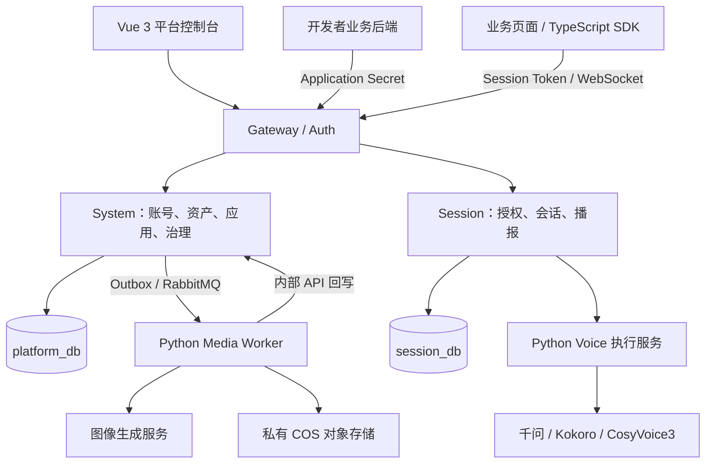

# LN 虚拟人平台

**从角色制作到应用接入，让可交互的虚拟角色走进你的 Web 应用。**

LN 是一个面向开发者的虚拟角色制作、资产管理与运行平台，基于 RuoYi-Cloud 扩展，结合 Java 微服务、Vue 3 控制台、Python 媒体与语音服务，以及 TypeScript 浏览器 SDK。

你可以在平台中制作全身角色、配置声音和 Skills，将它们组合为 Application，再通过业务后端与 SDK 接入自己的应用，实现角色动作、语音识别和文本播报。角色使用 **2D 透明动作图集 + Canvas** 播放。

> 本文对应 `LN_v1.0` 分支，当前处于 v1.0 发布准备阶段。核心链路已完成开发并进行过本机验证，生产部署与容量验证仍在完善中。

[功能概览](#功能概览) · [架构](#架构) · [技术栈](#技术栈) · [目录结构](#目录结构) · [开发与运行](#开发与运行) · [SDK 接入](#sdk-接入) · [贡献](#贡献) · [许可证与致谢](#许可证与致谢)

## 功能概览

| 能力 | 说明 |
| --- | --- |
| 角色制作 | 对接图像生成服务，制作角色与动作素材，完成透明背景处理、动作图集打包、预览和发布 |
| 资产管理 | 分别管理 Avatar 与 Voice，支持官方公共资源和开发者私有资源，以及发布、下架和引用保护 |
| 声音与语音 | 对接千问 TTS、Kokoro、CosyVoice3；按模型能力提供音色制作、试听、发布或声音克隆；支持官方 ASR 接入 |
| 应用配置 | 为 Application 选择角色、官方声音和 Skills，使用 Application Secret 接入业务会话 |
| 会话运行 | 提供 Session 授权、短期 Token、WebSocket 实时连接、文本播报、动作控制、停止与会话结束 |
| 浏览器 SDK | 提供 Canvas 角色播放器、动作切换、音频播放、会话连接及录音识别能力 |
| 平台治理 | 管理员与开发者使用独立账号和菜单，提供权限、任务、官方服务、额度、积分和用量管理 |

角色动作包括待机、说话、聆听、思考、点头、摇头、挥手和开心，对应 `idle`、`speaking`、`listening`、`thinking`、`nod`、`shake_head`、`wave`、`happy`。实际可用动作由角色包决定。

**对话如何接入？** 大模型调用、Prompt 编排、业务 Tool 执行和聊天历史由你的业务后端负责。LN 提供角色、声音、Skills 配置和会话运行能力，业务后端可将模型生成的回复交给 SDK 播报。

## 架构



- **制作链路**：System 持久化任务，通过 Outbox 与 RabbitMQ 唤醒 Worker；Worker 领取任务、调用图像服务、加工并上传素材，通过内部 API 回写结果。
- **运行链路**：业务后端创建 Session 并签发短期授权；SDK 获取连接票据，建立实时连接，加载角色包并播放动作与语音。
- **服务分工**：Nacos 提供配置与服务注册，Redis 提供缓存等能力；媒体 Worker 和语音执行器通过内部接口协作，业务状态由 Java 服务持久化。语音模型加载与推理部署在独立模型服务中。

## 技术栈

| 层次 | 主要技术 |
| --- | --- |
| 后端 | Java 17、Spring Boot 3.5、Spring Cloud、Spring Cloud Alibaba、MyBatis XML、Flyway |
| 控制台 | Vue 3、TypeScript、Vite 6、Element Plus、Pinia |
| 媒体服务 | Python 3.12+、FastAPI、Pillow、aio-pika |
| 语音服务 | Python 3.11+、独立 Provider 适配器与模型运行环境 |
| 播放与接入 | TypeScript、Canvas 2D、WebSocket、浏览器音频 API |
| 基础设施 | MySQL 8、Redis、Nacos、RabbitMQ、腾讯云 COS |

具体依赖版本以各模块的 `pom.xml`、`package.json` 和依赖锁文件为准。

## 目录结构

```text
LN-virtual-human-platform/
├── RuoYi-Cloud/                  # Java 后端
│   ├── ruoyi-gateway/            # API 网关
│   ├── ruoyi-auth/               # 登录与认证
│   ├── ruoyi-modules/
│   │   ├── ruoyi-system/         # 平台管理与资产业务
│   │   └── ruoyi-session/        # 会话与语音运行
│   ├── ruoyi-common/             # 公共模块与语音协议
│   ├── config/nacos/             # Nacos 配置模板
│   ├── sql/                      # 数据库参考与初始化脚本
│   └── docker/                   # 容器部署模板
├── RuoYi-Cloud-Vue3/             # 管理员 / 开发者控制台
├── avatar-sdk/                   # TypeScript 播放器与会话 SDK
├── ruoyi-media/                  # 媒体 API、Worker 与素材加工
├── ruoyi-voice/                  # 轻量语音执行服务
│   └── model-runtimes/           # 模型源码锁、依赖、许可证与容器入口
└── validation/                  # 制作验证工具及相关测试
```

## 开发与运行

### 1. 获取源码

```bash
git clone --branch LN_v1.0 https://github.com/liunianaw/LN-virtual-human-platform.git
cd LN-virtual-human-platform
```

构建源码需要 JDK 17、Maven 3、Node.js 20+ 与 npm。媒体服务需要 Python 3.12+；语音执行服务需要 Python 3.11+。Kokoro 与 CosyVoice3 的模型环境分别准备，具体输入见 [model-runtimes](ruoyi-voice/model-runtimes/)。

### 2. 构建 Java 后端

```bash
cd RuoYi-Cloud
mvn -B -ntp -DskipTests -pl ruoyi-modules/ruoyi-system,ruoyi-modules/ruoyi-session,ruoyi-auth,ruoyi-gateway -am package
```

该命令构建平台核心服务，跳过测试；配置基础设施后再运行生成的 JAR。

### 3. 启动前端开发服务

进入 `RuoYi-Cloud-Vue3/`，创建本地 `.env.development`：

```dotenv
VITE_APP_TITLE=LN 虚拟人平台
VITE_APP_ENV=development
VITE_APP_BASE_API=/dev-api
```

然后执行：

```bash
npm ci
npm run dev
```

开发服务默认端口为 `80`，HTTP 代理默认指向 `http://localhost:8080`。如端口被占用，可使用 `npm run dev -- --port 5173`。登录与业务操作需要后端服务和配置就绪。

生产构建使用本地 `.env.production`，设置标题、`VITE_APP_ENV=production` 和与反向代理匹配的 `VITE_APP_BASE_API`。仓库 Nginx 模板使用 `/prod-api` 前缀，构建命令为 `npm run build:prod`。

### 4. 准备媒体与语音执行环境

以下为 PowerShell 示例，各模块使用独立虚拟环境。

在 `ruoyi-media/` 下执行：

```powershell
python -m venv .venv
.\.venv\Scripts\python.exe -m pip install -r requirements.lock
.\.venv\Scripts\python.exe -m uvicorn ruoyi_media.api.app:app --app-dir src --host 127.0.0.1 --port 8002
```

API 的 `/health` 用于检查进程。制作任务还需在另一终端配置 Worker 环境并显式启动队列消费：

```powershell
$env:PYTHONPATH = (Resolve-Path .\src).Path
.\.venv\Scripts\python.exe -m ruoyi_media.worker --consume-rabbit --interval 30
```

Worker 需要 RabbitMQ、System 内部 API、COS 和图像服务配置。仅启动 API 或默认心跳模式不会处理制作队列。

在 `ruoyi-voice/` 下执行：

```powershell
python -m venv .venv
.\.venv\Scripts\python.exe -m pip install .
# 先向当前进程注入内部身份、Session 地址及所需 Provider 配置
.\.venv\Scripts\python.exe -m ruoyi_voice.server
```

语音配置字段见 [.env.example](ruoyi-voice/.env.example)。服务不会自动读取 `.env`；真实 Provider 默认关闭，自部署模型还需单独获取源码、权重与文本资源。模型准备入口见 [运行模板](ruoyi-voice/model-runtimes/compose.yml)、[资源获取程序](ruoyi-voice/ruoyi_voice/build_inputs.py)及各模型的 `source.lock.json`。

### 5. 配置完整运行环境

完整运行需要 MySQL、Redis、Nacos、RabbitMQ，以及按功能准备的对象存储和模型服务。配置参考 [部署环境模板](RuoYi-Cloud/docker/.env.example)、[Nacos 模板](RuoYi-Cloud/config/nacos/)和各服务的源码配置。

| 配置 | 主要变量或入口 |
| --- | --- |
| 平台 / 会话数据库 | `PLATFORM_DB_URL/USER/PASSWORD`、`SESSION_DB_URL/USER/PASSWORD` |
| 配置与注册 | `NACOS_ADDR/USERNAME/PASSWORD` |
| 缓存与消息 | `REDIS_HOST/PORT/PASSWORD`、`RABBITMQ_HOST/PORT/USERNAME/PASSWORD/VHOST` |
| 私有对象存储 | `COS_ENABLED`、`COS_REGION/BUCKET/SECRET_ID/SECRET_KEY`；Worker 使用 `RUOYI_MEDIA_COS_*` 对应字段 |
| 图像生成 | `M2_IMAGE_PROVIDER_ENABLED`、`RUOYI_MEDIA_QWEN_API_KEY/ENDPOINT` |
| 媒体内部身份 | `RUOYI_MEDIA_INTERNAL_PLATFORM_URL/TOKEN/WORKER_ID` |
| 语音与服务间身份 | `LN_VOICE_*`、`LN_SYSTEM_TO_SESSION_*`、`LN_SESSION_TO_SYSTEM_*`，见执行器模板及 Java 配置 |
| 官方服务凭证加密 | System 环境变量 `LN_OFFICIAL_SERVICE_MASTER_KEY`，需稳定保管 |

建议按以下顺序准备：

1. 使用 **MySQL 8.0.16+**，创建采用 `utf8mb4` 的 `platform_db` 与 `session_db` 两个空数据库，并配置访问权限。System 与 Session 启动时分别通过 Flyway 执行自己的迁移；`sql/init-platform-and-session.sql` 是早期结构参考，不要与全新 Flyway 初始化重复执行。
2. 启动 Redis、Nacos 和 RabbitMQ，将匹配当前源码的配置发布到 Nacos。默认环境为 `dev`，模板位于 `config/nacos/`；[发布脚本](RuoYi-Cloud/bin/publish-nacos-config.ps1)默认只预览，`-Apply` 才执行发布，当前实现使用 Nacos 3.2 API。
3. 为各进程注入环境变量和内部身份，按 System、Session、Auth、Gateway 的顺序启动核心 JAR，再启动媒体、语音服务与前端。System 默认端口 `9201`，Session `9202`，Auth `9200`，Gateway `8080`。
4. 在管理员控制台配置官方服务、声音和公共资源；开发者配置 Application，再接入业务后端。邮箱注册还需配置邮件服务，真实图像生成与云端语音需要自己的厂商凭证。

凭证通过受保护的环境变量或本地配置注入。Application Secret 仅由业务后端持有；浏览器使用短期 Session Token。数据库初始化包含本地开发管理员种子，部署时应自行设置管理员凭证。

### 部署模板的当前边界

- [Docker Compose](RuoYi-Cloud/docker/docker-compose.yml)是部署准备模板：需要准备 JAR、前端产物、数据库和运行配置。模板中仍有 MySQL 5.7 定义，而平台迁移使用 MySQL 8 特性，使用前需调整数据库配置。
- [Windows 启动器](RuoYi-Cloud/bin/Start-LocalPlatform.ps1)包含本机安装路径和忽略配置依赖，迁移到其他机器前需适配。
- 云端图像和语音调用可能产生费用；模型权重、账号凭证、现成角色资源及本地验收工程不包含在源码仓库中。
- 生产部署、容量与性能验证，以及部分 CosyVoice3 长文和混读场景仍待完善。构建成功或服务健康检查通过，仅说明对应检查结果。

## SDK 接入

SDK 源码位于 [avatar-sdk](avatar-sdk/)。先在该目录执行 `npm install` 和 `npm run build`，然后在你的前端工程中通过本地路径安装：

```bash
# 调整为你的工程到 SDK 的实际相对路径
npm install /path/to/LN-virtual-human-platform/avatar-sdk
```

接入流程：

1. 在控制台配置 Application，并在业务后端安全保存 Application Secret。
2. 业务后端通过 `/openapi/v1/sessions` 创建 Session，再通过其 Token 接口获取短期运行授权；业务用户身份由后端绑定。
3. 前端通过自己的后端获取 `{ token, expiresAt }`，交给 `SessionClient`。SDK 负责连接票据、实时连接、角色包加载和播放。

以下示例中的 `/api/avatar/session-token` 是**需要由你的业务后端实现的接口**，每次调用应返回同一业务会话当前有效的授权：

```typescript
import { AvatarPlayer, SessionClient, type SessionToken } from "@ln-avatar/sdk";

const player = new AvatarPlayer({
  container: document.getElementById("avatar")!,
});

const session = new SessionClient({
  baseUrl: "https://your-platform.example.com",
  player,
  getToken: async (): Promise<SessionToken> => {
    const response = await fetch("/api/avatar/session-token", {
      method: "POST",
      credentials: "same-origin",
    });
    if (!response.ok) throw new Error("无法获取会话授权");
    return response.json();
  },
});

session.on((event) => {
  if (event.type === "error") console.error(event.code, event.message);
});

await session.connect();
// 在用户点击等交互中触发播报，遵守浏览器音频播放策略
document.getElementById("speak")!.addEventListener("click", () => {
  session.speak("你好，欢迎来到 LN 虚拟人平台。");
});

// 按需调用 session.playAction("wave")、session.stop()。
// 页面卸载时调用 session.destroy() 和 player.destroy() 释放资源。
```

页面需提供 `id="avatar"` 的容器和 `id="speak"` 的按钮，并为会话授权配置相应权限。部署时配置 HTTPS、允许的 Origin、WebSocket 升级和运行媒体代理；浏览器录音需要安全上下文及用户授权。SDK 方法与类型以 [导出入口](avatar-sdk/src/index.ts)和 [SessionClient](avatar-sdk/src/session-client.ts)为准。

## 贡献

欢迎通过 [Issues](https://github.com/liunianaw/LN-virtual-human-platform/issues)反馈问题或提出改进，并提交聚焦的 Pull Request。

- 问题反馈请包含分支或提交版本、运行环境、复现步骤和脱敏日志。
- 修改代码时沿用模块分工：Controller 处理 HTTP 边界，Service 管理业务与事务，MyBatis XML 负责持久化；数据库演进通过新 Flyway 迁移完成。
- 提交前运行与改动相关的检查，例如前端 `npm run typecheck`、SDK `npm run typecheck` 或受影响 Java 模块的 Maven 检查。
- 请保留上游版权声明，并避免提交密钥、模型权重、日志、缓存和构建产物。

## 许可证与致谢

本项目基于 RuoYi 生态扩展，感谢 [RuoYi-Cloud](https://gitee.com/y_project/RuoYi-Cloud)、[RuoYi-Vue3](https://github.com/yangzongzhuan/RuoYi-Vue3)、[Kokoro](https://github.com/hexgrad/kokoro)和 [CosyVoice](https://github.com/QwenAudio/CosyVoice)等开源项目。

仓库中 [Java 后端](RuoYi-Cloud/LICENSE)、[Vue 前端](RuoYi-Cloud-Vue3/LICENSE)和 [语音执行模块](ruoyi-voice/LICENSE)保留 MIT 许可证文件。模型源码、子模块、文本资源与权重分别遵循其上游许可证和使用条款，详见 [模型声明](ruoyi-voice/model-runtimes/NOTICE)及各运行目录中的许可证文件。当前仓库尚未提供覆盖全部模块的根目录许可证，具体授权范围以对应文件为准。
