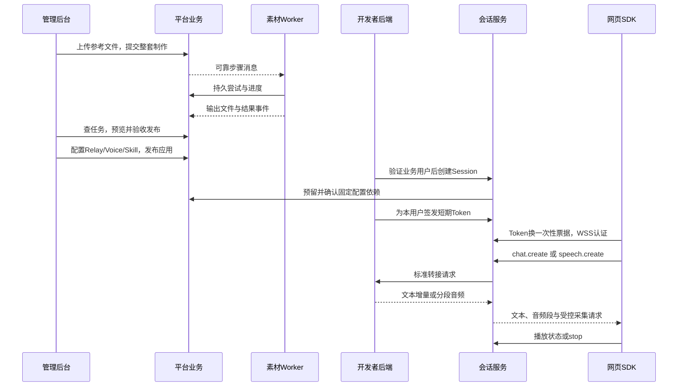

# LN 虚拟人开放平台接口设计说明书01

**版本：V0.2 · 核心业务接口设计稿（文档一致性修订）**
**日期：2026-09-09**
**适用范围：第一版平台业务、开发者后端接入及 JS/TS SDK**

> 本文是待实现的接口契约，既有 HTTP 接口、验证代码和拟新增接口分别标明。它覆盖核心业务闭环，不是全部接口清单，也不是已经通过联调的 OpenAPI 文档。示例 ID、域名及返回数据均为说明用数据；生产地址与部署参数由后续配置提供。

> 2026-09-24 适用性提示：开发者接入按[新执行计划](docs/superpowers/specs/2026-09-23-developer-integration-modules.md)和[接口与授权过程协议草案](docs/superpowers/specs/developer-integration-interface-contract.md)规划。用户已决定平台不保存聊天正文、不恢复已结束 Session，多轮记忆归开发者 Relay；每个 Application 必选平台官方 Voice/TTS；脱敏轮次、逐次调用、Avatar 任务/步骤/厂商尝试及 Webhook 投递/尝试业务记录长期保留，临时素材仍清理。每个 Application 一把开发者管理的 Secret；BUSINESS Session 闲置 2 小时/最长 24 小时，浏览器授权 15 分钟且普通续签允许新旧短暂并存。开发者重置 Secret 不追溯撤销已签发授权；管理员禁用拒绝新业务动作但不强断连接或已交付音频。新运行 Token 技术格式为统一 HMAC `v2` + 持久 JTI。本文的旧自有 TTS/私有 Voice、30 天业务日志/12 个月用量汇总、旧 JWT 格式、旧开放路径、`businessUserId`、Session 历史/恢复/持久 Context、旧签发 Key 即时撤销浏览器授权及旧内部引用路径不得直接实施；LLM/ASR Relay 能力握手、WSS 信封和 Webhook 规则可按新协议明确的部分复用。本文正文保留历史设计，仅由新协议明确引用且不冲突的部分有效。

## 1. 依据、范围与设计取舍

### 1.1 本次读取的依据

| 输入 | 本文采用的结论 |
|---|---|
| [项目需求说明书 V1.3](项目需求说明书.md) | 全身 Avatar、八动作、无匿名、无跨会话记忆、开发者厂商 Key 不进入平台、截图直传与 DOM 独立过滤 |
| [项目架构说明书 V1.4](项目架构说明书.md) | 五个逻辑服务、HTTPS/WSS、浏览器 Canvas 播放、Java 会话编排、Python 制作、两业务库与可靠消息 |
| [数据库设计说明书 V0.2](数据库设计说明书.md) | 账号隔离、主表与版本表、任务/步骤/尝试、引用预留、额度预占、会话与连接代数 |
| 制作验证记录（原文件已移除） | 旧稿记载负责人已验收制作路线；约 0.4 元/动作请求是当时参考，不是固定报价；实施须复核当前资料 |
| [素材加工代码](validation/avatar_lab/media.py)、[流程代码](validation/avatar_lab/workflow.py)、[调用适配](validation/avatar_lab/provider.py) | 单动作请求、六帧加工、哈希与检查、结果恢复；需转换成正式整套任务 |
| [验证播放器](validation/preview/src/player.mjs) | 单动作、语音事件、停止代数与有界动作队列；目前是本地预览，无正式会话协议 |
| 框架准备记录（原文件已移除）、[开源复用清单](docs/opensource-reuse.md) | 若依、LiveTalking、MuseTalk、TalkingHead 的早期复用分析，见第 15 节；实施须以当前源码复核 |

制作验收以验证记录顶部的负责人更新为准，当前验证工具用法见 validation/README.md；历史模型、预算和失败记录用于追溯。本文不修改验证工具，不恢复其已按用户要求关闭的手动门禁。正式平台的付费请求恢复仍按架构与数据库设计处理。

2026-09-09 V0.2 修订：修正 B/S 权限关系；明确业务与后台调试两类签发来源及会话 HTTP 幂等；统一文字、合成、播放状态；相关表与字段已同步数据库 V0.2 和结构化字段字典。协议和第 16 节默认值作为首版实现基线，实际兼容性、性能和限值仍需验证。

### 1.2 本册覆盖与省略

覆盖六条主线：素材上传与制作发布；Relay/Voice/Skill 与应用配置；后端身份与 Session 授权；实时文字、语音、停止；页面感知与指导；额度与制作通知。额外保留支撑这些流程的最小内部服务契约。

账号注册/找回密码的逐字段协议、若依菜单角色/字典/日志、所有资源列表与常规编辑删除、完整管理员配置、监控、SDK 的每个辅助方法，不在本册逐一展开。省略表示后续接口册补齐，不取消需求。本文列出的查询接口足以说明核心对象与状态，不能据此认定管理后台接口已经齐全。

采用“**业务资源 REST + 实时 WSS 事件 + SDK 本地能力**”组织：便于后台与外部开发者共用业务服务，避免把数据库每张表都开放成接口。相较于全 REST，WSS 更适合文字增量、取消和 AI 请求采集；相较于全部走 WSS，文件与可恢复任务仍用 HTTP 更清楚。动作播放和浏览器采集不是服务端远程操作接口。

本文新增的路径、字段、默认限值、音频格式和协议版本是本稿技术选择；已确认产品边界保持不变。

## 2. 接入面、身份与路由

### 2.1 路由归属

| 接入面 | 路径 | 调用者与服务 |
|---|---|---|
| 已有后台基础能力 | 若依 `/auth/**`、系统账号/菜单路由 | Vue 后台 → gateway → auth/platform；邮箱流程待改造 |
| 管理业务 API | `/api/v1/**` 中的资产、配置、任务等路径 | 开发者后端或已登录后台 → platform |
| 后端会话接入 | `/api/v1/applications/{applicationId}/sessions/**`、`revocations` | 开发者后端 → session，必要时内部访问 platform |
| 浏览器运行时 | `/api/v1/runtime/**` | SDK → session；服务端从 Token 推导 Session |
| 实时通信 | `/api/v1/realtime` | SDK → gateway → session，WSS |
| 管理员业务能力 | `/api/v1/admin/**` | 已登录管理员 → platform |
| 内部服务 | `/internal/v1/**` | 服务身份认证；公网网关不转发 |
| 开发者转接 | 开发者服务的 `/ln-relay/v1/**` | session → 开发者后端，不属于平台公开路由 |

生产使用 HTTPS/WSS。文中的 REST 路径均含 `/api/v1`；开发代理地址可不同，不通过改业务路径适配环境。

### 2.2 凭证代号与校验

| 代号 | 凭证 | 允许范围 |
|---|---|---|
| C | 若依后台登录 Token | 经账号与按钮权限校验的管理业务；不得直接用于浏览器运行时 |
| M | 账号级管理 Key | 本账号管理 API；不获得管理员或业务用户身份 |
| B | Application Secret | 唯一 Application 的 Session 创建、授权、Context 和撤销 |
| S | Session Token | 唯一账号、应用、Session、业务身份及 Scope 的运行时能力 |
| A | 管理员后台 Token | 官方资产生命周期等管理操作，仍需专门权限 |
| I | 内部服务凭证 | 固定调用方与操作范围；不接受浏览器伪造内部标头 |

HTTP 使用 `Authorization: Bearer <credential>`。同一请求只接受路由明确列出的凭证类型。Bearer 访问头遵循 [RFC 6750](https://www.rfc-editor.org/rfc/rfc6750)；项目不因此增加 OAuth 授权中心。

网关必须按路由区分后台认证、开放 Key、Session Token 和 WSS 认证，不能让若依原 `AuthFilter` 将全部凭证当作后台 JWT；也不能把 `/api/v1/**` 加入无需认证白名单。网关清除外来账号/内部来源标头，下游独立核对归属、状态和 Scope。

所有私有资源的 `accountId` 由身份推导，公开写入 DTO 不提供该字段。B 路径的 `applicationId` 必须与 Secret 一致。业务用户标识只能由已完成登录验证的开发者后端声明；S 不得更改身份，M 也不得伪装任意业务用户签发 S。

### 2.3 本稿 Scope

- M/C 管理能力：`assets:read/write`、`generation:read/write`、`config:read/write`、`keys:write`、`usage:read`、`webhooks:write`；C 映射后台权限，不照搬客户端提交的 scopes。
- B 接入能力：`sessions:create`、`sessions:grant`、`sessions:read/delete`、`sessions:context`、`sessions:revoke`。
- S 运行能力：`session:read`、`history:read`、`avatar:read`、`chat:write`、`speak:write`、`asr:write`、`context:capture`、`guidance:receive`。
- B 签发前须通过 `sessions:grant`、应用归属和当前 Key 状态校验。B 与 S 使用不同权限词表，不能直接求交集；第一版不增加“每个 Key 可下放哪些运行权限”的独立配置。
- 签发的 S 权限为请求的运行 Scope、Session 固定配置允许能力和应用当前有效授权的交集；未定义或超出可授予范围的请求 Scope 返回校验错误，不静默扩大授权。运行时还要以已签发 Scope 再取交集，配置收紧立即生效。`stop` 对拥有该会话有效授权者始终可用。

转接访问 Token、工具接口 Token、可选业务查询短期凭证另有用途，不是上述平台凭证。开发者的模型/ASR/TTS 厂商 Key 不在任何公开 DTO 中；禁止用通用 `headers` 或 `extra` 字段绕过这一边界。

## 3. 公共请求与响应约定

### 3.1 数据与 HTTP

- 新接口 JSON 用 UTF-8、camelCase；ID/序号/代数涉及 BIGINT 时用十进制字符串，时间为 UTC RFC 3339，如 `2026-09-09T08:00:00.000Z`。动作 code 使用既定 snake_case；转接中的 OpenAI 消息结构保留其原字段名。
- 枚举用大写；JSON 对象拒绝未定义写入字段。可选字段省略表示使用默认值；允许清空的字段才接受 `null`，PUT 配置为完整替换。数值 0 与不可获取的 `null` 分开。
- HTTP 201 表示创建成功，202 表示异步受理，200 表示读取/命令已完成；失败使用实际 4xx/5xx。业务失败不统一伪装成 HTTP 200。
- 所有新接口统一返回下列信封；文件二进制、SSE、WSS 和 Webhook 另按各自契约。成功 `code="OK"`、`error=null`；失败 `data=null`，稳定错误码放在 `code`。

```json
{
  "code": "OK",
  "message": "任务已受理",
  "requestId": "req-demo-001",
  "data": {"taskId": "21001", "status": "QUEUED"},
  "error": null
}
```

```json
{
  "code": "RESOURCE_IN_USE",
  "message": "该版本仍被应用或可恢复会话引用",
  "requestId": "req-demo-002",
  "data": null,
  "error": {
    "retryable": false,
    "details": {"applicationCount": 1, "recoverableSessionCount": 2}
  }
}
```

`X-Request-Id` 为可选追踪标识，格式校验后使用或由服务生成，并在响应头/体返回。它不承担幂等职责。错误 `details` 只返回安全字段，不含上游原响应、签名 URL、凭证或对话正文。

若依既有 `R/AjaxResult/TableDataInfo` 保持其原兼容格式。Vue 为新业务 API 建独立请求适配层，不能把字符串 `OK` 交给原先只接受数值 `200` 的拦截器。后台登录/菜单接口无需为此全部重写。

### 3.2 幂等、并发与重试

`Idempotency-Key` 为 1～64 位 ASCII 随机标识，创建任务、重试任务、创建资源版本、发布应用、创建 Session、额度动作必须携带。作用域为账号+操作+目标；Session 创建再加入应用和业务身份。服务保存规范化业务参数摘要与资源 ID，不保存被禁止持久化的请求正文。

同键同参数返回原对象及当前状态；同键不同参数返回 HTTP 409 `IDEMPOTENCY_CONFLICT`。首次异步结果未确定可返回同一对象的 202，不创建第二项。普通管理去重记录默认保留至少 24 小时；任务/轮次还用业务唯一键在自身保留期内防重。超过保留窗口不承诺永久去重，客户端应持久保存已取得的业务 ID。

两库分别使用 `p_api_idempotency/s_api_idempotency`，不跨库写去重表。`scope` 为操作、目标及必要身份/签发来源组成的版本化规范对象的 SHA-256 小写十六进制值（64 字符），不拼接可能歧义的字符串；会话操作加入应用、Session/业务身份，授权与撤销加入签发来源。`request_hash` 为规范化业务参数的 32 字节摘要，秘密字段先做服务端 keyed digest，不保存正文、完整 Token 或凭证响应。摘要密钥轮换须保留仍在去重窗口内记录的校验能力。

会话 HTTP 去重记录至少保留 24 小时并覆盖业务执行期；PROCESSING 或关联补偿未完成时不能到期删除。Token 签发将去重行与 grant 同事务提交；撤销将去重行、epoch 更新和 Outbox 同事务提交。重复撤销返回原撤销事实，不再次递增 epoch，避免撤销重新登录后的新授权。创建 Session、WSS 轮次及 ASR 操作继续使用其已有业务唯一键，不另建重复执行记录。具体字段及引用保留约束见数据库第 7.13 节。

凭证签发响应不进入通用幂等响应缓存。Application Secret 只创建一次并只显示一次：重试只返回 Key 元数据及 `secret=null, secretAvailable=false`，响应丢失时撤销该 Key 后重新创建。Session Token 可重新签发，但重复同一签发操作不得累计放大授权；返回同一有效 grant 的令牌或明确要求新建授权，不存完整 Token。

资源编辑/发布/生命周期使用 `If-Match`（创建、查询、更新均返回 `ETag`）；缺失返回 428，过期返回 412 `REVISION_CONFLICT`。ETag 由资源 revision 或受保护业务快照摘要构成，服务在持有业务锁时比较，不能仅按客户端时间判断。完成过的相同幂等操作先返回原结果，不因 ETag 已变化误报发布失败；新操作仍必须校验 ETag。

本册省略逐字段展开的普通详情查询仍按 `GET /api/v1/relay-services/{relayId}`、`voices/{voiceId}`、`skills/{skillId}`、`applications/{applicationId}` 返回当前资源和 ETag；后面三项同样以 `/api/v1/` 为前缀。响应只给可管理的配置和秘密脱敏标志。

网络重试与业务重生成不同。GET 可有限重试；付费操作只按稳定幂等键重试受理/查状态，不自动换键再次执行。未知上游结果先核对，不能把 `retryable=true` 解释为可重复扣费。

### 3.3 日志与列表

新业务请求层关闭若依 `request.ts` 的请求正文缓存与原样异常打印；尤其不得把接入 Token、System Prompt、Session Context 等写入其重复提交用的浏览器缓存。后端操作日志按字段白名单记录。

常规管理列表后续统一 `pageNum=1,pageSize=20`，最大 100，返回 `items,total,pageNum,pageSize`；历史使用稳定序号游标，见第 8 节。排序字段仅允许服务端白名单。

## 4. 核心接口导航

| 核心业务 | 主要接口 | 主服务 | 权限 |
|---|---|---|---|
| 当前能力与上传规则 | `GET /api/v1/capabilities` | platform | C/M，assets:read |
| 上传制作参考 | `POST /api/v1/files` | platform | C/M，assets:write |
| 制作与失败恢复 | `POST /api/v1/avatar-generation-tasks`；`GET /api/v1/avatar-generation-tasks/{taskId}`；`POST /api/v1/avatar-generation-tasks/{taskId}/retry` | platform/media Worker | C/M，generation |
| 验收及读取 Avatar | `POST /api/v1/avatars/{avatarId}/versions/{versionId}/publish`；`GET /api/v1/avatars/{avatarId}` | platform | C/M，assets |
| 删除及官方状态 | `DELETE /api/v1/avatars/{avatarId}`；`PATCH /api/v1/admin/avatars/{avatarId}/lifecycle` | platform | C/M 或 A |
| 配置 Relay/Voice/Skill | 第 6 节创建与新版本接口 | platform | C/M，config |
| 应用与发布 | `POST /api/v1/applications`；`POST /api/v1/applications/{applicationId}/config-versions` | platform | C/M，config:write |
| 当前权限收紧 | `PATCH /api/v1/applications/{applicationId}/policy` | platform | C/M，config:write |
| 后端接入凭证 | `POST /api/v1/applications/{applicationId}/secrets`；`DELETE /api/v1/access-keys/{keyId}` | platform | C/M，keys:write |
| Session 与授权 | 第 8 节创建、授权、撤销、Context、历史及删除 | session | B/S 按路径区分 |
| 对话、播报与停止 | WSS `chat.create`、`speech.create`、`turn.stop` | session | S |
| 录音与页面 | `POST /api/v1/runtime/asr`；`POST /api/v1/runtime/context-captures` | session/SDK | S |
| 包及临时音频 | `GET /api/v1/runtime/avatar-package`；`GET /api/v1/runtime/media/{mediaId}` | session → platform/对象存储 | S |
| 用量与通知 | `GET /api/v1/usage/summary`；`POST /api/v1/webhook-endpoints` | platform | C/M |

表格是导航，具体字段和行为以以下正文为准。部分创建/版本操作共用一种 DTO，不为每个普通 CRUD 重复展开。

## 5. Avatar 上传、制作、验收与删除

### 5.1 上传参考文件

**GET `/api/v1/capabilities`，C/M，assets:read，200。** 返回 `protocolVersions,uploadLimits,rightsNotice,avatarPackageSpec`，rightsNotice 包含 `version,text,confirmationRequired`；SDK 会话运行限值另由 runtime/session 返回。能力查询不暴露官方模型凭证或触发收费服务。

**POST `/api/v1/files`，C/M，201。** `multipart/form-data`：

| 字段 | 必填 | 约束 |
|---|---|---|
| `file` | 是 | 一个图片或视频文件，不接受本机路径/任意远程 URL |
| `purpose` | 是 | 本接口核心用途为 `AVATAR_SOURCE` |
| `rightsConfirmed` | 是 | 必须为 true，表示上传者完成权利提醒确认 |
| `rightsNoticeVersion` | 是 | 必须为服务端当前提醒文案版本；过期返回重新确认提示 |

本稿先采用平台流式接收并通过云官方 SDK 存储的方式，避免首版公开契约绑定某云预签名上传表单。需要直传优化时扩展上传凭据/完成确认接口，不改变 `fileId` 语义。上传前检查单文件与账号存储额度；服务端验证真实 MIME、尺寸/时长，不仅信扩展名。未完成上传不能作为制作输入。

响应 `data={fileId,purpose,mediaType,bytes,sha256,width,height,durationMs,status:"READY"}`，非适用字段为 null。不返回永久公开链接、bucket、objectKey；处理失败清理残留对象。单文件上传并非生成调用，不扣整套制作次数。`p_file` 保存来源、权利确认及元数据。

### 5.2 提交整套制作或重新生成

**POST `/api/v1/avatar-generation-tasks`，C/M，Idempotency-Key，202。**

```json
{
  "avatarId": null,
  "name": "赤霜",
  "sourceFileId": "11001",
  "sourceMode": "IMAGE_REFERENCE",
  "appearanceInstruction": "保持白发与红色围巾，全身站姿，手脚完整",
  "webhookEndpointId": null
}
```

| 字段 | 规则 |
|---|---|
| `avatarId` | null 表示同时创建私有 Avatar 草稿；提供时须为本账号 Avatar，用于新增候选版本 |
| `name` | 新 Avatar 必填，1～64 字符；已有 Avatar 不通过本接口改名 |
| `sourceFileId` | 必填，本账号 READY 图片/视频；不得引用别人的上传文件 |
| `sourceMode` | `IMAGE_REFERENCE` / `VIDEO_REFERENCE`，与实际类型一致 |
| `appearanceInstruction` | 可选，最多 2000 字符；作为制作要求，不允许覆盖固定八动作、全身规范或官方调用地址 |
| `webhookEndpointId` | 可选，本账号有效通知配置，不能直接传回调 URL |

返回 `taskId,avatarId,candidateVersionId,status,progress,quotaReservation`。`quotaReservation={type:"AVATAR_COUNT",units:1,status:"RESERVED"}` 表示一次整套制作预占，不是一次动作 API 成本。

平台固定编排：视频参考提帧（适用时）→ 基准形象 → 固定八动作分别生成 → 确定性加工与检查 → 完整候选包。参考图缺失的身体由生成服务补全；视频不学习个人动作。客户端不能传 `actions`、厂商 Key、任意模型 URL 或直接启动 Worker。

成功后不满意仍用本接口，以已有 `avatarId` 创建新任务和版本、新计一次额度；在用版本不被覆盖。正式平台的生成服务/模型来自管理员配置，不直接使用 validation 中硬编码模型常量。视频路径属于待实现能力，不因 MuseTalk 存在提帧代码就认为已跑通。

### 5.3 任务状态与重试

**GET `/api/v1/avatar-generation-tasks/{taskId}`，C/M，200，ETag。**

`data` 返回 `taskId,avatarId,candidateVersionId,status,progress,phase,steps,reviewRequired,error,canRetry,quotaReservation,reservationNo,createdAt,finishedAt`。`steps` 只含步骤 code、动作、状态、尝试次数与安全错误；厂商凭证及响应正文不出现在任务对象中。

| 任务状态/提示 | 含义与客户端处理 |
|---|---|
| `QUEUED` | 已可靠受理，等待调度 |
| `PROCESSING` | 正在加工或调用上游；百分比是步骤进度，不是 ETA |
| `PROCESSING` + `reviewRequired=true` | 上游结果未知，等待核对；`canRetry=false`，不把未知等同失败 |
| `SUCCEEDED` | 完整产物已保存，生成次数已结算；版本仍为 `REVIEW`，需验收发布 |
| `FAILED` | 本次执行终止，整套预占已释放；是否可恢复由失败原因决定 |

**POST `/api/v1/avatar-generation-tasks/{taskId}/retry`，C/M，Idempotency-Key、If-Match，202。** 请求 `{ "mode":"FAILED_STEPS" }`。服务器确定失败步骤及依赖闭包，不允许客户端任意跳过基准图或八动作。只接受已明确 FAILED 且可恢复任务；同一任务不会并发恢复。

内部失败重试只新增 attempt，不重复扣整套次数。明确失败并释放后，用户恢复沿用 task，`reservationNo` 递增并重新预占 1 次；最终成功仅结算当前预占。改变基准图需要重新制作全部依赖动作。已成功任务拒绝此接口，提示新建重生成任务。未知请求只在后台核对流程解决，本册不提供绕过核对开关。

### 5.4 预览、验收和正式包

**GET `/api/v1/avatars/{avatarId}`，C/M，200，ETag。** 返回主表状态、可见性、`currentVersionId`、候选版本摘要、八动作检查结果、引用计数，以及按权限签发的短时预览地址。允许所有者预览 REVIEW 产物，不能因此绑定到正式 Application。

**POST `/api/v1/avatars/{avatarId}/versions/{versionId}/publish`，C/M，Idempotency-Key、If-Match，200。** 请求 `{ "visualAccepted":true, "reviewNote":"已检查全身、手部、动作过渡和透明边缘" }`。管理员发布其官方资产时用 A 并验证官方发布权限。

服务端确认父子归属、候选产物完整、固定八动作、文件哈希/几何检查通过、实际人工验收确认。发布只切换 Avatar 当前版本，不替换已有 Application 或 Session。发布不产生第二次生成费用；自动检查失败不能只靠 `visualAccepted=true` 越过。

运行时包读取由 **GET `/api/v1/runtime/avatar-package`，S，avatar:read，200** 提供。只返回 Session 固定 Avatar 版本；也适用于已授权的后台调试 Session。长期数据保存 fileId/哈希，响应动态附短期资源地址和 `expiresAt`，过期重取同版本地址，不重新生成。

正式包使用 `packageType="LN_AVATAR"、schemaVersion=1、framing="FULL_BODY"、lipSyncMode="BASIC_SPEAKING"`，包含 `avatarId,versionId,width,height,anchor,preview,baseImage,actions`。每项动作包含 `code,frameCount,fps,loop,atlas,frames`；atlas 为 `fileId,sha256,url,expiresAt`，frames 为按播放顺序的 `x,y,width,height` 数组。包不能携带官方秘密、原始请求正文或开发者账号内部配置。

本稿制作初始规格沿用验证输出：单帧 512×768、六帧、6 fps。平台将每动作六张透明 PNG 确定性合成为 1536×1536 的 3列×2行透明图集；frames 的坐标为 `(0,0),(512,0),(1024,0),(0,768),(512,768),(1024,768)`，矩形大小均为 512×768。脚底 anchor 以帧左上角为原点、单位像素，由归一化加工产出并在整版本一致；不从图片画布底边猜测脚底。

`idle/speaking/listening/thinking` 默认循环，其余四项单次。图集文件与 `p_avatar_action.atlas_file_id/frame_layout` 对齐。验证工具的单动作 `schema_version=1`、PNG 列表和本地路径不是正式包格式，需显式转换，不能因为版本号同为 1 就混用。以上图集合并/锚点规范尚未在正式 SDK 验证，不把 validation 的 GIF 时长当精确播放时钟。

### 5.5 删除及官方生命周期

**DELETE `/api/v1/avatars/{avatarId}`，C/M，If-Match，202。** 只允许本账号私有资产；存在当前 Application、可恢复 Session 或生成任务的有效/预留引用时，返回 409 `RESOURCE_IN_USE` 及安全引用摘要。无引用则先标记 DELETING、阻止新引用，再异步删文件。删除中的 GET 可返回状态，完成后资源为 DELETED；重复删除不重复扣减存储。

删除原始参考文件和删除已生成包是不同操作；原素材独立删除不得破坏已发布包。普通文件删除接口不允许绕过 Avatar 引用保护。

**PATCH `/api/v1/admin/avatars/{avatarId}/lifecycle`，A，If-Match，200。** 请求 `status` 为 `PUBLISHED/UNLISTED/DISABLED`，附必要 `reason`。PUBLISHED 仅能恢复已有验收版本，不代替首次验收发布。UNLISTED 禁止新绑定，既有绑定继续；DISABLED 立即阻止资产使用、通知 SDK 释放缓存并提示更换，不通过历史版本绕过。已下载图像无法被远程物理收回，生效承诺限定为平台与遵守协议的 SDK 停止使用。

## 6. Relay、Voice 与 Skill 配置

### 6.1 账号级 RelayService

**POST `/api/v1/relay-services`** 创建服务和首版本；**POST `/api/v1/relay-services/{relayId}/versions`** 创建配置新版本，后者需 If-Match。均 C/M、Idempotency-Key，201。

```json
{
  "name": "业务后端模型转接",
  "baseUrl": "https://relay.example.com/ln-relay/v1",
  "protocolVersion": "1",
  "capabilities": {"llm": true, "asr": true, "tts": true},
  "accessToken": "EXAMPLE_RELAY_ACCESS_TOKEN",
  "grantMode": "ALL_ACCOUNT_APPS",
  "applicationGrants": []
}
```

`accessToken` 是开发者专门签发给平台的转接访问 Token，绝不是厂商 Key。创建必填；新版本省略时保留当前引用。Token 变化作为独立秘密轮换，旧配置引用也使用当前有效秘密，不保存旧秘密副本。响应返回 `relayId,versionId,status,capabilities,credentialConfigured,credentialSuffix`，永不回显 Token。

`grantMode` 为 `ALL_ACCOUNT_APPS/EXPLICIT_APPS`；后者的 `applicationGrants` 为 `{applicationId,scopes}` 数组，scopes 仅 `LLM/ASR/TTS`，应用须属于本账号。授权收紧立即影响旧 Session。版本固定地址/协议/能力；当前停用、授权与接入凭证状态优先。地址必须 HTTPS，禁 userinfo/fragment、任意重定向及内部/元数据网段；本地转接示例只能使用运维明确允许的开发网络地址，不向普通开发者开放任意内网访问。

**POST `/api/v1/relay-services/{relayId}/test`，C/M，200。** 请求 `{ "versionId":"31002" }`；仅执行第 12 节能力握手，返回 `reachable,authorized,protocolCompatible,capabilities,latencyMs,error`，不隐式调用收费模型。握手通过不代表某模型视觉/工具或语音质量已经验证，真实验证在调试 Session 中进行。

### 6.2 Voice 独立版本

**POST `/api/v1/voices`** / **POST `/api/v1/voices/{voiceId}/versions`**，C/M、Idempotency-Key，201；更新版本需 If-Match。

核心 DTO：`name,description,serviceType,relayVersionId,voiceAlias,language,modelAlias,parameters`。私有第三方 Voice 只允许 `serviceType="RELAY"`，relay 必须声明 TTS 能力；`parameters` 首版只允许其能力声明支持的语速等白名单，禁止 URL/headers/Key。返回 `voiceId,versionId,status`。

官方 Voice 由管理员配置 `serviceType="OFFICIAL"` 并关联官方服务，普通开发者直接引用官方 `voiceVersionId`，不能提交官方凭证。Avatar DTO 中不设置 Voice；一个音色可以复用到不同应用。

Voice、Relay 与 Skill 的配置保存通过 schema/归属检查后形成可引用版本，真实可用性仍需调试验证。后续修改始终新建版本；普通重命名不改变已冻结的运行内容。

### 6.3 Prompt 与查询 Tool Skill

**POST `/api/v1/skills`** / **POST `/api/v1/skills/{skillId}/versions`**，C/M、Idempotency-Key，201；更新版本需 If-Match。共同字段 `name,description,type,contextRequirements`。

| type | 核心字段与规则 |
|---|---|
| `PROMPT` | `instructions`，1～16000 字符；导入 Markdown/纯文本由后台读取 UTF-8 后填入该字段，`importFormat="MARKDOWN"/"TEXT"`；不上传执行脚本或代码压缩包 |
| `HTTP_TOOL` | `toolName,url,method,inputSchema,outputSchema,accessToken,identityBinding,requiresUserCredential,frontendResultFields,timeoutMs,queryOnly=true` |

Tool 名称 1～64 位 `[A-Za-z0-9_-]`，不得使用平台保留的 `ln_` 前缀；同一应用内唯一。地址固定且通过与 Relay 相同的网络范围校验；method 只允许 GET/POST。`queryOnly` 表示开发者声明查询用途，后端接口仍必须实际只读并校验业务数据权限。

schema 使用有限 JSON Schema 子集：object/array/string/number/integer/boolean/null、properties、required、enum、items、additionalProperties=false 及长度/数值上下界；不接收远程 `$ref`、代码表达式，最大深度 8。GET 参数只支持可明确编码的标量/标量数组；复杂结构使用 POST JSON。

`identityBinding` 指定是否注入可信 `businessUserId` 和可选短期查询凭证，位置固定为 `X-LN-Business-User-Id`、`X-LN-User-Credential`；业务 ID 以 UTF-8 的 base64url 编码，避免头部字符限制。开发者 Tool 后端负责解码和鉴权。模型参数不能占用这些字段、修改目标或授权头。`accessToken` 是专用工具接口 Token，后台注入 Authorization；查询凭证由第 8 节后端授权入口提供。

Tool 返回 HTTP 2xx JSON，整个响应体按 outputSchema 校验后作为工具数据。超时、非 2xx、超量或格式错误返回安全失败结果给模型。前端默认只收到调用状态；只有 `frontendResultFields` 明确列出的 JSON Pointer 字段可以进入 SDK 结果事件，结果仍仅本轮临时使用。没有额外查询凭证要求的公共查询工具仍只能从非匿名 Session 调用。

## 7. Application 发布、实时限制与 Secret

### 7.1 创建及发布配置

**POST `/api/v1/applications`，C/M，Idempotency-Key，201。** 请求 `{ "name":"网页讲解助手", "description":"解释业务页面内容" }`；返回 `applicationId,status:"DRAFT",currentConfigVersionId:null` 和 ETag。

**POST `/api/v1/applications/{applicationId}/config-versions`，C/M，Idempotency-Key、If-Match，201。** 该接口校验并原子发布完整配置，不只是保存一份草稿。

```json
{
  "mode": "CHAT",
  "avatarVersionId": "22001",
  "voiceVersionId": "32001",
  "llm": {
    "relayVersionId": "31002",
    "modelId": "my-vision-model",
    "systemPrompt": "你是一名网页讲解助手。根据用户问题解释已授权的页面内容。",
    "parameters": {"temperature": 0.6, "maxOutputTokens": 2048},
    "capabilities": {"imageInput": true, "toolCalling": true}
  },
  "asrRelayVersionId": "31002",
  "skills": [{"skillVersionId":"33001","enabled":true,"sortOrder":0}],
  "contextPolicy": {
    "schemaVersion": 1,
    "enabled": true,
    "modes": ["EXPLICIT", "AI_ON_DEMAND"],
    "sources": ["ELEMENT", "PAGE"],
    "captureScope": {"allow":["#report"],"deny":[],"allowViewport":false},
    "targets": [{"key":"report","selector":"#report"}],
    "dom": {"allow":["#report"],"deny":[".private-field"],"excludePassword":true},
    "fullPageEnabled": false,
    "resultMode": "PARTIAL",
    "highlightMode": "EVENT_ONLY",
    "maxCapturesPerTurn": 2
  },
  "runtimeLimits": {"historyTurnLimit":20,"toolCallsPerTurn":4}
}
```

返回 `applicationId,configVersionId,versionNo,configHash,effectiveLimits,capabilities` 与新 ETag。字段约束：

- `CHAT` 必须有一个有效 LLM；`voiceVersionId`、ASR 可空。`SPEAK_ONLY` 必须有 Voice，llm 为 null、skills 为空、contextPolicy.enabled=false；不提供 chat 或页面调用。ASR 是独立可选能力，只有配置相应服务和授权时才能识别，识别结果不会自动触发 LLM。
- Avatar 必须已发布且八动作齐备。Voice/Skill/Relay 必须为本账号可用版本或可引用官方资源，Relay 对此应用有能力授权。
- 图片上传视觉需 imageInput；HTTP Tool 和 AI_ON_DEMAND 需 toolCalling。声明不符合则 422；运行遇到厂商不支持仍返回明确能力错误，不自动降为“已看图”。
- Skill 的 Context 要求必须满足；运行参数只接受协议白名单。`modelId` 可手填，不因示例模型别名固定厂商。
- 示例允许区域是 `#report`，因此 PAGE 虽列为能力，其视口实际含范围外内容时仍拒绝采集；sources 表示可用类型，不覆盖范围校验。整页能力须显式扩大范围并开启 fullPage。
- 新发布配置更新当前应用指针与当前授权上限；旧 Session 冻结旧版本。普通业务数据结构及当前授权完整保存在数据库对应 JSON，不在 API 中暴露原表结构。

### 7.2 紧急收紧当前权限

**PATCH `/api/v1/applications/{applicationId}/policy`，C/M，If-Match，200。** 请求提供新的完整 `contextPolicy` 与允许的运行能力上限；只接受收紧或关闭，放宽需发布新配置。

返回 `policyRevision,effectiveAt`。旧 Session 运行时逐项计算旧配置与当前有效策略交集，包括对同一个 DOM 元素分别应用两套 allow/deny，不比较选择器字符串就判等。页面读取关闭后未提交采集作废、在途结果不再交给模型；已经交给上游的内容不能声称被撤回。

### 7.3 Application Secret

**POST `/api/v1/applications/{applicationId}/secrets`，C/M，keys:write、Idempotency-Key，201。** 请求 `name,scopes,expiresAt`，只可授予第 2 节 B 的能力。返回 `keyId,publicId,secret,secretAvailable,scopes,expiresAt`；Secret 只显示一次，保存到开发者后端。允许先创建新 Key、完成后端切换后撤销旧 Key，不自动选择厂商凭证。

**DELETE `/api/v1/access-keys/{keyId}`，C/M，keys:write，200。** 撤销后落库 epoch/状态先于失效通知。由该 Key 签发的旧 Session 授权失效、连接断开、运行停止；Session 文本仍按原期限保留，可由有效新 Key 重新授权。SDK `disconnect()` 不等于调用本接口。

账号级管理 Key 的初始创建在后台账号凭证功能完成，本册不重复后台账号流程。普通 M 不能创建管理员凭证，B 不能创建或删除自身凭证。

## 8. Session 创建、恢复、授权与撤销

### 8.1 创建业务 Session

**POST `/api/v1/applications/{applicationId}/sessions`，B，sessions:create、Idempotency-Key，201 或 202。**

```json
{
  "businessUserId": "customer-123",
  "sessionContext": {"courseId":"course-01","locale":"zh-CN"}
}
```

`businessUserId` 必填，为业务后端验证的稳定、区分大小写的 1～191 字符 ID；不能用浏览器临时随机 ID 代替业务登录。`sessionContext` 可选，必须是有界 JSON 对象，不可含身份凭证或用作授权覆盖。

新 Session 使用当前已发布配置。内部完成“平台预留依赖 → 会话落库 → 确认引用 → ACTIVE”后返回 201；尚在补偿过程返回 202 和同一个 `sessionId`，不能提前签发可运行 Token。

响应 `sessionId,applicationId,configVersionId,status,expiresAt,contextRevision`。同一个业务用户新建第二个 Session 不复制前一个历史或 Context。

**GET `/api/v1/applications/{applicationId}/sessions/{sessionId}`，B，sessions:read，200。** 用于创建轮询/后端状态查询，必须携带 `X-LN-Business-User-Id`（可信业务 ID 的 UTF-8 base64url），核对该 Session 的实际归属。返回状态、contextRevision 及当前运行摘要，不含对话正文或凭证。B 的其余指定 Session 接口同样必须提供并核对此头；授权接口已在 body 提供身份时不重复要求。

### 8.2 创建/恢复/刷新 Session 授权

**POST `/api/v1/applications/{applicationId}/sessions/{sessionId}/tokens`，B，sessions:grant、Idempotency-Key，201。**

```json
{
  "businessUserId": "customer-123",
  "scopes": ["session:read","history:read","avatar:read","chat:write","speak:write","context:capture","guidance:receive"],
  "queryCredentials": []
}
```

返回 `sessionToken,tokenType:"Bearer",expiresAt,sessionId,configVersionId,scopes`。恢复和刷新复用此接口，每次都要求业务后端重新验证用户，不能凭 Session ID 或过期 S 自助刷新。请求的身份必须与 Session 完全一致；历史过期/删除返回 410，未 ACTIVE 返回 409。

`queryCredentials` 可选，每项 `{skillVersionId,token,expiresAt}`，仅可针对本 Session 已绑定并声明需要凭证的查询 Tool。平台加密暂存 Redis，过期/撤销/删除时清理，不进入 Session Context、模型或数据库正文。为保持后台身份一致性，浏览器 Token 接口不提供更新此数组的入口。再次后端签发时可更新，省略保留未过期项、空数组表示清除。

本稿采用 **JWT + 持久 JTI**，使用服务端固定允许的签名算法与密钥；校验 iss/aud/exp、grant 状态及账号/应用/业务身份/Session 的 epoch。BUSINESS_KEY 来源还校验签发 Key 的状态与 epoch；CONSOLE_DEBUG 来源改为校验原后台登录仍有效，不能跳过来源校验。业务用户明文 ID、查询凭证、模型配置不放 JWT，绑定用内部 ID。Redis 缺失不恢复撤销前权限；无法确认授权时拒绝。

Token 默认 15 分钟；它到期只影响授权，不删除 Session。同一幂等键对应的 grant 已过期/撤销时返回 TOKEN_EXPIRED/TOKEN_REVOKED，重新验证业务登录后用新的键签发，不延长原 grant。旧 Session 始终使用原 `configVersionId`，重新签发不能升级旧配置。有效新 Secret 可以恢复同一应用和用户的历史，已撤销的旧 Token 不会因此重新生效。

### 8.3 浏览器状态与历史

**GET `/api/v1/runtime/session`，S，session:read，200。** 返回 `sessionId,applicationId,configVersionId,status,expiresAt,activeTurn,connectionEpoch,effectiveScopes,contextPolicy,effectiveLimits,capabilities`。只提供 SDK 必需配置；不向浏览器下发 System Prompt、完整 Skill 定义、Relay URL 或秘密。

**GET `/api/v1/runtime/messages?beforeSeq={seq}&limit=20`，S，history:read，200。** 只查 Token 对应 Session。首次省略 beforeSeq 返回最近一页，页内按 seq 升序；后续 beforeSeq 为前一页最小 seq，严格小于，最大 100。响应：

```json
{
  "items": [
    {"messageId":"51001","seq":"1","turnId":"52001","role":"USER","text":"这张图是什么意思？","status":"COMPLETED"},
    {"messageId":"51002","seq":"2","turnId":"52001","role":"ASSISTANT","text":"图中显示了每月的变化趋势。","status":"INTERRUPTED"}
  ],
  "hasMore": false,
  "nextBeforeSeq": null
}
```

示例为 `data` 内容。返回文本与必要状态，不返回旧录音、截图、工具原结果、临时音频或可重放事件。文字 COMPLETED 仅表示生成完成，不能当作用户已全部听到。文字生成被打断时按已有内容保存并标记 INTERRUPTED；文字已完成后停止播放，文字仍为 COMPLETED。纯播报默认不写历史。

### 8.4 后端维护 Context

**PUT `/api/v1/applications/{applicationId}/sessions/{sessionId}/context`，B，sessions:context、可信身份头、If-Match，200。** body 为 `{ "context":{...} }` 的完整替换；`context={}` 清除。初始 `contextRevision` 由创建/状态返回，使用独立的 `ETag: "context-{revision}"`。

响应 `contextRevision,updatedAt`。更新供下一轮读取，已启动轮次使用其开始时的 Context 快照；不能在半轮中静默替换业务事实。成功业务更新可延长 Session 最后活动时间，心跳、Token 刷新、后台查看历史不能续期。S 无权限写 Session Context；本轮 context 在 chat 请求中传入并只存内存。

### 8.5 退出登录撤销与删除

**POST `/api/v1/applications/{applicationId}/revocations`，B，sessions:revoke、Idempotency-Key，200。**

请求 `{businessUserId,scope,sessionId,reason}`，scope 为 `SESSION/USER`；SESSION 必须给属于该用户的 sessionId，USER 时 sessionId 必须为空。USER 撤销该应用此用户的全部现有 Session 授权，不跨应用扩散，也不永久停用用户。

响应 `revocationId,effectiveAt,affectedSessionCount`。持久撤销先提交，然后广播断开、停止正在进行的轮次及清理短期凭证。服务继续处理任何模型/工具/音频结果前重新校验授权，不能仅等 Token 到期。重新登录可由可信后端重新签发，历史保留。

**DELETE `/api/v1/applications/{applicationId}/sessions/{sessionId}`，B，sessions:delete、可信身份头，202。** 立即逻辑不可访问，后台清理消息、Context、临时对象并可靠释放平台引用。返回 `sessionId,status:"DELETING",recoverable:false`，清理失败持续补偿，不能恢复已删会话。先完成待结算结果持久化再清理运行记录。

### 8.6 平台调试 Session

**POST `/api/v1/applications/{applicationId}/debug-sessions`，C，应用调试权限、Idempotency-Key，201/202。** body 为空对象。后台服务从当前登录账号推导 DEBUG 身份，不接受输入 businessUserId 或 principalType。成功后通过 **POST `/api/v1/debug-sessions/{sessionId}/tokens`**（C、Idempotency-Key）签发受同一应用能力限制的 S；只允许原调试账号。

后续使用正式 SDK、WSS、包、ASR 和计额链路。数据库记录 `grant_source=CONSOLE_DEBUG` 和当前后台登录的引用摘要 `issuer_console_ref`，Key ID/epoch 留空；BUSINESS_KEY 来源反过来要求 Key 字段必填、后台引用为空。来源与 Session 的 DEBUG/BUSINESS 身份必须一致，不能伪造 Application Secret。

调试 Token 仅在原后台登录仍有效时可用，有效期不超过该登录的到期时间。后台登出立即使来源登录失效，并可靠通知会话服务撤销该登录引用下的 grant、关闭连接；账号停用覆盖其全部调试授权。新登录不能复活旧 grant，也不误撤销同账号其他仍有效的后台登录。字段已同步数据库第 7.3 节。

## 9. WSS 实时协议与音频传输

### 9.1 一次性票据与连接

**POST `/api/v1/runtime/connection-tickets`，S，200。** body `{ "purpose":"CONNECT" }` 或 `{ "purpose":"REAUTHORIZE" }`；返回 `ticket,expiresAt,webSocketUrl,protocol:"ln-avatar.v1"`。ticket 为高熵随机一次性值，30 秒有效，绑定当前有效 grant、Session 和 purpose；REAUTHORIZE 还绑定当前 connectionEpoch。

浏览器以 `new WebSocket(webSocketUrl,"ln-avatar.v1")` 建立连接。ticket 不放 URL、子协议值或普通访问日志，第一条 JSON 消息为：

```json
{"v":1,"type":"connection.auth","requestId":"connect-001","data":{"ticket":"EXAMPLE_ONE_TIME_TICKET"}}
```

握手只协商固定子协议，5 秒内未完成首帧认证关闭连接；此前不发资产、历史或接受业务。票据原子消费并再次检查当前授权后，服务为 CONNECT 分配持久递增 connectionEpoch，替换旧连接并停止旧轮次。票据消费与抢占连接之间崩溃时可重新换票，不能重复使用旧票。

REAUTHORIZE 使用 `connection.reauthorize` 首层消息，data 带新票据；要求账号、应用、Session、身份、connectionEpoch 全部一致，只更新当前有效授权和到期时间，不建立新连接或打断当前轮次。SDK 提前调用开发者后端刷新 S，再换票；若过期前未成功则关闭并停止运行，不临时延长权限。

关闭码由本协议定义为 4001 授权过期、4003 撤销、4009 连接替换、4010 Session 删除、4400 消息格式错误。收到 REPLACED 不自动抢回；普通网络中断可有限重连，但不自动重发消息或重播音频。WebSocket 传输与子协议协商基于 [RFC 6455](https://www.rfc-editor.org/rfc/rfc6455)，上述应用消息与关闭码为本项目定义。

### 9.2 事件信封与顺序

首帧认证外，客户端业务消息至少包含 `v,type,requestId,connectionEpoch,data`；针对已有轮次追加 turnId。服务端消息如下：

```json
{
  "v": 1,
  "type": "text.delta",
  "requestId": "chat-001",
  "sessionId": "41001",
  "connectionEpoch": "3",
  "turnId": "52001",
  "seq": "2",
  "occurredAt": "2026-09-09T08:00:01.000Z",
  "data": {"messageId":"51002","delta":"图中显示了"}
}
```

turnId 为空时是连接事件。seq 在同一 `(connectionEpoch,turnId)` 内递增；无 turnId 的控制事件使用当前连接独立序列。SDK 丢弃旧 epoch、重复序号和已停止轮次的迟到事件；序号只支持去重/诊断，不承诺跨连接重放。断线恢复走 Session 与历史查询。

服务端 `connection.ready` 返回 epoch、有效授权/限值；`request.ack` 返回被受理的 requestId/turnId/status。每个 chat/speak 的 requestId 在该 Session 保留期内唯一，同键同参数不创建新轮次；不同参数报冲突。重连仅查询旧轮状态，服务不把旧 requestId 当作新消息再次生成。

### 9.3 客户端核心命令

| type | data | 处理 |
|---|---|---|
| `chat.create` | `text,output,turnContext,contextMode,contextRequest` | text 1～8000 字符；output=`TEXT/TEXT_AUDIO`，默认 TEXT；需 chat:write，TEXT_AUDIO 还需 speak:write 与 Voice |
| `speech.create` | `text` | 1～8000 字符；需 speak:write，独立 TTS，不调用 LLM/Skills/页面，不写 AI 历史 |
| `turn.stop` | `reason`，信封必须带目标 turnId | 停止该轮；旧 turnId 的停止不能影响新轮 |
| `playback.report` | `segmentId,state,reason` | state=`STARTED/ENDED/FAILED/SKIPPED`；只接收当前轮所属段，反馈播放状态和清理，不决定厂商是否计费 |
| `guidance.result` | `guidanceId,status,reason` | SDK 返回高亮成功、拒绝或失效；不产生页面操作权限 |
| `ping` | `clientTime` | 返回 pong；不延长 Session 保存期限 |

新 chat/speak 默认原子停止上一轮、创建新轮；身份/基础参数不合法的消息先拒绝，不为了处理无效输入打断旧轮。服务锁 Session 分配轮次和消息序号，不能依靠先查询“没有运行中请求”防并发。

`turnContext` 可选有界 JSON，只本轮使用；身份与权限从独立授权推导。`contextMode` 默认 NONE；EXPLICIT 时必须带第 10 节 contextRequest，AI_ON_DEMAND 时应用及 S 必须允许。不因普通 chat 或仅加载 context 模块就读取页面。

**HTTP 停止兜底：POST `/api/v1/runtime/stop`，S，200**，body `{turnId,reason}`，与 WSS stop 共用状态转换。SDK 先立即停本地音频/动画，再通知服务；重复 stop 返回已有停止状态，网络故障也不能妨碍本地立即停止。

### 9.4 服务端核心事件

| type | 主要 data 字段 | 语义 |
|---|---|---|
| `turn.started` | mode | 本轮开始 |
| `text.delta` | messageId,delta | 回答文本增量 |
| `text.completed` | messageId | LLM 文本已结束，不表示音频已播放完 |
| `tool.started/completed/failed` | callId,toolName,status,result/error | result 仅允许前端白名单；不给完整参数/原结果 |
| `context.request` | captureRequestId,source,targetKey,coverage,resultMode,deadlineAt | 请求活跃 SDK 采集，见第 10 节 |
| `context.received` | captureRequestId,screenshotStatus,domStatus,coverage | 采集接收状态，不回显图片/DOM |
| `guidance.proposed` | guidanceId,captureRequestId,elementRef,scrollIntoView | 指导目标；只能使用本轮有效引用 |
| `audio.segment` | segmentId,ordinal,mediaId,mimeType,durationMs,expiresAt | 一段完整可播放音频已就绪，按 ordinal 播放 |
| `audio.failed` | segmentId,ordinal,error | 保留文本；默认停止本轮后续语音，继续文字回答 |
| `turn.completed` | status,textStatus,audioStatus,playbackStatus | 非主动中止的轮次终止；各状态见下表，事件名不保证所有组件成功 |
| `turn.stopped` | reason,lastMessageId,status,textStatus,audioStatus,playbackStatus | 用户停止、替换、断线或撤销使轮次中止；只把仍在生成的文本标记为 INTERRUPTED |
| `connection.replaced/revoked` | reason | 停本地声音、清队列、关闭连接 |
| `request.error` | code,message,retryable,details | 命令/流错误；沿用第 14 节错误码 |

取消后不能继续执行工具、上传 Context 给模型或向 SDK 推送可播放音频。已发出的付费调用尽力取消，结果仍按实际执行事实结算；未知状态不得直接当作免费失败重试。

轮次状态由服务端保存到 `s_turn`，状态查询和终止事件使用同一份事实：

| 字段 | 允许值与含义 |
|---|---|
| `status` | RUNNING/COMPLETED/INTERRUPTED/FAILED；独立保存轮次整体处理结果 |
| `textStatus` | NOT_REQUESTED（纯 SPEAK）/RUNNING/COMPLETED/FAILED/INTERRUPTED；只表达回答文本生成 |
| `audioStatus` | NOT_REQUESTED（纯文字）/RUNNING/COMPLETED/FAILED/INTERRUPTED/UNKNOWN；表达本轮 TTS 段合成，不表示播放或已免费取消 |
| `playbackStatus` | NOT_REQUESTED（纯文字）/WAITING/PLAYING/COMPLETED/FAILED/STOPPED/UNKNOWN；表达播放观测，暂停/缓冲时仍属未完成播放 |

- CHAT 创建时 textStatus=RUNNING；纯 SPEAK 为 NOT_REQUESTED。要求语音时 audioStatus=RUNNING、playbackStatus=WAITING，否则二者为 NOT_REQUESTED。正常结束文字后 textStatus=COMPLETED；合成全部已提交段成功、且不再有待合成文本时 audioStatus=COMPLETED。若文本正常结束但为空、没有任何段，则语音与播放以 COMPLETED 结束，不制造空音频。
- 文字生成期间被停止才将 textStatus 和正在生成的 ASSISTANT 消息改为 INTERRUPTED；已经 COMPLETED/FAILED 的文字保持原值。已完成合成也不因后来 stop 退回 INTERRUPTED；合成未完成而明确取消为 INTERRUPTED，已发出但结果不明为 UNKNOWN。播放尚未完成时停止为 STOPPED；已结束或已有明确失败的播放不被回写。
- 分段播放以 `s_operation.playback_status` 为准：STARTED/ENDED/FAILED/SKIPPED 回执分别写同名值；WAITING 表示等待，STOPPED 由服务端中止未终止段，UNKNOWN 表示超时无法确认。只允许当前连接、轮次及段的有效转换；重复回执幂等，终态不被迟到 STARTED 覆盖。失败或 SKIPPED 均终止后续语音，SKIPPED 在轮次层汇总为 STOPPED；全部段 ENDED 才能汇总为 COMPLETED。播放回执与 `s_operation.status` 的合成事实独立。
- 整体仍有前台工作时为 RUNNING；用户停止、替换、断线、撤销以 INTERRUPTED 结束并发送 turn.stopped。其余收尾：出现 FAILED/UNKNOWN 组件则整体 FAILED；仅播放 STOPPED 则整体 INTERRUPTED；所有请求的组件成功或 NOT_REQUESTED 则 COMPLETED，发送一次 turn.completed。每轮只发一次前台终止事件，重复 stop 不重发。
- 达到总时限时，仍在生成的文字以 FAILED 和超时错误收尾；无法确认的合成/播放用 UNKNOWN 结束前台等待，付费核对继续可靠补偿。后续核对可修正 audioStatus 及调用/额度事实，但不改已终止的整体状态、不重发终止事件、不恢复音频播放；查询可读到核对后的状态。

例如文本与合成均已完成、播放中点停止：`status=INTERRUPTED,textStatus=COMPLETED,audioStatus=COMPLETED,playbackStatus=STOPPED`，历史回答继续显示完整文本。文字仍在生成时点停止，textStatus 才是 INTERRUPTED。

### 9.5 分段音频与播放生命周期

服务按完整句子形成 TTS 段，最大段长在第 16 节定义；输出结束时处理尾部剩余文本。每段有稳定 segmentId/ordinal，合成并发有界；后段先完成也不越过前段播放，失败时明确终止语音，不静默跨过缺失段继续。

第一版选用“文字流 + 逐句完整音频段”，不在 WSS 中塞原始音频/图片 Base64。**GET `/api/v1/runtime/media/{mediaId}`，S，200** 返回本 Session、本轮尚可读取的临时音频二进制；SDK 用 fetch 携带 S 后创建本地播放资源，播完释放。接口不重定向到无需当前鉴权的临时音频 URL，响应 Cache-Control:no-store。

平台标准段输出 `audio/wav`，PCM 16-bit little-endian、单声道、24 kHz，由适配层归一化；浏览器设备采样率可由浏览器解码层处理。不因 LiveTalking 使用 16 kHz 就把其内部块大小作为公共协议。后续其他编码必须通过能力声明增加，不静默改变。

实际播放的 playing/pause/waiting/ended/error 驱动 speaking；“收到 audio.segment”不是播放开始。浏览器阻止自动播放时发 SDK `audio.blocked`，开发者 UI 提供用户手势恢复；服务按有界缓冲/等待超时处理，不无限合成。

有语音的轮次在文字结束、合成结果已收尾且播放完成/失败/停止/等待超时后终止；总时限到达仍未明确的合成按 UNKNOWN 结束前台等待、后台继续核对，不能无限阻塞。纯文字在文字结束即终止。服务器不能仅因 text.completed 就删除 SDK 还没播放的音频。正常段播放终止后清理；断线/停止使临时读取立即不可用，异步删除对象，超时扫描兜底。DOM、截图与工具原结果在本轮推理不再需要时尽早释放，最迟轮次终止清理。

### 9.6 手动 ASR

**POST `/api/v1/runtime/asr`，S，asr:write，200。** multipart：`audio`、`requestId`，可选 language。录音由 SDK 开始/结束，用户结束后一次上传，非持续监听或流式 ASR。平台使用 Session 固定 ASR RelayVersion，厂商 Key 在开发者后端。

响应 `operationId,text,language,durationMs,usage`，usage 不可获取为 null。识别文本仅本次返回，只有后续 chat.create 才写 USER 历史；便捷方法也必须显式发送一次，不能出现接口自动发、前端又发的重复轮次。

同 requestId 不重复执行识别；正文响应丢失时只返回已执行状态，临时结果已清理则 `RESULT_EXPIRED`，由用户决定重录，不自动二次消费。取消录音/上传时 SDK 立即释放麦克风；已发出的 ASR 尽力取消。后台真实采样率/格式不可信，需服务端探测再调用转接。

## 10. 页面感知、部分结果与高亮

### 10.1 两种触发方式共用采集请求

显式模式：开发者发送 chat.create，并给 `contextMode="EXPLICIT"`、`contextRequest={source:"ELEMENT",targetKey:"report",coverage:"ELEMENT",resultMode:"PARTIAL"}`。服务先建轮次并校验策略，再发 context.request；SDK 采集后才进入视觉推理。

AI 按需：开发者选择 AI_ON_DEMAND，服务只在本轮向模型提供受控 `ln_capture_context` 工具。模型可选应用登记的 targetKey、ELEMENT/PAGE-VIEWPORT，不能指定任意 CSS、URL 或 FULL_PAGE。平台检查轮次/次数/当前权限后转换成相同 context.request。每次按需采集都占用采集次数，不开启后台监控。

PAGE 默认 coverage=VIEWPORT；FULL_PAGE 仅显式请求且配置开启时允许，按面积和片数限制截断并报告。targetKey 来源于配置的 targets；精确 CSS 留在开发者配置/SDK，不作为可被模型任意执行的参数。SDK 必须同时满足 Session 策略和最新策略。

### 10.2 上传本轮采集结果

**POST `/api/v1/runtime/context-captures`，S，context:capture，200。** multipart 中 `metadata` 为 JSON，`screenshot0` 等为按片上传的图片。只能响应服务端尚未过期的 captureRequestId，且 Session、turnId、connectionEpoch 均匹配；浏览器不能把任意持久 fileId 当页面截图提交。

```json
{
  "captureRequestId": "capture-001",
  "turnId": "52001",
  "connectionEpoch": "3",
  "capturedAt": "2026-09-09T08:00:02.000Z",
  "source": "ELEMENT",
  "targetKey": "report",
  "coverage": {"mode":"ELEMENT","width":900,"height":600,"truncated":false},
  "screenshot": {"status":"SUCCESS","parts":[{"field":"screenshot0","x":0,"y":0,"width":900,"height":600}],"reason":null},
  "dom": {
    "status": "SUCCESS",
    "text": "月度用量图表",
    "elements": [{"ref":"el-1","role":"figure","text":"月度用量图表"}],
    "excludedCount": 2,
    "reason": null
  }
}
```

返回 `captureRequestId,accepted,screenshotStatus,domStatus,coverage`；无需再发一条 WSS 上传完成命令，服务从 HTTP 成功接收推进同一轮，避免双重完成。重复同一采集请求仅接受相同摘要，冲突拒绝；超时、已停止/替换轮次、无有效授权拒绝并清理临时上传。

status 为 `SUCCESS/PARTIAL/FAILED`，reason 使用固定安全原因如 TARGET_MISSING、CROSS_ORIGIN、FILTER_FAILED、PIXEL_LIMIT、TIMEOUT。预期 DOM 排除是正常过滤，仍可 SUCCESS 并记录 excludedCount；非预期缺失才是 PARTIAL。权限拒绝的范围整体不能上传，不把越权内容作为“部分结果”。

PARTIAL 模式允许至少一个已授权模态有可用内容继续；STRICT 要求两个模态均 SUCCESS。没有任何可用内容则显式采集失败结束本次请求；AI 按需失败作为工具错误供模型解释并继续已有信息回答。超过限额不不断重试。

### 10.3 截图与 DOM 的独立边界

截图范围执行 captureScope；涉及禁采集区域或不能证明范围合规时拒绝该截图，不悄悄改成遮蔽图。**允许范围内图片直接上传，不做敏感检测、马赛克或 DOM deny 遮蔽。** DOM/Text 单独执行 dom.allow/deny，deny 优先，密码字段默认排除；过滤失败不上传相应 DOM，但已获授权的截图可按 PARTIAL 规则提交。

dom.deny 不等于 captureScope.deny。被 DOM 排除的文字可能仍出现在截图中，后台配置与接入文档都必须明确。不能从脱敏 DOM 重绘后冒充所选范围直传，也不能借服务端代理突破跨域限制。

SDK 是浏览器内的执行者，平台无法仅凭客户端声明证明截图像素来自某个 DOM；平台控制请求范围、身份、大小和数据生命周期，SDK负责采集前过滤，开发者负责正确集成。不得将这套约束描述成能验证恶意改造浏览器的图像来源。

### 10.4 指导仅接受临时元素引用

模型通过受控 `ln_highlight_element` 提议 `{captureRequestId,elementRef,scrollIntoView}`，平台确认引用来自该轮允许的采集后发 guidance.proposed。SDK 的引用表保存在本地，本轮/当前连接有效；执行前检查目标仍存在、未被替换且仍在有效区域。

`highlightMode="EVENT_ONLY"` 默认仅通知开发者 UI；AUTO 模式由 SDK 自动高亮，滚动须开发者配置允许。执行后发 guidance.result。失效返回 TARGET_STALE，不猜相似目标、不执行模型提供的任意选择器。允许清除高亮；没有点击、填写、提交或电脑操作接口。轮次停止、结束、连接替换和 SDK 销毁时清理引用及高亮。

## 11. 核心 SDK 契约

建议统一 npm 入口 `@ln-avatar/sdk`，包名是本稿选定的项目命名，尚未发布。核心不依赖 Vue，页面能力以 `@ln-avatar/sdk/context` 按需加载，平台后台使用同一包。

| 方法/能力 | 行为及接口映射 |
|---|---|
| `createAvatar({container,apiBaseUrl,getSessionToken})` | 返回实例；container 由开发者提供，getSessionToken 调用自己的已登录业务后端，不返回 B |
| `connect()` | 获取 S、查 runtime/session、加载包、换票并认证 WSS；Promise 在认证成功后完成 |
| `chat(text, options)` | WSS chat.create；返回 turnId/完成句柄，增量通过事件；options 可选输出音频和本轮 Context |
| `speak(text)` | WSS speech.create；无需 LLM，返回独立轮次句柄 |
| `stop()` | 先停本地音频/动作与待采集，再发目标 turnId 的 stop；可重复调用 |
| `startRecording()/finishRecording()/cancelRecording()` | 浏览器麦克风操作；结束后 POST asr 返回文本，不默认自动发送 chat |
| `playAction(code)/getActions()` | 本地渲染能力；不为每个动作请求一个后端 REST 操作 |
| `context.captureElement(targetKey)/capturePage(options)` | 已加载感知模块的本地能力；按有效策略与本轮请求执行，返回结果供该轮上传，不绕过授权直接调用模型 |
| `highlightElement(ref)/clearHighlight()` | 仅接受本轮采集产生的有效引用，返回明确成功/失败 |
| `disconnect()/destroy()` | disconnect 停运行与连接，保留可恢复 Session；destroy 进一步释放 Canvas、音频、监听器和本地资源 |

普通动作替换当前普通动作；实际 speaking 期间入 FIFO 队列，容量 8，溢出时拒绝新动作并返回 `ACTION_QUEUE_FULL`。暂停/缓冲期间显示 idle，但尚未结束的语音仍保留调度优先权；语音整体结束后按序执行普通动作。stop 清队列；不支持的动作返回 `ACTION_NOT_SUPPORTED`，不悄悄替换。

主要本地事件：`ready`、`action.started/ended`、`audio.started/ended/blocked`、`recording.started/ended`、`context.failed`、`guidance.proposed`、`error`，以及第 9 节映射的文本/工具/轮次事件。同步本地状态事件与服务端合成事件分开，避免把“已生成”显示成“已播放”。

验证 `Player.action()` 当前队满时静默丢弃，正式 SDK 要补明确错误；`media.package()` 的本地文件读取要替换成受授权包解析。首版仍为完整全身等比渲染和单动作，不引入 TalkingHead 的 3D 骨骼或 LiveTalking 的实时视频输出。

## 12. 开发者后端标准转接协议

### 12.1 共用要求与能力握手

这组接口由**开发者在自己的后端实现**，平台发送的是专用 Relay Bearer Token；由开发者后端注入厂商 Key、转换厂商协议。首版协议名 `LN_RELAY`、版本 1，标准路径相对已登记 baseUrl。它采用 OpenAI-compatible 的消息/工具语义，并不宣称整个自定义外层协议能直接交给任意厂商 SDK。

| 方法与相对路径 | 输入/输出 | 是否调用厂商 |
|---|---|---|
| `GET /capabilities` | 协议、模型能力、音频格式、取消能力 | 否，返回转接端声明 |
| `POST /chat/completions` | JSON 消息 → SSE 增量 | 是，开发者 LLM |
| `POST /audio/transcriptions` | multipart 录音 → JSON 文本 | 是，开发者 ASR |
| `POST /audio/speech` | JSON 文本/音色 → 一段 WAV | 是，开发者 TTS |
| `POST /requests/{requestId}/cancel` | 取消已知请求 → 已完成/已取消/不可取消状态 | 尽力取消，不能承诺免费 |

请求带 `X-LN-Protocol-Version: 1`、`X-Request-Id`；requestId 为本次 operation 的稳定标识，工具之后继续请求模型属于新的 operation。Bearer 认证与此服务允许的 Application 独立校验，不把 body 的 applicationId 当认证证据。转接端必须绑定访问 Token 的许可范围。

JSON 响应/错误沿用第 3 节信封；SSE/二进制不包入 JSON。开发者只需实现所选能力，不要求纯 TTS 应用同时实现 LLM。能力握手示例 `data`：

```json
{
  "protocol": "LN_RELAY",
  "protocolVersion": "1",
  "capabilities": {"llm":true,"asr":true,"tts":true,"cancel":true},
  "models": [{"id":"my-vision-model","imageInput":true,"toolCalling":true,"maxInputTokens":16384}],
  "asr": {"inputMimeTypes":["audio/webm","audio/ogg","audio/mp4","audio/wav"]},
  "tts": {"outputMimeType":"audio/wav","sampleRate":24000,"channels":1,"sampleBits":16},
  "idempotency": {"supported":false}
}
```

模型列表允许不完整，手填模型仍可由显式配置声明能力并在调试中验证；平台不把未知字段当支持。`idempotency.supported` 表示该转接端是否真正持久去重，不能从支持 cancel 推断支持幂等。即使转接支持去重，也不能消除它调用上游时响应丢失的窗口，必须返回未知状态。

### 12.2 LLM 请求与 SSE

核心请求字段：`requestId,applicationId,sessionId,turnId,model,messages,tools,parameters,stream=true`。平台保证 requestId 与头一致。业务用户凭证不进入 messages；会话身份需要 Tool 使用时由平台受控注入，不由模型转述。

messages 使用 role/content 语义；文字 content 可为字符串，图片使用包含 text/image_url 的内容项。图片只允许平台为本轮生成的受限引用或按适配器转换的内容，不接受模型选择的任意下载地址。工具消息使用 tool_calls、tool_call_id；tools 使用 function/name/description/parameters。参数 `temperature,maxOutputTokens` 由转接转换为厂商接受的参数，只传双方声明支持项。

平台系统规则和已启用 Prompt Skills 固定在指令层；历史按完整轮次截断，本轮业务 Context、页面与工具结果作为数据。固定指令已超预算则返回 CONTEXT_BUDGET_EXCEEDED，不静默删掉总规则或授权限制。

SSE 的 event 与 data：

| event | data 内容 |
|---|---|
| `text.delta` | requestId,seq,delta |
| `tool_call.delta` | requestId,seq,index,id,nameDelta,argumentsDelta；只是片段，不能立即执行 |
| `response.completed` | requestId,seq,finishReason,toolCalls,usage,providerRequestId |
| `error` | requestId,seq,code,message,retryable |

finishReason 为 STOP/LENGTH/TOOL_CALLS；TOOL_CALLS 时 terminal toolCalls 必须包含完整 `{id,name,arguments}`，arguments 为 JSON 对象，平台校验绑定/权限/schema后执行。转接将厂商字符串参数解析归一化；不完整/无效参数返回错误，不执行半截调用。该 completed 仅指一次模型操作完成，工具结果后可在同一 Turn 继续调用模型。

流中必须以 response.completed 或 error 结束；连接提前中断且未终态视为上游失败/不确定，保留已生成文本，不自动再次发送整段对话。usage 可包含 inputTokens/outputTokens，未知项为 null，providerRequestId 不可得也为 null。不输出厂商请求头、Key、完整错误响应；禁止照搬上游演示代码记录对话正文。

### 12.3 ASR、TTS 与取消

ASR multipart 包含 `audio,requestId,applicationId,sessionId,language`，language 可省略；返回 `text,language,durationMs,usage,providerRequestId`。第一版只处理完整录音，转接按其已声明输入格式转换；不能返回文本后再隐式发起 LLM。

TTS JSON 包含 `requestId,applicationId,sessionId,turnId,segmentId,ordinal,text,voiceAlias,modelAlias,parameters`。成功返回第 9 节规定的 audio/wav；响应头含 `X-Request-Id`，可选 `X-Provider-Request-Id`、`X-LN-Audio-Duration-Ms`、`X-LN-Usage-Characters`。可选字段缺失不按零计；平台可自行统计实际提交字符，但与厂商报告值分开。音频长度/容器/大小不匹配则失败，不把任意返回体当可播放音频。

取消接口返回 `requestId,state`，state 为 CANCELLED/ALREADY_FINISHED/NOT_SUPPORTED/UNKNOWN。首次取消与重复取消不得启动新请求。平台主动关闭流读取并取消后续编排；即使上游不可取消也不会再将旧轮结果交给 SDK。TTS 是否成功必须以可核对的执行结果结算，不采用客户端播放报告替代。

## 13. 用量、Webhook 与必要内部契约

### 13.1 额度与用量查询

**GET `/api/v1/usage/summary?from=2026-09-01&to=2026-09-09&applicationId={id}`，C/M，usage:read，200。** 日期为 UTC 日，to 包含当日，单次最多 31 天；可选 applicationId 只查本账号应用。账号额度始终是账号级，应用筛选只影响 usage。

返回 `quotas,limits,usage,asOf`。每种 quota 包含 `type,granted,used,reserved,available,unit`，计数为十进制字符串；available=granted-used-reserved。类型分别为 AVATAR_COUNT、TTS_CHAR、STORAGE_BYTE。展示预占与已用，不能将两者重复计算。

usage 按能力/费用承担方/币种分组，含请求成功/失败/取消数、可获取 Token/字符/时长、`knownCost,unknownCostCallCount,costSource`；金额使用十进制定点字符串，缺失为 null，不跨币种相加。约 0.4 元实测不写成价格常量，也不据此推导整套报价或账号赠送额度。

整套 Avatar 提交预占 1 次、成功结算、最终失败释放；官方 TTS 按实际提交文本的 Unicode 码点数预占，计入标点、空格、换行，与 JS UTF-16 length 区分。分句/规范化后按实际发给上游的同一字符串计数，不能按原长文本和分段文本重复结算。合成成功即计额，停止/未播放不退款。自定义 TTS/LLM/ASR 不扣平台官方生成/语音额度。

### 13.2 Webhook 配置与事件

**POST `/api/v1/webhook-endpoints`，C/M，webhooks:write、Idempotency-Key，201。** 请求 `name,url,events`，events 仅 `avatar.generation.succeeded`、`avatar.generation.failed`；URL 通过配置目标网络校验。返回 `endpointId,status,signingSecret,secretAvailable`，秘密只显示一次，同键重复只返回元数据。任务提交只引用 endpointId。

生成终态通过 Outbox 投递 HTTPS POST，不发送素材或凭证。示例：

```json
{
  "id": "evt-generation-001",
  "type": "avatar.generation.succeeded",
  "timestamp": "2026-09-09T08:10:00.000Z",
  "schemaVersion": 1,
  "data": {
    "taskId": "21001",
    "executionNo": 1,
    "avatarId": "20001",
    "candidateVersionId": "22001",
    "status": "SUCCEEDED",
    "publicationStatus": "REVIEW",
    "error": null
  }
}
```

成功事件表示生成完成，不表示人工验收发布。executionNo 对应任务 reservationNo，恢复失败任务后递增；接收方按 event ID 去重，不能让迟到的旧 executionNo 失败事件覆盖新执行结果，需要时查任务当前状态。

签名采用 **Standard Webhooks 的 HMAC-SHA256 方案**，已同步架构基线：每个 endpoint 独立 32 字节随机秘密，以 `whsec_` + Base64 展示；请求头使用 `webhook-id`、`webhook-timestamp`、`webhook-signature`。签名输入为 `id.timestamp.rawBody`，取原始字节，结果为 `v1,` + Base64(HMAC)。接收方解码秘密后常量时间比较并校验时间窗，不能重排 JSON 后验签。[Standard Webhooks 规范](https://github.com/standard-webhooks/standard-webhooks/blob/main/spec/standard-webhooks.md)

项目默认时间容差 5 分钟；重试保持 event ID/事件正文不变，每次投递更新时间戳并重新签名。接收方持久去重覆盖本平台 30 天记录窗口，只有可靠接收后才回 2xx。超时与非 2xx 有限重试，不跟随 3xx；签名轮换后待发记录使用当前有效 endpoint 秘密，不把旧秘密复制进任务。

默认共 6 次投递：首次立即，其后相对上一次失败等待 1 分钟、5 分钟、30 分钟、2 小时、12 小时并加少量抖动。达到上限标记投递失败，任务真实状态不改变，开发者仍可查询任务。投递记录的查询/手动补发属于后续接口册。

### 13.3 服务间的最小业务契约

以下只列支撑核心闭环的内部契约，不能通过公网网关访问。I 身份绑定固定调用服务并按 task/session/账号范围核对，忽略客户端自称内部来源；普通若依内部标头不能代替服务认证。契约字段版本化，不共享对方数据库写权限。

| 内部接口/消息 | 调用方向 | 关键契约与事务 |
|---|---|---|
| `POST /internal/v1/session-references/reserve` | session → platform | operationId,sessionId,applicationId,accountId；验证应用状态并预留完整依赖闭包，返回 configVersionId、运行配置及引用状态；配置中秘密只有引用 |
| `POST /internal/v1/session-references/{operationId}/confirm` | session → platform | 同 operationId 重试返回原确认；先会话 CREATING 持久化，再确认，随后 ACTIVE |
| `session.reference.release` 消息 | session → platform | eventId,operationId,sessionId,accountId；会话先不可恢复再可靠释放，不能用超时直接释放未知预留 |
| `POST /internal/v1/generation-steps/{stepId}/claim` | Worker → platform | workerId,taskId；返回 leaseEpoch/leaseExpiresAt、参考 fileId、固定参数及必要调用配置；任务归属由平台校验 |
| `POST /internal/v1/generation-steps/{stepId}/attempts` | Worker → platform | leaseEpoch,attemptNo,providerRequestKey,requestHash；真实上游请求前持久写 PREPARED，不能先调用后建尝试记录 |
| `PUT /internal/v1/generation-steps/{stepId}/progress` | Worker → platform | leaseEpoch,attemptId,state,providerRequestId/providerTaskId,progress；记录回执/心跳，拒绝旧租约；仅无可恢复副作用的步骤可以超时重做 |
| `generation.step.result` 消息 | Worker → platform | eventId,accountId,taskId,stepId,attemptId,leaseEpoch,status,outputFileIds,usage,error；验证输出所属存储位置、文件与状态，幂等落库后确认消息 |
| `POST /internal/v1/tts-reservations` | session → platform | operationId,accountId,sessionId,turnId,segmentId,characters,voiceVersionId；先持久预占再调用官方 TTS，重复只返回原预占 |
| `tts.operation.result` 消息 | session → platform | eventId,operationId,reservationId,status,providerRequestId,usage；成功结算、明确失败释放、未知待核对；与 session 删除顺序协调 |

内部结果统一至少一次投递。事件带 schemaVersion、traceId 和稳定 eventId，消费者以 Inbox/业务唯一键防重，不能仅信 MQ ACK 等于完成业务。文件先上传到服务端分配的任务路径，结果只发引用与计数，不发大文件、对话、秘密或永久 URL。

Worker 按领取任务取得当前有效的必要官方调用凭证，经受保护内部通信传递且禁止日志/MQ保存；这不是开发者厂商 Key 的上传入口。上游长任务 ID 要持久保存，后续查询由调度推进。旧 lease 的结果不能覆盖新执行；但收到真实副作用证据应留作核对，不能因为租约过期就再次付费。

官方 TTS 所需服务信息与秘密同样通过平台内部受权路径获得，不直接读平台库。细化的凭证读取、文件上传授权、心跳和状态核对辅助接口留在内部接口册，不暴露给外部开发者。

## 14. 核心错误码与降级

| HTTP/适用端 | code | 行为与可重试含义 |
|---|---|---|
| 400 | INVALID_ARGUMENT、PROTOCOL_ERROR | 修改输入/协议后重试 |
| 401 | AUTH_REQUIRED、TOKEN_EXPIRED、TOKEN_REVOKED | 走可信后端重新授权；旧 Token 不可复活 |
| 403 | SCOPE_DENIED、APPLICATION_DISABLED、RESOURCE_DISABLED、RELAY_DISABLED | 修复当前授权/配置；不自动换资源 |
| 404 | RESOURCE_NOT_FOUND | 不存在或不属于调用范围，避免泄露他人对象 |
| 409 | IDEMPOTENCY_CONFLICT、RESOURCE_IN_USE、SESSION_NOT_READY、TASK_NOT_RETRYABLE、UPSTREAM_RESULT_UNKNOWN | 按详情查询状态、解除引用或核对，不自动再次付费 |
| 410 | SESSION_EXPIRED、SESSION_DELETED、RESULT_EXPIRED | 不恢复已清理结果；必要时用户新建请求 |
| 412 / 428 | REVISION_CONFLICT、PRECONDITION_REQUIRED | 读取最新版本或补 If-Match |
| 413 | FILE_TOO_LARGE、CONTEXT_TOO_LARGE | 缩小素材、录音或 Context |
| 415 | MEDIA_TYPE_NOT_SUPPORTED | 改为能力声明支持的格式 |
| 422 | CAPABILITY_NOT_SUPPORTED、ASSET_VALIDATION_FAILED、CONTEXT_BUDGET_EXCEEDED、CONTEXT_CAPTURE_FAILED | 配置/资产/上下文不满足要求；不能假装完成 |
| 429 | QUOTA_EXCEEDED、RATE_LIMITED、CONCURRENCY_LIMIT | 额度不足停止新付费调用；限流可按 Retry-After 重试 |
| 502 / 504 | UPSTREAM_FAILED、UPSTREAM_TIMEOUT | 转接/厂商失败或超时；是否存在未知副作用需结合状态 |
| 503 | SERVICE_UNAVAILABLE | 无法确认授权/依赖不可用时拒绝，有限重试 |
| WSS/SDK | STALE_CONNECTION、TURN_STOPPED、ACTION_NOT_SUPPORTED、ACTION_QUEUE_FULL、AUDIO_PLAYBACK_BLOCKED、TARGET_STALE | 丢弃旧事件、清队列或交给开发者 UI；不自动扩大权限 |

采集子结果、取消状态、Webhook投递状态使用前述各自枚举，不全部混成 HTTP 错误码。LLM 失败结束本轮且保留部分文本；TTS 失败保留文字；Tool/AI采集失败交模型说明现有信息限制；Avatar 文件加载失败发渲染错误，文字/语音可独立用。服务不得自动切换厂商、Key、Voice 或 Avatar。

## 15. 从现有源码到接口的复用映射

| 实际读取的源码 | 可复用内容 | 对应接口与需要补齐的部分 |
|---|---|---|
| [TokenController.java](RuoYi-Cloud/ruoyi-auth/src/main/java/com/ruoyi/auth/controller/TokenController.java)、[SysUserController.java](RuoYi-Cloud/ruoyi-modules/ruoyi-system/src/main/java/com/ruoyi/system/controller/SysUserController.java) | 后台登录/退出、账号权限组织 | 后台身份复用；当前登录取 username/password，邮箱验证、开放三层凭证与业务 Session 不是现成功能 |
| [AuthFilter.java](RuoYi-Cloud/ruoyi-gateway/src/main/java/com/ruoyi/gateway/filter/AuthFilter.java) | 网关认证与头部处理框架 | 增加按接入面鉴权和 WSS 首帧认证；不能开放通配白名单 |
| [request.ts](RuoYi-Cloud-Vue3/src/utils/request.ts) | 后台请求与错误展示思路 | 新 API 信封适配；去掉敏感正文重复提交缓存和原样错误打印 |
| SysFileController.java（原文件已移除） | 旧稿中的 Multipart 和存储适配思路，实施须核对当前文件服务 | 上传 fileId/归属/额度/引用校验重做；不得沿用旧稿中的按 fileUrl 删除方式作为资产删除 |
| [workflow.py](validation/avatar_lab/workflow.py)、[provider.py](validation/avatar_lab/provider.py)、[prompts.py](validation/avatar_lab/prompts.py) | 调用参数、参考图、单请求、回执/恢复与动作提示词 | 迁入媒体 Worker 适配；平台调度整套八动作；SQLite、本地 config、固定模型及 CLI 状态不作为正式 API 契约 |
| [media.py](validation/avatar_lab/media.py)、[player.mjs](validation/preview/src/player.mjs) | 去背景、六帧、哈希/检查、播放与停止状态 | 正式云文件引用、透明图集合并、脚底归一化、包校验和 SDK 错误需补齐；实际视觉仍需人工验收 |
| [LiveTalking llm.py](upstream/LiveTalking/llm.py)、[base_tts.py](upstream/LiveTalking/tts/base_tts.py)、[qwentts.py](upstream/LiveTalking/tts/qwentts.py) | 标点聚合、文本/音频队列、云 TTS 回调 | 用于 Java 会话分句和转接示例；补工具循环、Turn/epoch、取消、有界缓冲，避免照搬正文日志和 queue 内部 clear |
| [MuseTalk preprocess.py](upstream/MuseTalk/scripts/preprocess.py)、[realtime_inference.py](upstream/MuseTalk/scripts/realtime_inference.py)、[blending.py](upstream/MuseTalk/musetalk/utils/blending.py) | FFmpeg 转码/切片、video2imgs、已有掩码贴合 | 视频参考步骤按需抽取；参数数组调用，隔离顶层 torch/Whisper 依赖；不提供文字转语音或自动生成动作能力 |
| [TalkingHead talkinghead.mjs](upstream/TalkingHead/modules/talkinghead.mjs) | streamStart/streamInterrupt/streamStop、实际播放回调、playGesture 的接口组织 | SDK 音频生命周期与 playAction 参考；继续 Canvas 2D，不整包接入 3D 系统 |

若依角色/部门的数据权限不能代替 accountId 条件；源码生成的通用 CRUD 也不能代替版本发布、任务幂等和引用删除事务。复用应保留来源与修改记录，使用已下载提交作为对照；当前是静态检查结论，不宣称上述模块已经移植或联调。

## 16. 本稿默认参数与能力返回

下列值是首轮实现/联调的保守起点，不是已实测的性能承诺。服务配置统一管理，runtime/session 返回本 Session 生效值；上传能力与后台表单读取同一配置。开发者只能在应用配置里收紧，不超过平台或账号上限。后续调整应更新协议文档，不能只改前端校验。

| 参数 | V0.2 起始值/规则 |
|---|---|
| Session Token / WSS ticket | 15 分钟 / 30 秒；首帧认证等待 5 秒 |
| WSS 心跳 / 无响应超时 | 20 秒 / 60 秒；网络重连最多 3 次，等待 1/2/4 秒加抖动 |
| 管理幂等记录 | 至少 24 小时；任务/轮次业务键在其保留期防重 |
| 图片参考 | PNG/JPEG/WebP，最多 10 MiB，解码后最多 2500 万像素，单人全身优先 |
| 视频参考 | MP4/H.264 或 WebM/VP8/VP9，最多 100 MiB、30 秒；需真实探测验证 |
| 录音 | audio/webm、audio/ogg、audio/mp4、audio/wav；最多 60 秒/10 MiB；只接受 ASR Relay 声明支持格式的交集 |
| 单条 chat/speak / 本轮业务 Context / Session Context | 8000 Unicode 码点 / 32 KiB UTF-8 JSON / 32 KiB UTF-8 JSON |
| 历史 / 工具 / 采集 | 最近最多 20 个完整轮次；Tool 最多 4 次/轮（含 HTTP Tool、内置采集/高亮及失败），其中采集另受最多 2 次/轮限制 |
| 模型输入预算 | 按选用模型明确配置 maxInputTokens，并为 maxOutputTokens 预留空间；无可靠计数器时用保守预算并真实验证，不随意认定能放下全部历史 |
| 页面截图 | 每片最多 4096×4096 且总像素不超 1600 万、合计不超 10 MiB；全页最多 4 片，超限明确截断或失败 |
| 页面 DOM | 最多 32000 Unicode 码点、500 个元素引用；metadata 不超 256 KiB；采集等待 15 秒 |
| Tool 输出 | 最多 64 KiB UTF-8 JSON；超限整体失败，不把截断 JSON 交模型 |
| Relay 连接 / LLM 首事件 / 总时限 | 连接 5 秒；LLM 首事件 30 秒、操作总时限 120 秒；Tool 10 秒；ASR 60 秒；每段 TTS 30 秒 |
| 单轮总时限 | 最多 5 分钟，涵盖多次工具/采集/模型操作；达到限制明确停止 |
| TTS 分段与缓冲 | 完整句优先，每段最多 200 Unicode 码点；超长句按安全边界切分，最多并发 2 段、领先播放最多 2 段 |
| 音频等待与临时存储 | 自动播放等待最多 60 秒；单音频段最多 5 MiB；正常结束即清理，异常对象最长 15 分钟兜底 |
| SDK 普通动作等待队列 | 最多 8 个，FIFO，满后拒绝新动作并报错 |
| Webhook | 请求时限 10 秒；最多 6 次；签名时间容差 5 分钟 |

账号总存储、赠送次数、TTS 额度、生成/会话并发由管理员明确配置，不在文档预设“无限”或自动赠送。上游生成的提交/查询时限由已验证适配器和持久调度策略控制，不套用 30 秒 TTS 时限。

## 17. 数据落点与已同步的设计细节

### 17.1 核心流程到表

| 核心接口/流程 | 主要持久表 | 临时数据 |
|---|---|---|
| 上传、制作、发布 | p_file、p_avatar/version/action、p_generation_task/step/attempt、p_resource_reference | Worker 中间文件；最终原素材/包上云长期保存 |
| Relay/Voice/Skill 与应用 | p_relay_service/version/grant、p_voice/version、p_skill/version、p_application、p_app_config、p_app_skill、p_secret | 写入的秘密不进日志；配置快照仅引用秘密 |
| 开放 Key 与 Session 授权 | p_access_key、sys_user；s_principal、s_session、s_session_grant、s_api_idempotency、s_outbox | 一次性票据、连接归属、查询短期凭证在 Redis |
| 历史与运行 | s_turn、s_message、s_operation、s_session_context | 图片/DOM/工具原结果/本轮 Context 不写入普通数据库 |
| 音频/截图清理 | s_temp_object、s_cleanup_job | 对象内容按本轮/播放生命周期使用，异常 TTL 兜底 |
| 计额与用量 | p_quota_balance/reservation/entry、p_account_limit、p_call_record、p_usage_daily | 不把客户端播放报告当结算依据 |
| 可靠执行/通知 | 各库 Outbox/Inbox/job_lease；p_webhook_endpoint/delivery/attempt；p_api_idempotency | MQ 无大文件、秘密或敏感正文 |

Session 30 天按最后有效活动计算，整段清理；不按每条消息分别续期。任务日志 30 天不删除长期包元数据；未知/未结算任务与账本的技术保留例外沿用数据库稿。跨库依赖通过内部接口及事件，不开放直接改 quota/reference/attempt 状态的公共 CRUD。

### 17.2 已同步的数据库设计

数据库 V0.2 与 [schema-draft.json](docs/database/schema-draft.json) 已纳入以下契约，新增业务表合计 **48 张（平台 35、会话 13）**，仍未生成或执行 DDL：

| 契约 | 数据库落点 |
|---|---|
| B 检查签发权限，S 受配置与当前授权限制 | p_access_key.scopes 与 s_session_grant.scopes 分别存各自词表；不增加 Key 的运行权限配置 |
| 业务/后台调试签发来源互斥 | 第 7.3 节 grant_source、issuer_console_ref 及条件可空 Key 字段；按来源校验、撤销 |
| Session Token 签发与撤销 HTTP 幂等 | 第 7.13 节 s_api_idempotency；同库事务与关联事实保留；resource_id 使用 grant 主键或 s_outbox.id，字符串 eventId 不写入 BIGINT |
| 文字、合成、播放独立状态 | 第 7.4 节 s_turn 三字段；第 7.7 节 s_operation 分段枚举，与本册第 9.4 节一致 |
| 两库一致的 scope/参数摘要 | 第 6.32、7.13 节；固定 64 字符 scope、敏感字段 keyed digest、至少 24 小时且覆盖执行期 |

版本/任务 DTO 与字段映射沿用主外键；WSS/Relay 协议版本进入已有 JSON/schema 字段，不为每条文本增量增加业务表。后续 SQL 和协议 Schema 实现须遵循这些已同步的设计。

## 18. 核心链路与接口验收顺序

### 18.1 核心业务顺序



图中只显示开发者转接路径；官方 TTS 由会话服务调用官方适配器，事先向平台申请字符额度。画面/音频可以经过平台和开发者后端，“厂商 Key 不进入平台”不表示业务内容绕过平台。

### 18.2 首轮接口验收清单

| 验收点 | 必须观测到的结果 |
|---|---|
| 跨账号、跨应用、伪造用户 | 无法生成/获取他人资产、签发/恢复他人 Session；仅知 ID 不够 |
| 制作提交重复、Worker 重投 | 同任务与同额度事实不重复创建；未知上游不自动二次付费 |
| 制作成功与验收 | SUCCEEDED 可预览但不可直接绑定，发布后才可用于新应用配置 |
| 版本更新与删除并发 | 新 Session 用新配置，恢复用原配置；引用未安全释放时禁止删除 |
| 普通下架与紧急停用 | 前者仅阻止新绑定；后者覆盖旧配置，并停止 SDK 使用对应资产 |
| Token刷新/业务退出/后台调试退出 | 合法刷新不断扩大权限；撤销先持久化、旧 Token 与旧连接不能继续 |
| 新轮、stop、连接替换与迟到响应 | 同 Session 只有一轮/一个活连接，停止后无旧音频重播、工具续跑 |
| 纯播报与手动 ASR | speak 不调用 LLM/Skill、不写历史；ASR 只有显式发送 chat 才落用户消息 |
| TTS 合成与播放 | 分段按 ordinal；实际播放驱动 speaking；已成功合成但未播放也按规则计额 |
| 已完成文字后停止播放 | 历史文字仍 COMPLETED，播放 STOPPED；不会把完整回答误标为生成中断 |
| 撤销请求重试与再次登录 | 同幂等键返回原撤销结果，不误撤销再次登录签发的新 grant |
| 页面直传与 DOM 过滤 | 允许截图不遮蔽，DOM deny 先过滤；分别报告结果，越权范围不提交 |
| AI 按需与高亮 | 只在用户本轮工作、次数有限；只接受有效元素引用，无任意选择器/点击 |
| 数据与日志清理 | 短期凭证、DOM、录音、截图、工具原结果不进入普通日志或长期历史 |
| Webhook失败/乱序 | 事件去重、签名正确、旧 executionNo 不覆盖新结果，投递失败不改任务成功状态 |

实现顺序建议：先完成后台身份与开放 Key → 上传/制作/发布闭环 → 配置版本与 Session 授权 → TEXT 对话及停止 → 分段 TTS/ASR → 页面感知与工具 → Webhook/用量及清理补偿。可靠性与归属校验随各模块一并实现，不留到最后统一补权限。

本册可据此编写核心 OpenAPI、WSS/Relay JSON Schema 和调用示例；第 17.2 节所列数据库设计已同步。当前只完成设计与静态核对，未启动后端、执行数据库迁移、调用收费模型或进行接口联调。
