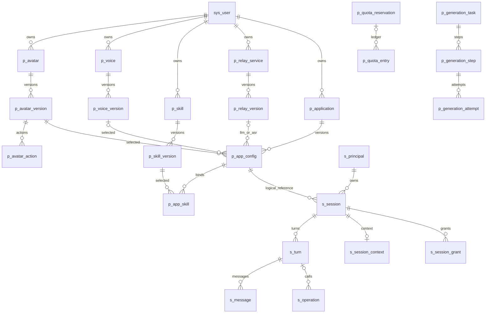

# LN 虚拟人开放平台数据库设计说明书

**版本：V0.2 · 设计稿（文档一致性修订）**  
**日期：2026-09-09**  
**依据：项目需求说明书 V1.3、项目架构说明书 V1.4、接口设计说明书01 V0.2、当前若依 Cloud springboot3 源码。**

本稿由已经确认的业务行为推导数据实体、字段、索引及一致性规则。2026-09-09 V0.2 按负责人认可的一致性修订同步核心接口：补充调试授权来源、会话 HTTP 幂等与三类运行状态，统一摘要及留存规则。本轮文档修订未执行数据库迁移、导入种子数据或访问云数据库；仓库已有的迁移与实际环境状态须分别核对。

2026-09-24 开发者接入修订：平台不再保存聊天正文、跨轮业务 Context 或提供旧 Session 恢复；多轮记忆由开发者 Relay 负责。V1 已有的 `s_message`、`s_session_context` 结构保留以免改历史迁移，新 BUSINESS 路径不使用。每轮创建时写一条不含正文的 `s_turn` 摘要，每次外部调用提交前写独立操作/调用事实，随后修正状态；脱敏轮次、操作、`p_call_record`、`p_usage_daily`、Avatar 任务/步骤/厂商尝试及 Webhook 投递/尝试记录长期保留，不等 Session 结束才记录，也不按固定期限删除。Application 必选平台官方 Voice/TTS，不允许开发者自有 TTS；每应用一把 Secret、15 分钟浏览器授权和管理员禁用的区别见[接口草案](docs/superpowers/specs/developer-integration-interface-contract.md)。这些是目标设计，仍需追加迁移及清理逻辑修改。

## 1. 设计结论与范围

- 同一 MySQL 实例使用 `platform_db` 和 `session_db`；平台服务、会话服务分别拥有本库业务表写权限；保留的 ruoyi-job 只写框架 sys_job/sys_job_log（未来启用 JDBC Quartz 时增加其调度表权限）。auth-service通过平台账号接口访问；Python通过平台内部接口领取任务和回传结果。
- 复用若依 **10张核心系统表**，新增 **48张表：平台库35张、会话库13张**。这是完整第一版的逻辑设计，不要求一次实现全部模块。
- 其中6张新增表是两库分别使用的Outbox、Inbox和扫描租约表，不新增服务。Nacos/Flyway内部表不计入业务设计。
- `Account = sys_user.user_id`；一个开发者账号就是一个隔离边界，无独立团队、组织租户和第二份用户表。业务最终用户另用应用内身份映射，不注册为sys_user。
- Avatar、Voice、Skill、Relay各自管理；发布内容不可变，Application引用明确版本，Session固定Application配置版本。
- 当前状态及实时授权单独查询；旧版本不能恢复已停用账号、凭证、转接能力或紧急停用资产。
- 不建立开发者厂商Key表、截图正文表、DOM表、长期记忆表、向量表、充值订单表或每帧一行的动画表。

### 1.1 输入与实际源码

| 输入 | 使用内容 |
|---|---|
| [项目需求说明书](项目需求说明书.md) | 账号、三层凭证、资产版本、转接、Skills、Session、Context、额度与留存 |
| [项目架构说明书](项目架构说明书.md) | 分库归属、Outbox、租约、持久撤销、引用预留、清理与对象存储 |
| [若依初始化SQL](RuoYi-Cloud/sql/ry_20260417.sql) | sys_*实际字段及关联，不重新发明后台用户权限 |
| [开源复用清单](docs/opensource-reuse.md) | 开源语音/媒体逻辑不会额外生成一套业务数据库 |
| [结构化字段字典](docs/database/schema-draft.json) | 本稿48张新增表、716个字段的唯一键和索引机器可读记录 |

### 1.2 三种组织方式与本稿选择

| 方式 | 适用性 |
|---|---|
| 全部配置一张大JSON表 | 初期快，但版本依赖、归属检查、删除引用、检索及唯一约束难保证 |
| 每个配置字段都拆关联表 | 可约束，但首版维护成本高，动作帧、模型参数和权限选择器会产生大量机械表 |
| **实体与版本关系规范化，参数使用受约束JSON** | 本稿采用；主键、归属、状态和被引用版本独立列，schema/模型参数/manifest布局使用JSON |

## 2. 通用字段、类型与约束约定

1. 新表默认InnoDB、utf8mb4。业务ID、外部用户标识、事件ID和幂等键按大小写敏感比较；展示名称可使用普通文本排序规则。具体MySQL小版本在工程版本冻结时确定。
2. 新表主键统一 `id BIGINT` 正整数，由Java平台/会话服务生成；API以字符串返回避免JavaScript整数精度损失。若依sys_*继续使用原主键名称与生成策略。无需让Python生成或直写数据库ID。
3. 新表均有 `created_at DATETIME(3)`、`updated_at DATETIME(3)`，UTC保存，由服务或统一数据库策略写入。**字段字典标“可空=否”表示必须写值；除明确写出默认值者，不默认为空字符串、0或空JSON。**
4. `account_id` 为真实归属账号，私有业务查询必带账号范围；官方资源也有管理账号，并明确 `visibility=OFFICIAL`。引用官方资源时引用者账号与资源管理者账号可以不同，必须验证发布状态及公开可引用性。
5. `revision/auth_epoch/lease_epoch` 为不同概念：编辑并发版本、授权撤销版本、执行租约代数，不能互换。
6. 金额 `DECIMAL(18,6)` 加币种；次数、字符、字节及Token计数用BIGINT。未知用量/成本为NULL，不用0伪装已知。管理员赠送额度与上游人民币成本分开。
7. 枚举使用短VARCHAR便于迁移，由服务白名单及支持的数据库CHECK落实；布尔仅0/1，计数与大小非负，fps/尺寸/超时必须大于0。
8. 外部URL最大2048字符，object_key是平台生成ASCII键，绝不保存会过期签名URL作永久地址。对象键与bucket联合唯一；DDL阶段显式采用适当ASCII列定义以控制索引长度。
9. 状态可变，发布版本内容不可变；所有“主表.current_version_id”必须确实属于该主表。删除是明确生命周期状态，不一律加入del_flag，也不使用“名称+删除标记”充当唯一业务键。
10. 新增表PK均为id。字典列出的UQ为唯一约束，IDX为查询索引；这些是初始索引设计，后续以实际分页/执行计划验证。新表不用缺少账号条件的通用CRUD接口。
11. 同库强父子关系建议显式外键RESTRICT，见第8节；跨库、多态引用及需要独立过期的操作ID只用逻辑关联。外键不能代替账号归属校验，避免CASCADE静默删除在用数据。
12. JSON必须有版本化schema与大小限制。任何通用parameters、payload、result_summary或日志字段都不得夹带厂商Key、短期业务凭证、截图、DOM、工具原结果。

## 3. 核心关系图

图中是逻辑关系，跨库线条不代表物理外键；可靠性技术表未全部展示。

## 4. 若依复用及改造

### 4.1 直接沿用的10张核心表

| 表 | 用途 | 本项目调整 |
|---|---|---|
| sys_user | 开发者/管理员账号 | 邮箱注册登录、验证状态、持久撤销版本；Account就是user_id |
| sys_role | 角色 | 管理员、开发者两类初始角色；不按部门划分开发者数据权限 |
| sys_menu | 菜单及按钮权限 | 替换为Avatar、应用、会话等菜单；后端仍独立鉴权 |
| sys_user_role | 用户角色关联 | 复用联合主键 |
| sys_role_menu | 角色菜单关联 | 复用联合主键 |
| sys_dict_type | 字典类型 | 可维护状态展示文案；不让随意编辑字典改变状态机 |
| sys_dict_data | 字典条目 | 可提供动作/状态显示，业务枚举仍代码校验 |
| sys_config | 非秘密配置 | 通用平台参数；禁止放任何Key及业务用户数据 |
| sys_oper_log | 后台操作审计 | 只记标识、动作、状态；禁用通用请求/响应正文采集 |
| sys_logininfor | 平台登录记录 | 限管理员审计，30天清理 |

当前上游还含sys_dept、sys_post、sys_role_dept、sys_user_post；为减少若依Mapper/登录兼容改动，可以先保留空表或最小技术记录，隐藏业务菜单，不开放组织/岗位产品能力。需要先检查并裁剪引用，不能直接删表。2026-09-11 已确认保留 ruoyi-job，sys_job/sys_job_log 属于运行必需的框架表，不计入新增48张业务表。Quartz SQL保留；本轮仍沿用内存调度器，不自动初始化Quartz JDBC表。Seata、公告不进入正式运行基线；代码生成表仅在工具库按需保留。组织兼容表本轮不删除，旧库也未执行删表。

### 4.2 sys_user改造字段

下面是目标改造，覆盖附录中的上游原类型；其余字段保留以兼容若依。

| 字段 | 目标类型 | 可空/默认 | 说明 |
|---|---|---|---|
| email | varchar(254) | 否 | 注册邮箱原展示值；上游50字符扩展 |
| email_normalized | varchar(254) | 否，UQ | 平台统一规范化值，用于邮箱登录和唯一性；不做特定邮箱厂商的去点/别名合并 |
| email_verified_at | datetime(3) | 可空 | 邮箱验证完成时间 |
| auth_epoch | bigint | 否，默认1 | 账号停用、密码重置、全局撤销时递增 |
| avatar_file_id | bigint | 可空 | 平台账号头像对象引用；与虚拟人Avatar概念区分，若不开头像上传可留空 |
| user_name | varchar(30) | 否，UQ | 若依内部稳定账号名；邮箱登录不把254字符邮箱硬塞入此字段 |
| password | varchar(100) | 否 | 保留若依密码哈希格式，不存明文 |
| status/del_flag | char(1) | 沿用若依编码 | 不套用新业务表的大写状态值 |

正式账号头像的p_file.purpose增加ACCOUNT_ICON，不与Avatar资产混用。当前裁剪阶段账号头像临时沿用sys_user.avatar存COS对象键；avatar_file_id及p_file仍为待实施设计，不能宣称文件账本已完成。迁移已有数据需先处理空/重复邮箱；不直接给上游示例账号编造已验证邮箱。删除账号后不自动释放邮箱注册名，重新注册策略不在第一版额外扩展。

建议补充唯一性：sys_role.role_key、sys_dict_type.dict_type、sys_config.config_key，以及sys_dict_data(dict_type,dict_value)。先检查现有数据再加唯一索引。sys_oper_log按oper_time、sys_logininfor按login_time建立清理索引。

### 4.3 上游字段完整附录

以下逐字段从已拉取的 `ry_20260417.sql` 提取，只列结构，不带初始密码或示例数据。字段默认与类型是上游原样；最终以4.2的项目改造覆盖。

#### sys_user

| 字段 | 上游类型 | 可空 | 上游默认 | 说明 |
|---|---|---|---|---|
| user_id | bigint(20) | 否 | — | 用户ID |
| dept_id | bigint(20) | 是 | null | 部门ID |
| user_name | varchar(30) | 否 | — | 用户账号 |
| nick_name | varchar(30) | 否 | — | 用户昵称 |
| user_type | varchar(2) | 是 | '00' | 用户类型（00系统用户） |
| email | varchar(50) | 是 | '' | 用户邮箱 |
| phonenumber | varchar(11) | 是 | '' | 手机号码 |
| sex | char(1) | 是 | '0' | 用户性别（0男 1女 2未知） |
| avatar | varchar(100) | 是 | '' | 头像地址 |
| password | varchar(100) | 是 | '' | 密码 |
| status | char(1) | 是 | '0' | 账号状态（0正常 1停用） |
| del_flag | char(1) | 是 | '0' | 删除标志（0代表存在 2代表删除） |
| login_ip | varchar(128) | 是 | '' | 最后登录IP |
| login_date | datetime | 是 | — | 最后登录时间 |
| pwd_update_date | datetime | 是 | — | 密码最后更新时间 |
| create_by | varchar(64) | 是 | '' | 创建者 |
| create_time | datetime | 是 | — | 创建时间 |
| update_by | varchar(64) | 是 | '' | 更新者 |
| update_time | datetime | 是 | — | 更新时间 |
| remark | varchar(500) | 是 | null | 备注 |

#### sys_role

| 字段 | 上游类型 | 可空 | 上游默认 | 说明 |
|---|---|---|---|---|
| role_id | bigint(20) | 否 | — | 角色ID |
| role_name | varchar(30) | 否 | — | 角色名称 |
| role_key | varchar(100) | 否 | — | 角色权限字符串 |
| role_sort | int(4) | 否 | — | 显示顺序 |
| data_scope | char(1) | 是 | '1' | 数据范围（1：全部数据权限 2：自定数据权限 3：本部门数据权限 4：本部门及以下数据权限） |
| menu_check_strictly | tinyint(1) | 是 | 1 | 菜单树选择项是否关联显示 |
| dept_check_strictly | tinyint(1) | 是 | 1 | 部门树选择项是否关联显示 |
| status | char(1) | 否 | — | 角色状态（0正常 1停用） |
| del_flag | char(1) | 是 | '0' | 删除标志（0代表存在 2代表删除） |
| create_by | varchar(64) | 是 | '' | 创建者 |
| create_time | datetime | 是 | — | 创建时间 |
| update_by | varchar(64) | 是 | '' | 更新者 |
| update_time | datetime | 是 | — | 更新时间 |
| remark | varchar(500) | 是 | null | 备注 |

#### sys_menu

| 字段 | 上游类型 | 可空 | 上游默认 | 说明 |
|---|---|---|---|---|
| menu_id | bigint(20) | 否 | — | 菜单ID |
| menu_name | varchar(50) | 否 | — | 菜单名称 |
| parent_id | bigint(20) | 是 | 0 | 父菜单ID |
| order_num | int(4) | 是 | 0 | 显示顺序 |
| path | varchar(200) | 是 | '' | 路由地址 |
| component | varchar(255) | 是 | null | 组件路径 |
| query | varchar(255) | 是 | null | 路由参数 |
| route_name | varchar(50) | 是 | '' | 路由名称 |
| is_frame | int(1) | 是 | 1 | 是否为外链（0是 1否） |
| is_cache | int(1) | 是 | 0 | 是否缓存（0缓存 1不缓存） |
| menu_type | char(1) | 是 | '' | 菜单类型（M目录 C菜单 F按钮） |
| visible | char(1) | 是 | 0 | 菜单状态（0显示 1隐藏） |
| status | char(1) | 是 | 0 | 菜单状态（0正常 1停用） |
| perms | varchar(100) | 是 | null | 权限标识 |
| icon | varchar(100) | 是 | '#' | 菜单图标 |
| create_by | varchar(64) | 是 | '' | 创建者 |
| create_time | datetime | 是 | — | 创建时间 |
| update_by | varchar(64) | 是 | '' | 更新者 |
| update_time | datetime | 是 | — | 更新时间 |
| remark | varchar(500) | 是 | '' | 备注 |

#### sys_user_role

| 字段 | 上游类型 | 可空 | 上游默认 | 说明 |
|---|---|---|---|---|
| user_id | bigint(20) | 否 | — | 用户ID |
| role_id | bigint(20) | 否 | — | 角色ID |

#### sys_role_menu

| 字段 | 上游类型 | 可空 | 上游默认 | 说明 |
|---|---|---|---|---|
| role_id | bigint(20) | 否 | — | 角色ID |
| menu_id | bigint(20) | 否 | — | 菜单ID |

#### sys_oper_log

| 字段 | 上游类型 | 可空 | 上游默认 | 说明 |
|---|---|---|---|---|
| oper_id | bigint(20) | 否 | — | 日志主键 |
| title | varchar(50) | 是 | '' | 模块标题 |
| business_type | int(2) | 是 | 0 | 业务类型（0其它 1新增 2修改 3删除） |
| method | varchar(200) | 是 | '' | 方法名称 |
| request_method | varchar(10) | 是 | '' | 请求方式 |
| operator_type | int(1) | 是 | 0 | 操作类别（0其它 1后台用户 2手机端用户） |
| oper_name | varchar(50) | 是 | '' | 操作人员 |
| dept_name | varchar(50) | 是 | '' | 部门名称 |
| oper_url | varchar(255) | 是 | '' | 请求URL |
| oper_ip | varchar(128) | 是 | '' | 主机地址 |
| oper_location | varchar(255) | 是 | '' | 操作地点 |
| oper_param | varchar(2000) | 是 | '' | 请求参数 |
| json_result | varchar(2000) | 是 | '' | 返回参数 |
| status | int(1) | 是 | 0 | 操作状态（0正常 1异常） |
| error_msg | varchar(2000) | 是 | '' | 错误消息 |
| oper_time | datetime | 是 | — | 操作时间 |
| cost_time | bigint(20) | 是 | 0 | 消耗时间 |

#### sys_dict_type

| 字段 | 上游类型 | 可空 | 上游默认 | 说明 |
|---|---|---|---|---|
| dict_id | bigint(20) | 否 | — | 字典主键 |
| dict_name | varchar(100) | 是 | '' | 字典名称 |
| dict_type | varchar(100) | 是 | '' | 字典类型 |
| status | char(1) | 是 | '0' | 状态（0正常 1停用） |
| create_by | varchar(64) | 是 | '' | 创建者 |
| create_time | datetime | 是 | — | 创建时间 |
| update_by | varchar(64) | 是 | '' | 更新者 |
| update_time | datetime | 是 | — | 更新时间 |
| remark | varchar(500) | 是 | null | 备注 |

#### sys_dict_data

| 字段 | 上游类型 | 可空 | 上游默认 | 说明 |
|---|---|---|---|---|
| dict_code | bigint(20) | 否 | — | 字典编码 |
| dict_sort | int(4) | 是 | 0 | 字典排序 |
| dict_label | varchar(100) | 是 | '' | 字典标签 |
| dict_value | varchar(100) | 是 | '' | 字典键值 |
| dict_type | varchar(100) | 是 | '' | 字典类型 |
| css_class | varchar(100) | 是 | null | 样式属性（其他样式扩展） |
| list_class | varchar(100) | 是 | null | 表格回显样式 |
| is_default | char(1) | 是 | 'N' | 是否默认（Y是 N否） |
| status | char(1) | 是 | '0' | 状态（0正常 1停用） |
| create_by | varchar(64) | 是 | '' | 创建者 |
| create_time | datetime | 是 | — | 创建时间 |
| update_by | varchar(64) | 是 | '' | 更新者 |
| update_time | datetime | 是 | — | 更新时间 |
| remark | varchar(500) | 是 | null | 备注 |

#### sys_config

| 字段 | 上游类型 | 可空 | 上游默认 | 说明 |
|---|---|---|---|---|
| config_id | int(5) | 否 | — | 参数主键 |
| config_name | varchar(100) | 是 | '' | 参数名称 |
| config_key | varchar(100) | 是 | '' | 参数键名 |
| config_value | varchar(500) | 是 | '' | 参数键值 |
| config_type | char(1) | 是 | 'N' | 系统内置（Y是 N否） |
| create_by | varchar(64) | 是 | '' | 创建者 |
| create_time | datetime | 是 | — | 创建时间 |
| update_by | varchar(64) | 是 | '' | 更新者 |
| update_time | datetime | 是 | — | 更新时间 |
| remark | varchar(500) | 是 | null | 备注 |

#### sys_logininfor

| 字段 | 上游类型 | 可空 | 上游默认 | 说明 |
|---|---|---|---|---|
| info_id | bigint(20) | 否 | — | 访问ID |
| user_name | varchar(50) | 是 | '' | 用户账号 |
| ipaddr | varchar(128) | 是 | '' | 登录IP地址 |
| status | char(1) | 是 | '0' | 登录状态（0成功 1失败） |
| msg | varchar(255) | 是 | '' | 提示信息 |
| access_time | datetime | 是 | — | 访问时间 |

## 5. 新增表总览

| 数据库 | 模块 | 表 | 职责 |
|---|---|---|---|
| platform_db | 账号与接入 | p_email_token | 邮箱验证与密码重置 |
| platform_db | 账号与接入 | p_access_key | 管理Key与Application Secret |
| platform_db | 账号与接入 | p_secret | 平台需可解密的秘密 |
| platform_db | 账号与接入 | p_official_service | 官方生成及TTS服务 |
| platform_db | 转接、Voice与Skill | p_relay_service | 开发者转接服务 |
| platform_db | 转接、Voice与Skill | p_relay_version | 转接配置版本 |
| platform_db | 转接、Voice与Skill | p_relay_grant | 转接服务对应用授权 |
| platform_db | 资产与版本 | p_avatar | Avatar主表 |
| platform_db | 资产与版本 | p_avatar_version | Avatar不可变版本 |
| platform_db | 资产与版本 | p_avatar_action | 版本内动作 |
| platform_db | 资产与版本 | p_voice | Voice主表 |
| platform_db | 资产与版本 | p_voice_version | Voice配置版本 |
| platform_db | 资产与版本 | p_skill | Skill主表 |
| platform_db | 资产与版本 | p_skill_version | Prompt或Tool版本 |
| platform_db | 应用与引用 | p_application | Application与当前授权 |
| platform_db | 应用与引用 | p_app_config | Application不可变配置 |
| platform_db | 应用与引用 | p_app_skill | 配置绑定Skill及顺序 |
| platform_db | 应用与引用 | p_resource_reference | 资产绑定与跨库引用预留 |
| platform_db | 文件与生成任务 | p_file | 长期资产与上传元数据 |
| platform_db | 文件与生成任务 | p_generation_task | 一次完整制作任务 |
| platform_db | 文件与生成任务 | p_generation_step | 制作步骤及Worker租约 |
| platform_db | 文件与生成任务 | p_generation_attempt | 实际API尝试与核对 |
| platform_db | 额度与用量 | p_account_limit | 账号运行上限 |
| platform_db | 额度与用量 | p_quota_balance | 账号分类额度余额 |
| platform_db | 额度与用量 | p_quota_reservation | 额度预占与结算 |
| platform_db | 额度与用量 | p_quota_entry | 额度不可变流水 |
| platform_db | 额度与用量 | p_call_record | 调用用量及厂商成本 |
| platform_db | 额度与用量 | p_usage_daily | 每日汇总用量 |
| platform_db | 通知与可靠性 | p_webhook_endpoint | 账号生成通知配置 |
| platform_db | 通知与可靠性 | p_webhook_delivery | 事件及投递状态 |
| platform_db | 通知与可靠性 | p_webhook_attempt | Webhook逐次投递记录 |
| platform_db | 通知与可靠性 | p_api_idempotency | 管理API幂等结果 |
| session_db | 会话身份 | s_principal | 应用业务身份与持久撤销版本 |
| session_db | 会话身份 | s_session | 当前运行 Session 归属与到期；结束后不恢复 |
| session_db | 会话身份 | s_session_grant | 短期Session授权 |
| session_db | 会话可靠性 | s_api_idempotency | 会话HTTP API幂等结果 |
| session_db | 运行记录 | s_turn | 每轮一条不含正文的运行摘要 |
| session_db | 预留兼容表 | s_message | 旧对话文本结构；新 BUSINESS 接入不写入、不读取 |
| session_db | 预留兼容表 | s_session_context | 旧 Session Context 结构；新 BUSINESS 接入不写入、不读取 |
| session_db | 消息与运行记录 | s_operation | 本轮外部操作及分段状态 |
| session_db | 会话清理 | s_temp_object | 临时对象清理登记 |
| session_db | 会话清理 | s_cleanup_job | 会话删除与引用释放任务 |
| platform_db | 可靠性基础表 | p_outbox | 本地事务事件发件箱 |
| platform_db | 可靠性基础表 | p_inbox | 消费事件去重 |
| platform_db | 可靠性基础表 | p_job_lease | 持久扫描任务租约 |
| session_db | 可靠性基础表 | s_outbox | 本地事务事件发件箱 |
| session_db | 可靠性基础表 | s_inbox | 消费事件去重 |
| session_db | 可靠性基础表 | s_job_lease | 持久扫描任务租约 |

## 6. 平台库字段字典

### 6.1 p_email_token — 邮箱验证与密码重置

| 字段 | 类型 | 可空 | 含义及默认值 |
|---|---|---|---|
| id | bigint | 否 | 主键，服务生成的正整数 ID |
| created_at | datetime(3) | 否 | 创建时间，UTC |
| updated_at | datetime(3) | 否 | 更新时间，UTC |
| user_id | bigint | 是 | 关联sys_user.user_id；注册前允许为空 |
| email | varchar(254) | 否 | 规范化邮箱 |
| purpose | varchar(24) | 否 | VERIFY_EMAIL/RESET_PASSWORD |
| token_hash | binary(32) | 否 | 一次性随机令牌摘要，不存明文验证码 |
| expires_at | datetime(3) | 否 | 到期时间 |
| consumed_at | datetime(3) | 是 | 成功消费时间 |
| failed_attempts | int | 否 | 默认0；失败尝试次数 |

主键：id。唯一约束：UQ(token_hash)。

查询索引：IDX(email, purpose, created_at)；IDX(expires_at)。

规则：校验、消费和改密码在平台库事务中完成；密码重置递增账号 auth_epoch。到期后清理；邮件发送限流在Redis。

### 6.2 p_access_key — 管理Key与Application Secret

| 字段 | 类型 | 可空 | 含义及默认值 |
|---|---|---|---|
| id | bigint | 否 | 主键，服务生成的正整数 ID |
| created_at | datetime(3) | 否 | 创建时间，UTC |
| updated_at | datetime(3) | 否 | 更新时间，UTC |
| account_id | bigint | 否 | sys_user.user_id |
| application_id | bigint | 是 | APPLICATION类型必填，MANAGEMENT类型为空 |
| key_type | varchar(24) | 否 | MANAGEMENT/APPLICATION |
| name | varchar(100) | 否 | 凭证显示名称 |
| public_id | varchar(48) | 否 | 对外可见且全局唯一的凭证标识 |
| secret_hash | binary(32) | 否 | 高熵Secret摘要或带服务端pepper的摘要 |
| hash_key_version | varchar(32) | 否 | 摘要方案/pepper版本 |
| display_suffix | varchar(8) | 否 | 脱敏显示后缀 |
| scopes | json | 否 | 本Key接入权限词表；APPLICATION存sessions:*，不存S运行权限 |
| status | varchar(20) | 否 | ACTIVE/DISABLED/DELETED |
| expires_at | datetime(3) | 是 | 可选有效期 |
| revoked_at | datetime(3) | 是 | 撤销时间 |
| last_used_at | datetime(3) | 是 | 最近使用，异步合并更新 |
| auth_epoch | bigint | 否 | 默认1；重置/停用/撤销 Key 时递增；只限制该 Key 后续请求，普通 Secret 重置不追溯撤销既有浏览器授权 |

主键：id。现有唯一约束：UQ(public_id)。开发者接入增量迁移增加仅对 APPLICATION 且 ACTIVE 生效的应用级唯一约束，可用持久生成列 `active_application_id=CASE WHEN key_type='APPLICATION' AND status='ACTIVE' THEN application_id ELSE NULL END` 与 UQ(active_application_id) 表达；迁移前先核对并处理存量重复。应用行锁串行化重置，数据库唯一键兜底并发；MANAGEMENT 可多把，不受此约束。

查询索引：IDX(account_id, key_type, status)；IDX(application_id, status)。

规则：原始Secret仅创建时展示。旧 Key 的审计/关联墓碑至少保留至相关短期 Token 全部到期；不存Session Token于此表。APPLICATION 签发浏览器授权前校验 `sessions:grant`、归属和状态；重置旧 Secret 后新后端请求立即拒绝，已签发浏览器 grant 不因此提前撤销。S 范围由请求运行 Scope、Session 配置和当前授权共同限制，不与本列直接求交集，不增设 Key 可下放运行权限配置。

DEV-01 增量迁移 `V17__developer_access_keys.sql` 另建长期保留的 `p_access_key_audit`：`id`、`created_at`、`account_id`、`key_id`、`actor_type`（CONSOLE/MANAGEMENT）、可空 `actor_key_id`、`action`（ACTIVE/DISABLED/DELETED）。与 Key 状态及 Outbox 在同一事务写入，不记录明文或摘要。应用级有效 Secret 唯一性由 `active_application_id` 生成列及唯一键兜底；`p_application.admin_disabled` 与开发者可编辑的 `status` 独立。

### 6.3 p_secret — 平台需可解密的秘密

| 字段 | 类型 | 可空 | 含义及默认值 |
|---|---|---|---|
| id | bigint | 否 | 主键，服务生成的正整数 ID |
| created_at | datetime(3) | 否 | 创建时间，UTC |
| updated_at | datetime(3) | 否 | 更新时间，UTC |
| account_id | bigint | 否 | 管理该秘密的账号；官方秘密由管理员账号管理 |
| purpose | varchar(24) | 否 | OFFICIAL_PROVIDER/RELAY_ACCESS/TOOL_ACCESS/WEBHOOK_SIGN |
| name | varchar(100) | 否 | 显示名称 |
| ciphertext | mediumblob | 否 | 经审核加密库输出的密文 |
| nonce | varbinary(32) | 否 | 随机nonce/IV |
| auth_tag | varbinary(32) | 否 | AEAD认证标签 |
| key_version | varchar(32) | 否 | 部署主密钥版本 |
| algorithm | varchar(32) | 否 | 受支持算法标识 |
| display_suffix | varchar(8) | 是 | 脱敏后缀 |
| status | varchar(20) | 否 | ACTIVE/DISABLED/DELETED |
| revision | bigint | 否 | 默认1；原子轮换序号 |
| expires_at | datetime(3) | 是 | 有效期 |

主键：id。无额外唯一键。

查询索引：IDX(account_id, purpose, status)。

规则：只允许列出的用途，禁止开发者厂商Key。轮换更新同一逻辑id，历史配置引用id而不复制旧秘密；主密钥不入库。Tool/Relay秘密必须同账号，官方秘密仅内部服务可取。

### 6.4 p_official_service — 官方生成及TTS服务

| 字段 | 类型 | 可空 | 含义及默认值 |
|---|---|---|---|
| id | bigint | 否 | 主键，服务生成的正整数 ID |
| created_at | datetime(3) | 否 | 创建时间，UTC |
| updated_at | datetime(3) | 否 | 更新时间，UTC |
| account_id | bigint | 否 | 管理员账号 |
| name | varchar(100) | 否 | 服务显示名称 |
| capability | varchar(20) | 否 | AVATAR_GENERATION/TTS |
| provider_code | varchar(64) | 否 | 厂商适配器标识 |
| endpoint | varchar(2048) | 否 | 固定官方API地址 |
| model_id | varchar(128) | 否 | 显式模型版本 |
| secret_id | bigint | 否 | p_secret.id |
| parameters | json | 否 | 非秘密参数，按能力白名单校验 |
| status | varchar(20) | 否 | ACTIVE/DISABLED |
| revision | bigint | 否 | 默认1；服务配置修订号 |

主键：id。无额外唯一键。

查询索引：IDX(capability, status)。

规则：允许同厂商多条配置，每个任务/Voice显式指定，不自动路由或换Key。任务和Voice版本保存非秘密快照；紧急停用检查当前本表。

### 6.5 p_relay_service — 开发者转接服务

| 字段 | 类型 | 可空 | 含义及默认值 |
|---|---|---|---|
| id | bigint | 否 | 主键，服务生成的正整数 ID |
| created_at | datetime(3) | 否 | 创建时间，UTC |
| updated_at | datetime(3) | 否 | 更新时间，UTC |
| account_id | bigint | 否 | 所属开发者 |
| name | varchar(100) | 否 | 名称 |
| description | varchar(500) | 是 | 描述 |
| status | varchar(20) | 否 | ACTIVE/DISABLED/DELETING/DELETED |
| admin_disabled | tinyint | 否 | 增量迁移新增，默认0；仅平台管理员可改，1时禁止新 Session、Secret 重置及禁用后新发起的运行命令/外部副作用，不强断既有连接 |
| current_version_id | bigint | 是 | 已发布转接版本 |
| access_secret_id | bigint | 否 | p_secret.id；转接Bearer访问凭证 |
| grant_mode | varchar(20) | 否 | ALL_ACCOUNT_APPS/EXPLICIT_APPS |
| auth_epoch | bigint | 否 | 默认1；停用或授权变化递增 |
| last_test_at | datetime(3) | 是 | 最近测试时间 |
| last_test_status | varchar(20) | 是 | SUCCESS/FAILED |
| last_test_error | varchar(64) | 是 | 安全错误码 |
| last_test_version_id | bigint | 是 | 最近无计费能力探测对应的准确版本；V19 新增 |

主键：id。无额外唯一键。

查询索引：IDX(account_id, status)。

规则：接入秘密通过本表动态引用；旧版本不保存其副本。停用立即作用于旧Session。

### 6.6 p_relay_version — 转接配置版本

| 字段 | 类型 | 可空 | 含义及默认值 |
|---|---|---|---|
| id | bigint | 否 | 主键，服务生成的正整数 ID |
| created_at | datetime(3) | 否 | 创建时间，UTC |
| updated_at | datetime(3) | 否 | 更新时间，UTC |
| account_id | bigint | 否 | 所属开发者 |
| relay_service_id | bigint | 否 | p_relay_service.id |
| version_no | int | 否 | 从1递增 |
| base_url | varchar(2048) | 否 | 开发者后端HTTPS地址 |
| protocol_version | varchar(32) | 否 | 平台转接协议版本 |
| capabilities | json | 否 | llm/asr/tts及image/tool/cancel能力声明 |
| endpoints | json | 否 | 各能力相对路径，模型不可改写 |
| timeout_ms | int | 否 | 总调用超时，大于0 |
| max_response_bytes | bigint | 否 | 响应上限，大于0 |
| config_hash | binary(32) | 否 | 规范化非秘密配置摘要 |
| created_by | bigint | 否 | 版本创建者sys_user.user_id |

主键：id。唯一约束：UQ(relay_service_id, version_no)。

查询索引：IDX(account_id, relay_service_id)。

规则：发布后不可变；声明能力不等于实际厂商能力已验证。网络目标仍执行服务端访问范围检查。

### 6.7 p_relay_grant — 转接服务对应用授权

| 字段 | 类型 | 可空 | 含义及默认值 |
|---|---|---|---|
| id | bigint | 否 | 主键，服务生成的正整数 ID |
| created_at | datetime(3) | 否 | 创建时间，UTC |
| updated_at | datetime(3) | 否 | 更新时间，UTC |
| account_id | bigint | 否 | 所属开发者 |
| relay_service_id | bigint | 否 | p_relay_service.id |
| application_id | bigint | 否 | p_application.id |
| scopes | json | 否 | LLM/ASR/TTS允许能力 |
| status | varchar(20) | 否 | ACTIVE/REVOKED |

主键：id。唯一约束：UQ(relay_service_id, application_id)。

查询索引：IDX(account_id, application_id)。

规则：EXPLICIT_APPS模式查询本表；缺记录拒绝。授权变更同时递增转接auth_epoch。

### 6.8 p_avatar — Avatar主表

| 字段 | 类型 | 可空 | 含义及默认值 |
|---|---|---|---|
| id | bigint | 否 | 主键，服务生成的正整数 ID |
| created_at | datetime(3) | 否 | 创建时间，UTC |
| updated_at | datetime(3) | 否 | 更新时间，UTC |
| account_id | bigint | 否 | 私有归属账号；官方资源的管理账号 |
| visibility | varchar(16) | 否 | PRIVATE/OFFICIAL；不得仅以account_id为空判断公开 |
| name | varchar(100) | 否 | 名称 |
| description | varchar(1000) | 是 | 描述 |
| status | varchar(20) | 否 | DRAFT/PUBLISHED/UNLISTED/DISABLED/DELETING/DELETED |
| current_version_id | bigint | 是 | 最新发布版本 |
| revision | bigint | 否 | 默认1；乐观锁与实时状态修订 |
| deleted_at | datetime(3) | 是 | 删除完成时间 |

主键：id。无额外唯一键。

查询索引：IDX(account_id, status, created_at)；IDX(visibility, status, created_at)。

规则：同名允许，以ID识别。普通下架只限制新绑定，停用立即阻止旧引用使用；官方资源不可复制后修改。

### 6.9 p_avatar_version — Avatar不可变版本

| 字段 | 类型 | 可空 | 含义及默认值 |
|---|---|---|---|
| id | bigint | 否 | 主键，服务生成的正整数 ID |
| created_at | datetime(3) | 否 | 创建时间，UTC |
| updated_at | datetime(3) | 否 | 更新时间，UTC |
| account_id | bigint | 否 | Avatar管理账号 |
| avatar_id | bigint | 否 | p_avatar.id |
| version_no | int | 否 | 从1递增 |
| status | varchar(20) | 否 | BUILDING/REVIEW/PUBLISHED/REJECTED/DELETING/DELETED |
| source_type | varchar(20) | 否 | 新写入使用 IMAGE/OFFICIAL_UPLOAD；VIDEO 为早期表结构保留枚举，视频制作需求已废弃 |
| source_file_id | bigint | 是 | 原始文件，允许用户独立删除 |
| base_file_id | bigint | 是 | 生成基准图 |
| manifest_file_id | bigint | 是 | 包manifest |
| preview_file_id | bigint | 是 | 预览图或动画 |
| frame_width | int | 是 | 单帧宽度，发布时必填 |
| frame_height | int | 是 | 单帧高度，发布时必填 |
| anchor_x | decimal(8,6) | 是 | 归一化脚底锚点X，0到1 |
| anchor_y | decimal(8,6) | 是 | 归一化脚底锚点Y，0到1 |
| manifest_schema | varchar(32) | 是 | 包协议版本 |
| pipeline_version | varchar(64) | 否 | 制作流水线版本 |
| generation_recipe | json | 否 | 非秘密模型/参数/提示词版本/参考哈希，长期保留 |
| capabilities | json | 否 | 实际动作及基础speaking声明 |
| qa_report | json | 否 | 结构化几何与人工检查结论，不存素材内容 |
| accepted_by | bigint | 是 | 验收者sys_user.user_id |
| accepted_at | datetime(3) | 是 | 人工验收时间 |
| published_at | datetime(3) | 是 | 发布时间 |
| created_by | bigint | 否 | 版本创建者sys_user.user_id |

主键：id。唯一约束：UQ(avatar_id, version_no)。

查询索引：IDX(account_id, avatar_id, status)。

规则：发布检查八动作齐备、有效文件和QA通过。发布后生成数据不可改；长期任务记录与 recipe、版本元数据分别保存，临时素材清理不能破坏已发布包读取。source_file_id失效只影响再生成。

### 6.10 p_avatar_action — 版本内动作

| 字段 | 类型 | 可空 | 含义及默认值 |
|---|---|---|---|
| id | bigint | 否 | 主键，服务生成的正整数 ID |
| created_at | datetime(3) | 否 | 创建时间，UTC |
| updated_at | datetime(3) | 否 | 更新时间，UTC |
| account_id | bigint | 否 | Avatar管理账号 |
| avatar_version_id | bigint | 否 | p_avatar_version.id |
| action_code | varchar(24) | 否 | 八项固定枚举 |
| atlas_file_id | bigint | 否 | 动作图集对象 |
| preview_file_id | bigint | 是 | 动作预览 |
| frame_count | int | 否 | 正整数；不写死为6 |
| fps | decimal(6,2) | 否 | 正数；实际验证规格 |
| loop_enabled | tinyint | 否 | 默认0；是否循环 |
| frame_layout | json | 否 | 帧坐标/时长/布局；不放图像二进制 |
| content_hash | binary(32) | 否 | 图集或动作manifest摘要 |

主键：id。唯一约束：UQ(avatar_version_id, action_code)。

查询索引：IDX(account_id, avatar_version_id)。

规则：不建每帧一行的表。裁切坐标/帧序列保存在manifest及frame_layout，p_file记录图集文件。

### 6.11 p_voice — Voice主表

| 字段 | 类型 | 可空 | 含义及默认值 |
|---|---|---|---|
| id | bigint | 否 | 主键，服务生成的正整数 ID |
| created_at | datetime(3) | 否 | 创建时间，UTC |
| updated_at | datetime(3) | 否 | 更新时间，UTC |
| account_id | bigint | 否 | 私有归属账号；官方资源的管理账号 |
| visibility | varchar(16) | 否 | PRIVATE/OFFICIAL；不得仅以account_id为空判断公开 |
| name | varchar(100) | 否 | 名称 |
| description | varchar(1000) | 是 | 描述 |
| status | varchar(20) | 否 | DRAFT/PUBLISHED/UNLISTED/DISABLED/DELETING/DELETED |
| current_version_id | bigint | 是 | 最新发布版本 |
| revision | bigint | 否 | 默认1；乐观锁与实时状态修订 |
| deleted_at | datetime(3) | 是 | 删除完成时间 |

主键：id。无额外唯一键。

查询索引：IDX(account_id, status, created_at)；IDX(visibility, status, created_at)。

规则：同名允许，以ID识别。普通下架只限制新绑定，停用立即阻止旧引用使用；官方资源不可复制后修改。

### 6.12 p_voice_version — Voice配置版本

| 字段 | 类型 | 可空 | 含义及默认值 |
|---|---|---|---|
| id | bigint | 否 | 主键，服务生成的正整数 ID |
| created_at | datetime(3) | 否 | 创建时间，UTC |
| updated_at | datetime(3) | 否 | 更新时间，UTC |
| account_id | bigint | 否 | Voice管理账号 |
| voice_id | bigint | 否 | p_voice.id |
| version_no | int | 否 | 从1递增 |
| service_type | varchar(16) | 否 | OFFICIAL/RELAY |
| official_service_id | bigint | 是 | 官方TTS服务 |
| relay_version_id | bigint | 是 | 开发者TTS转接版本 |
| voice_code | varchar(128) | 否 | 厂商或转接音色别名 |
| language_code | varchar(32) | 是 | 语言标识 |
| model_id | varchar(128) | 是 | 可选显式模型 |
| parameters | json | 否 | 音速等白名单非秘密参数 |
| official_config_snapshot | json | 是 | 官方服务非秘密配置，含secret_id引用 |
| sample_file_id | bigint | 是 | 官方/自有音色演示音频，不是会话临时音频 |
| created_by | bigint | 否 | 版本创建者sys_user.user_id |

主键：id。唯一约束：UQ(voice_id, version_no)。

查询索引：IDX(account_id, voice_id)。

规则：现有表允许 OFFICIAL/RELAY 恰选其一以兼容旧迁移和存量代码，但新 Application 仅可绑定 OFFICIAL Voice，发布及运行均校验类型与当前状态；开发者不能创建或绑定私有 TTS Voice。Voice与Avatar无关联字段。服务实时停用优先；预览样本按长期资产保存。

### 6.13 p_skill — Skill主表

| 字段 | 类型 | 可空 | 含义及默认值 |
|---|---|---|---|
| id | bigint | 否 | 主键，服务生成的正整数 ID |
| created_at | datetime(3) | 否 | 创建时间，UTC |
| updated_at | datetime(3) | 否 | 更新时间，UTC |
| account_id | bigint | 否 | 私有归属账号；官方资源的管理账号 |
| visibility | varchar(16) | 否 | PRIVATE/OFFICIAL；不得仅以account_id为空判断公开 |
| name | varchar(100) | 否 | 名称 |
| description | varchar(1000) | 是 | 描述 |
| status | varchar(20) | 否 | DRAFT/PUBLISHED/UNLISTED/DISABLED/DELETING/DELETED |
| current_version_id | bigint | 是 | 最新发布版本 |
| revision | bigint | 否 | 默认1；乐观锁与实时状态修订 |
| deleted_at | datetime(3) | 是 | 删除完成时间 |

主键：id。无额外唯一键。

查询索引：IDX(account_id, status, created_at)；IDX(visibility, status, created_at)。

规则：同名允许，以ID识别。普通下架只限制新绑定，停用立即阻止旧引用使用；官方资源不可复制后修改。

### 6.14 p_skill_version — Prompt或Tool版本

| 字段 | 类型 | 可空 | 含义及默认值 |
|---|---|---|---|
| id | bigint | 否 | 主键，服务生成的正整数 ID |
| created_at | datetime(3) | 否 | 创建时间，UTC |
| updated_at | datetime(3) | 否 | 更新时间，UTC |
| account_id | bigint | 否 | Skill管理账号 |
| skill_id | bigint | 否 | p_skill.id |
| version_no | int | 否 | 从1递增 |
| skill_type | varchar(16) | 否 | PROMPT/HTTP_TOOL |
| tool_name | varchar(64) | 是 | Tool调用名称 |
| instructions | mediumtext | 是 | Prompt正文 |
| context_requirements | json | 否 | 需要的Context范围/模式 |
| tool_url | varchar(2048) | 是 | 固定查询地址 |
| http_method | varchar(8) | 是 | GET/POST |
| input_schema | json | 是 | 参数JSON Schema |
| output_schema | json | 是 | 返回数据约定 |
| tool_secret_id | bigint | 是 | p_secret.id；接口凭证引用 |
| requires_user_credential | tinyint | 否 | 默认0；是否需要业务用户短期凭证 |
| identity_binding | json | 是 | 用户身份注入到固定header/body字段的规则 |
| frontend_fields | json | 是 | 允许返回前端的结果字段白名单；默认空 |
| timeout_ms | int | 是 | 工具超时 |
| max_result_bytes | bigint | 是 | 工具原始结果上限 |
| import_format | varchar(32) | 是 | 导入格式来源 |
| content_hash | binary(32) | 否 | 规范化定义摘要 |
| created_by | bigint | 否 | 版本创建者sys_user.user_id |

主键：id。唯一约束：UQ(skill_id, version_no)。

查询索引：IDX(account_id, skill_id)。

规则：Prompt必须有instructions；Tool必须有固定URL/方法/schema/上限，禁止运行上传脚本。可POST但只允许查询语义。官方Tool不可注入官方管理员身份为业务用户。

### 6.15 p_application — Application与当前授权

| 字段 | 类型 | 可空 | 含义及默认值 |
|---|---|---|---|
| id | bigint | 否 | 主键，服务生成的正整数 ID |
| created_at | datetime(3) | 否 | 创建时间，UTC |
| updated_at | datetime(3) | 否 | 更新时间，UTC |
| account_id | bigint | 否 | 所属开发者 |
| name | varchar(100) | 否 | 名称 |
| description | varchar(1000) | 是 | 描述 |
| status | varchar(20) | 否 | ACTIVE/DISABLED/DELETING/DELETED |
| current_config_id | bigint | 是 | 已发布配置版本 |
| current_policy | json | 否 | 当前实时权限上限；与配置快照求交集 |
| auth_epoch | bigint | 否 | 默认1；撤权/停用递增 |
| revision | bigint | 否 | 默认1；配置发布乐观锁 |
| deleted_at | datetime(3) | 是 | 删除完成时间 |

主键：id。无额外唯一键。

查询索引：IDX(account_id, status, created_at)。

规则：current_policy存开关、范围规则、允许Skill等，不含模型参数；与发布配置在一事务更新。无有效配置不可创建Session。`status` 保留开发者自行启停/删除语义；`admin_disabled` 是独立的管理员禁用事实，只能经管理员入口变更，禁用及解除均递增应用 `auth_epoch`，不得由发布配置、开发者启用或重置 Secret 清除。普通 Secret 重置不递增应用 `auth_epoch`；管理员禁用拒绝新动作，不强断已连接 WSS 或已交付音频。迁移与管理员审计操作需同 DEV-01 实现。

### 6.16 p_app_config — Application不可变配置

| 字段 | 类型 | 可空 | 含义及默认值 |
|---|---|---|---|
| id | bigint | 否 | 主键，服务生成的正整数 ID |
| created_at | datetime(3) | 否 | 创建时间，UTC |
| updated_at | datetime(3) | 否 | 更新时间，UTC |
| account_id | bigint | 否 | 所属开发者 |
| application_id | bigint | 否 | p_application.id |
| version_no | int | 否 | 从1递增 |
| mode | varchar(16) | 否 | CHAT/SPEAK_ONLY |
| avatar_version_id | bigint | 否 | 一个已发布Avatar版本 |
| voice_version_id | bigint | 是 | 存量结构可空；新 CHAT/SPEAK_ONLY 发布必须填写官方 Voice 版本 |
| llm_relay_version_id | bigint | 是 | CHAT必填 |
| asr_relay_version_id | bigint | 是 | 录音识别能力可选 |
| llm_model_id | varchar(128) | 是 | CHAT必填 |
| system_prompt | mediumtext | 是 | Application人设 |
| llm_parameters | json | 是 | 温度/输出上限等支持的参数 |
| llm_capabilities | json | 是 | 图片/工具能力声明 |
| context_policy | json | 否 | Element/Page、allow/deny、显式或AI、全页、严格模式、高亮规则 |
| runtime_limits | json | 否 | 输入预算/每轮工具采集次数/超时等生效值；旧 history_turn_limit 不用于新 BUSINESS 接入 |
| config_hash | binary(32) | 否 | 规范化配置摘要 |
| published_at | datetime(3) | 否 | 发布时间 |
| created_by | bigint | 否 | 版本创建者sys_user.user_id |

主键：id。唯一约束：UQ(application_id, version_no)。

查询索引：IDX(account_id, application_id)。

规则：新发布的 SPEAK_ONLY/CHAT 均必须配当前有效的 OFFICIAL Voice；SPEAK_ONLY 不启用LLM/Skill/采集。拒绝无 Voice 或 RELAY Voice；已有可空列只作存量兼容，是否收紧数据库 CHECK 须先核对旧数据。发布校验跨账号引用、LLM/ASR转接授权和能力。JSON仅装结构化配置；版本引用和检索字段独立成列。

### 6.17 p_app_skill — 配置绑定Skill及顺序

| 字段 | 类型 | 可空 | 含义及默认值 |
|---|---|---|---|
| id | bigint | 否 | 主键，服务生成的正整数 ID |
| created_at | datetime(3) | 否 | 创建时间，UTC |
| updated_at | datetime(3) | 否 | 更新时间，UTC |
| account_id | bigint | 否 | 所属开发者 |
| app_config_id | bigint | 否 | p_app_config.id |
| skill_version_id | bigint | 否 | p_skill_version.id |
| enabled | tinyint | 否 | 默认1 |
| sort_order | int | 否 | 默认0；升序，同值按id |

主键：id。唯一约束：UQ(app_config_id, skill_version_id)。

查询索引：IDX(account_id, app_config_id, sort_order)。

规则：发布后不可变；同配置启用Tool名称必须唯一，由发布事务校验。实时禁用Skill以当前授权及Skill状态再次过滤。

### 6.18 p_resource_reference — 资产绑定与跨库引用预留

| 字段 | 类型 | 可空 | 含义及默认值 |
|---|---|---|---|
| id | bigint | 否 | 主键，服务生成的正整数 ID |
| created_at | datetime(3) | 否 | 创建时间，UTC |
| updated_at | datetime(3) | 否 | 更新时间，UTC |
| account_id | bigint | 否 | 引用者账号；可与官方资源管理账号不同 |
| holder_type | varchar(24) | 否 | APP_CURRENT/SESSION/GENERATION |
| holder_id | bigint | 否 | 应用/Session/任务ID |
| operation_id | varchar(64) | 否 | 引用操作幂等标识 |
| resource_type | varchar(24) | 否 | APP_CONFIG/AVATAR_VERSION/VOICE_VERSION/SKILL_VERSION/RELAY_VERSION |
| resource_id | bigint | 否 | 对应资源版本ID |
| state | varchar(20) | 否 | RESERVED/CONFIRMED/RELEASED |
| lease_expires_at | datetime(3) | 是 | 待核对时间，非自动释放依据 |
| confirmed_at | datetime(3) | 是 | 确认时间 |
| released_at | datetime(3) | 是 | 释放时间 |
| next_check_at | datetime(3) | 是 | 补偿核对时间 |

主键：id。唯一约束：UQ(holder_type, holder_id, resource_type, resource_id)。

查询索引：IDX(resource_type, resource_id, state)；IDX(state, next_check_at)；IDX(account_id, holder_type, holder_id)。

规则：统一登记展开后的依赖闭包；同资源多条路径去重。应用切版本释放APP_CURRENT旧引用，Session独立持有。预留必须与资源主表删除状态在同一事务检查；跨库仅API核对，不建外键。

### 6.19 p_file — 长期资产与上传元数据

| 字段 | 类型 | 可空 | 含义及默认值 |
|---|---|---|---|
| id | bigint | 否 | 主键，服务生成的正整数 ID |
| created_at | datetime(3) | 否 | 创建时间，UTC |
| updated_at | datetime(3) | 否 | 更新时间，UTC |
| account_id | bigint | 否 | 所属账号 |
| purpose | varchar(24) | 否 | AVATAR_SOURCE/BASE/ATLAS/MANIFEST/PREVIEW/VOICE_SAMPLE |
| storage_provider | varchar(32) | 否 | 云存储适配器 |
| bucket | varchar(128) | 否 | 桶标识 |
| object_key | varchar(768) | 否 | 平台生成的ASCII对象键，不是签名URL |
| original_name | varchar(255) | 是 | 原始文件名 |
| content_type | varchar(128) | 否 | 实测媒体类型 |
| size_bytes | bigint | 否 | 文件字节数 |
| sha256 | binary(32) | 是 | 上传完成核验摘要 |
| width | int | 是 | 图片宽度 |
| height | int | 是 | 图片高度 |
| duration_ms | bigint | 是 | 音视频时长 |
| status | varchar(20) | 否 | UPLOADING/AVAILABLE/DELETE_PENDING/DELETED/FAILED |
| storage_reservation_id | bigint | 是 | p_quota_reservation.id |
| upload_expires_at | datetime(3) | 是 | 未完成上传回收时间 |
| delete_after | datetime(3) | 是 | 下次删除扫描时间 |
| rights_notice_version | varchar(32) | 是 | 真人素材弹窗版本 |
| rights_confirmed_at | datetime(3) | 是 | 上传者确认时间 |
| confirmed_by | bigint | 是 | 确认账号 |

主键：id。唯一约束：UQ(storage_provider, bucket, object_key)。

查询索引：IDX(account_id, status, created_at)；IDX(status, delete_after)；IDX(status, upload_expires_at)。

规则：object_key使用ASCII类型/排序规则以控制索引长度；不按sha256跨账号去重。不存截图/录音/工具原文。删除前检查版本/action/voice字段引用，原始source是可解除的弱引用。

### 6.20 p_generation_task — 一次完整制作任务

| 字段 | 类型 | 可空 | 含义及默认值 |
|---|---|---|---|
| id | bigint | 否 | 主键，服务生成的正整数 ID |
| created_at | datetime(3) | 否 | 创建时间，UTC |
| updated_at | datetime(3) | 否 | 更新时间，UTC |
| account_id | bigint | 否 | 所属账号 |
| avatar_id | bigint | 否 | 目标Avatar |
| avatar_version_id | bigint | 否 | 目标未发布版本 |
| source_file_id | bigint | 是 | 输入文件 |
| task_kind | varchar(24) | 否 | GENERATE/REGENERATE |
| status | varchar(20) | 否 | QUEUED/PROCESSING/SUCCEEDED/FAILED |
| internal_state | varchar(24) | 否 | READY/RUNNING/REVIEW_REQUIRED/FINISHED |
| progress | smallint | 否 | 0到100 |
| official_service_id | bigint | 否 | 官方生成服务 |
| service_snapshot | json | 否 | 非秘密端点/模型/参数与secret_id引用 |
| pipeline_version | varchar(64) | 否 | 流水线版本 |
| quota_reservation_id | bigint | 否 | 一整套生成次数预占 |
| request_id | varchar(64) | 否 | 用户提交幂等ID |
| retry_of_task_id | bigint | 是 | 失败任务恢复来源，非成功重生成 |
| error_code | varchar(64) | 是 | 安全错误码 |
| error_message | varchar(500) | 是 | 脱敏说明 |
| started_at | datetime(3) | 是 | 开始时间 |
| finished_at | datetime(3) | 是 | 最终结束时间 |
| expires_at | datetime(3) | 是 | 存量到期列；目标规则不再设置任务自动删除期限，增量迁移清空旧值 |
| webhook_endpoint_id | bigint | 是 | 提交时选择的账号Webhook，可空 |
| reservation_no | int | 否 | 默认1；用户显式重试已释放任务时递增 |

主键：id。唯一约束：UQ(account_id, request_id)。

查询索引：IDX(account_id, status, created_at)；IDX(status, created_at)；IDX(expires_at)。

规则：成功表示产出完成待使用者验收；发布验收在Avatar版本。失败后重试可沿用原task并新建步骤attempt，重新预占释放过的额度，但最终仅结算一次；成功后不满意重生成必须新任务/版本。长期保留任务、步骤和厂商尝试的脱敏事实；删除素材或 Avatar 时不能级联删除任务日志。实施前核对实际外键和清理任务，必要时保留非运行父级墓碑或调整关联，不能把临时文件正文改为永久保存。

### 6.21 p_generation_step — 制作步骤及Worker租约

| 字段 | 类型 | 可空 | 含义及默认值 |
|---|---|---|---|
| id | bigint | 否 | 主键，服务生成的正整数 ID |
| created_at | datetime(3) | 否 | 创建时间，UTC |
| updated_at | datetime(3) | 否 | 更新时间，UTC |
| account_id | bigint | 否 | 所属账号 |
| task_id | bigint | 否 | p_generation_task.id |
| step_key | varchar(64) | 否 | SOURCE/BASE/ACTION_idle等/PACKAGE/QA |
| step_type | varchar(24) | 否 | EXTRACT_REFERENCE/GENERATE_BASE/GENERATE_ACTION/PACKAGE/QA |
| action_code | varchar(24) | 是 | 固定动作代码 |
| depends_on | json | 否 | 前置step_key数组；同任务内无环 |
| status | varchar(24) | 否 | WAITING/READY/RUNNING/POLLING/UNKNOWN/SUCCEEDED/FAILED |
| attempt_no | int | 否 | 默认0；已分配执行次数 |
| result_file_id | bigint | 是 | 主要输出 |
| result_metadata | json | 是 | 非秘密QA或产物引用 |
| lease_owner | varchar(128) | 是 | Worker标识 |
| lease_epoch | bigint | 否 | 默认0；每次领取递增 |
| lease_expires_at | datetime(3) | 是 | 租约截止 |
| heartbeat_at | datetime(3) | 是 | 最近心跳 |
| next_run_at | datetime(3) | 是 | 下一调度时间 |
| error_code | varchar(64) | 是 | 安全错误码 |

主键：id。唯一约束：UQ(task_id, step_key)。

查询索引：IDX(status, next_run_at)；IDX(status, lease_expires_at)；IDX(account_id, task_id)。

规则：租约到期不代表上游未执行；存在SUBMITTED/UNKNOWN付费attempt时只查询或人工核对。旧epoch结果不能覆盖当前状态。

### 6.22 p_generation_attempt — 实际API尝试与核对

| 字段 | 类型 | 可空 | 含义及默认值 |
|---|---|---|---|
| id | bigint | 否 | 主键，服务生成的正整数 ID |
| created_at | datetime(3) | 否 | 创建时间，UTC |
| updated_at | datetime(3) | 否 | 更新时间，UTC |
| account_id | bigint | 否 | 所属账号 |
| task_id | bigint | 否 | p_generation_task.id |
| step_id | bigint | 否 | p_generation_step.id |
| attempt_no | int | 否 | 步骤内递增 |
| lease_epoch | bigint | 否 | 执行租约代数 |
| provider_request_key | varchar(64) | 否 | 发出前持久生成，厂商支持时用于幂等 |
| provider_request_id | varchar(128) | 是 | 厂商返回请求ID |
| provider_task_id | varchar(128) | 是 | 异步任务ID |
| model_id | varchar(128) | 否 | 本次模型 |
| status | varchar(24) | 否 | PREPARED/SUBMITTED/UNKNOWN/SUCCEEDED/FAILED |
| request_hash | binary(32) | 否 | 非秘密请求摘要 |
| output_file_id | bigint | 是 | 主要返回文件 |
| submitted_at | datetime(3) | 是 | 提交时间 |
| completed_at | datetime(3) | 是 | 完成时间 |
| reviewed_by | bigint | 是 | 人工核对人 |
| reviewed_at | datetime(3) | 是 | 核对时间 |
| review_note | varchar(500) | 是 | 脱敏核对依据 |
| error_code | varchar(64) | 是 | 安全错误码 |

主键：id。唯一约束：UQ(step_id, attempt_no)；UQ(provider_request_key)。

查询索引：IDX(status, submitted_at)；IDX(account_id, task_id)。

规则：实际厂商成本写p_call_record并与attempt.id关联。PREPARED→SUBMITTED在调用前持久化；窗口崩溃按不确定处理，不假定无消费。

### 6.23 p_account_limit — 账号运行上限

| 字段 | 类型 | 可空 | 含义及默认值 |
|---|---|---|---|
| id | bigint | 否 | 主键，服务生成的正整数ID |
| created_at | datetime(3) | 否 | 创建时间，UTC |
| updated_at | datetime(3) | 否 | 更新时间，UTC |
| account_id | bigint | 否 | 所属账号 |
| max_file_bytes | bigint | 否 | 单文件上限 |
| max_sessions | int | 否 | 同时活跃Session上限 |
| max_generation_tasks | int | 否 | 并行生成任务上限 |
| max_turns | int | 否 | 全账号并发轮次上限 |
| revision | bigint | 否 | 默认1；修改修订号 |

主键：id。唯一约束：UQ(account_id)。

查询通过主键/唯一键。

规则：额度余额另表管理；这里仅保存管理员配置的容量/并发上限。初始值在部署配置确定，不能填成已验证性能承诺。

### 6.24 p_quota_balance — 账号分类额度余额

| 字段 | 类型 | 可空 | 含义及默认值 |
|---|---|---|---|
| id | bigint | 否 | 主键，服务生成的正整数ID |
| created_at | datetime(3) | 否 | 创建时间，UTC |
| updated_at | datetime(3) | 否 | 更新时间，UTC |
| account_id | bigint | 否 | 所属账号 |
| quota_type | varchar(24) | 否 | AVATAR_COUNT/TTS_CHAR/STORAGE_BYTE |
| granted_units | bigint | 否 | 管理员累计授予额度 |
| used_units | bigint | 否 | 已用；存储表示当前已占用字节 |
| reserved_units | bigint | 否 | 正在预占 |
| revision | bigint | 否 | 默认1；并发更新版本 |

主键：id。唯一约束：UQ(account_id, quota_type)。

查询通过主键/唯一键。

规则：可用=granted-used-reserved，三者非负且used+reserved<=granted；管理员减额不能越过占用值。不用浮点数。

### 6.25 p_quota_reservation — 额度预占与结算

| 字段 | 类型 | 可空 | 含义及默认值 |
|---|---|---|---|
| id | bigint | 否 | 主键，服务生成的正整数ID |
| created_at | datetime(3) | 否 | 创建时间，UTC |
| updated_at | datetime(3) | 否 | 更新时间，UTC |
| account_id | bigint | 否 | 所属账号 |
| quota_type | varchar(24) | 否 | AVATAR_COUNT/TTS_CHAR/STORAGE_BYTE |
| business_type | varchar(24) | 否 | GENERATION/TTS_SEGMENT/UPLOAD |
| business_id | varchar(128) | 否 | 任务ID、turn_id:segment_id或file_id |
| reservation_no | int | 否 | 默认1；失败释放后显式重试递增 |
| reserved_units | bigint | 否 | 本次预占整数 |
| settled_units | bigint | 否 | 默认0；实际结算量 |
| state | varchar(20) | 否 | RESERVED/SETTLED/RELEASED/REVIEW_REQUIRED |
| expires_at | datetime(3) | 是 | 触发核对，不自动退款 |
| settled_at | datetime(3) | 是 | 最终结算时间 |
| released_at | datetime(3) | 是 | 最终释放时间 |

主键：id。唯一约束：UQ(account_id, quota_type, business_type, business_id, reservation_no)。

查询索引：IDX(state, expires_at)；IDX(account_id, created_at)。

规则：同business逻辑只允许一个有效预占，由锁定任务/操作记录保证；已成功任务禁止再预占。失败后显式重试递增reservation_no，成功累计只扣一次生成次数。

### 6.26 p_quota_entry — 额度不可变流水

| 字段 | 类型 | 可空 | 含义及默认值 |
|---|---|---|---|
| id | bigint | 否 | 主键，服务生成的正整数ID |
| created_at | datetime(3) | 否 | 创建时间，UTC |
| updated_at | datetime(3) | 否 | 更新时间，UTC |
| account_id | bigint | 否 | 所属账号 |
| quota_type | varchar(24) | 否 | 额度类别 |
| reservation_id | bigint | 是 | 预占ID；管理员调整可空 |
| event_key | varchar(128) | 否 | 业务结算/调整唯一标识 |
| entry_type | varchar(24) | 否 | GRANT/RESERVE/SETTLE/RELEASE/STORAGE_FREE/ADJUST |
| delta_granted | bigint | 否 | 授予额度变化量 |
| delta_used | bigint | 否 | 使用额度变化量 |
| delta_reserved | bigint | 否 | 预占变化量 |
| operator_id | bigint | 是 | 人工操作账号 |
| reason | varchar(500) | 是 | 调整依据 |

主键：id。唯一约束：UQ(account_id, event_key)。

查询索引：IDX(account_id, quota_type, created_at)。

规则：余额、reservation和entry在平台同一事务变更。保留为余额依据，不随30天调用日志清理；新增技术留存决策，账号销毁时先完成账务收尾。金额不在此表。

### 6.27 p_call_record — 调用用量及厂商成本

| 字段 | 类型 | 可空 | 含义及默认值 |
|---|---|---|---|
| id | bigint | 否 | 主键，服务生成的正整数ID |
| created_at | datetime(3) | 否 | 创建时间，UTC |
| updated_at | datetime(3) | 否 | 更新时间，UTC |
| account_id | bigint | 否 | 归属账号 |
| application_id | bigint | 是 | 关联应用 |
| session_id | bigint | 是 | 跨库定位标识，不参与外键 |
| turn_id | bigint | 是 | 跨库轮次定位 |
| operation_key | varchar(128) | 否 | attempt或运行调用的全局业务标识 |
| capability | varchar(24) | 否 | GENERATION/LLM/ASR/TTS/TOOL/CONTEXT |
| billing_owner | varchar(16) | 否 | PLATFORM/DEVELOPER/NONE |
| provider_code | varchar(64) | 是 | 厂商或转接标识 |
| model_id | varchar(128) | 是 | 模型 |
| provider_request_id | varchar(128) | 是 | 上游请求ID |
| status | varchar(24) | 否 | STARTED/SUCCEEDED/FAILED/UNKNOWN/CANCELLED |
| input_tokens | bigint | 是 | 未提供为NULL |
| output_tokens | bigint | 是 | 未提供为NULL |
| input_chars | bigint | 是 | 输入字符数 |
| audio_duration_ms | bigint | 是 | 音频时长 |
| image_count | int | 是 | 图片数 |
| usage_available | tinyint | 否 | 默认0 |
| cost_amount | decimal(18,6) | 是 | 厂商成本；未知为NULL |
| currency | char(3) | 是 | 例如CNY |
| cost_source | varchar(20) | 否 | UNKNOWN/PROVIDER/CONSOLE/ESTIMATED |
| latency_ms | bigint | 是 | 总耗时 |
| first_byte_ms | bigint | 是 | 首字/首包耗时，按capability解释 |
| error_code | varchar(64) | 是 | 安全错误码 |
| finished_at | datetime(3) | 是 | 完成时间 |
| expires_at | datetime(3) | 是 | 存量清理字段；长期调用记录不设置到期，已赋值旧行须通过增量迁移清空 |
| quota_reservation_id | bigint | 是 | 官方生成/语音预占ID；Session删除后仍可核对结算 |

主键：id。唯一约束：UQ(operation_key)。

查询索引：IDX(account_id, created_at)；IDX(account_id, application_id, created_at)；IDX(status, created_at)；IDX(expires_at)。

规则：每次外部调用在所属服务库提交前以稳定业务键建立 STARTED/已提交事实，不等待 Session 结束；会话服务通过同库 Outbox 可靠同步到 `p_call_record`，平台库内操作直接建立该行，结果到达后幂等更新 SUCCEEDED/FAILED/UNKNOWN 等状态。跨库汇总允许短暂延迟但须可补偿；记录长期保留，不存Prompt/录音/截图/工具参数与原结果。0.4元仅负责人实测参考，不作所有记录默认成本。UNKNOWN继续核对；更新用量时按旧值和新值差额更新日汇总。实施前追加迁移清空存量 `expires_at`，并调整清理任务及写入逻辑，不能仅改文档。

### 6.28 p_usage_daily — 每日汇总用量

| 字段 | 类型 | 可空 | 含义及默认值 |
|---|---|---|---|
| id | bigint | 否 | 主键，服务生成的正整数ID |
| created_at | datetime(3) | 否 | 创建时间，UTC |
| updated_at | datetime(3) | 否 | 更新时间，UTC |
| account_id | bigint | 否 | 归属账号 |
| application_scope_id | bigint | 否 | 应用ID，无应用调用用0，避免NULL唯一键漏洞 |
| usage_date | date | 否 | UTC统计日，界面可换时区 |
| capability | varchar(24) | 否 | 能力类别 |
| billing_owner | varchar(16) | 否 | PLATFORM/DEVELOPER/NONE |
| request_count | bigint | 否 | 默认0 |
| success_count | bigint | 否 | 默认0 |
| failure_count | bigint | 否 | 默认0 |
| unknown_count | bigint | 否 | 默认0 |
| input_tokens | bigint | 否 | 默认0；仅已报告数值累计 |
| output_tokens | bigint | 否 | 默认0 |
| input_chars | bigint | 否 | 默认0 |
| image_count | bigint | 否 | 默认0 |
| audio_duration_ms | bigint | 否 | 默认0 |
| known_usage_count | bigint | 否 | 默认0；避免缺失被误读为0 |
| known_cost_count | bigint | 否 | 默认0 |
| cost_amount | decimal(18,6) | 否 | 默认0；只汇总同币种已知成本 |
| currency | varchar(8) | 否 | CNY等；未知用UNKNOWN |
| expires_at | datetime(3) | 否 | 存量列；长期汇总须用增量迁移改为可空并清空旧值，新写入不设置到期 |
| cancelled_count | bigint | 否 | 默认0；取消调用数 |

主键：id。唯一约束：UQ(account_id, application_scope_id, usage_date, capability, billing_owner, currency)。

查询索引：IDX(account_id, usage_date)；IDX(expires_at)。

规则：p_call_record插入/状态变化和本表更新在同一事务，operation_key防止重复累计；币种从UNKNOWN确定时迁移对应计数，不重复计调用。汇总长期保留，此表不含Session/业务用户/正文。已存在 NOT NULL/默认到期逻辑需增量迁移和清理任务同步修改。

### 6.29 p_webhook_endpoint — 账号生成通知配置

| 字段 | 类型 | 可空 | 含义及默认值 |
|---|---|---|---|
| id | bigint | 否 | 主键，服务生成的正整数ID |
| created_at | datetime(3) | 否 | 创建时间，UTC |
| updated_at | datetime(3) | 否 | 更新时间，UTC |
| account_id | bigint | 否 | 所属开发者 |
| name | varchar(100) | 否 | 显示名称 |
| url | varchar(2048) | 否 | HTTPS回调地址 |
| sign_secret_id | bigint | 否 | p_secret.id；签名秘密引用 |
| signature_version | varchar(32) | 否 | 验签协议版本 |
| status | varchar(20) | 否 | ACTIVE/DISABLED/DELETED |
| events | json | 否 | 仅AVATAR_SUCCEEDED/AVATAR_FAILED |
| timeout_ms | int | 否 | 投递超时 |
| max_attempts | int | 否 | 有限次重试上限 |
| revision | bigint | 否 | 默认1；配置修订 |

主键：id。无额外唯一键。

查询索引：IDX(account_id, status)。

规则：生成任务常在Application创建之前发生，所以回调归账号，不强制绑定Application。每任务允许选择一个启用endpoint或不通知。

### 6.30 p_webhook_delivery — 事件及投递状态

| 字段 | 类型 | 可空 | 含义及默认值 |
|---|---|---|---|
| id | bigint | 否 | 主键，服务生成的正整数ID |
| created_at | datetime(3) | 否 | 创建时间，UTC |
| updated_at | datetime(3) | 否 | 更新时间，UTC |
| account_id | bigint | 否 | 所属开发者 |
| endpoint_id | bigint | 否 | p_webhook_endpoint.id |
| event_id | varchar(64) | 否 | 唯一外部事件ID，重试不变 |
| task_id | bigint | 否 | 长期保留的任务ID |
| avatar_id | bigint | 否 | Avatar标识 |
| event_type | varchar(24) | 否 | AVATAR_SUCCEEDED/AVATAR_FAILED |
| payload | json | 否 | 白名单事件字段，无素材和凭证 |
| endpoint_snapshot | json | 否 | 非秘密目标/协议/限制快照 |
| status | varchar(20) | 否 | PENDING/SENDING/DELIVERED/EXHAUSTED/CANCELLED |
| attempt_count | int | 否 | 默认0 |
| last_http_status | int | 是 | 最近HTTP状态 |
| last_error_code | varchar(64) | 是 | 脱敏错误，不存完整响应 |
| next_attempt_at | datetime(3) | 是 | 重试时间 |
| lease_owner | varchar(128) | 是 | 投递者 |
| lease_expires_at | datetime(3) | 是 | 投递租约 |
| delivered_at | datetime(3) | 是 | 成功时间 |
| expires_at | datetime(3) | 是 | 存量到期列；目标规则不再设置投递记录自动删除期限，增量迁移清空旧值 |

主键：id。唯一约束：UQ(event_id, endpoint_id)。

查询索引：IDX(status, next_attempt_at)；IDX(status, lease_expires_at)；IDX(account_id, created_at)；IDX(expires_at)。

规则：每次尝试元数据记p_webhook_attempt。签名凭证动态取当前secret，发送前复查endpoint状态；已禁用不继续投递。投递失败不改变任务状态。delivery/payload 仅保留白名单脱敏事件元数据，长期保存不包含签名头、秘密、素材或接收端响应正文。

### 6.31 p_webhook_attempt — Webhook逐次投递记录

| 字段 | 类型 | 可空 | 含义及默认值 |
|---|---|---|---|
| id | bigint | 否 | 主键，服务生成的正整数ID |
| created_at | datetime(3) | 否 | 创建时间，UTC |
| updated_at | datetime(3) | 否 | 更新时间，UTC |
| account_id | bigint | 否 | 所属账号 |
| delivery_id | bigint | 否 | p_webhook_delivery.id |
| attempt_no | int | 否 | 从1递增 |
| started_at | datetime(3) | 否 | 发出时间 |
| finished_at | datetime(3) | 是 | 完成时间 |
| http_status | int | 是 | HTTP状态 |
| error_code | varchar(64) | 是 | 安全错误码 |
| latency_ms | bigint | 是 | 耗时 |

主键：id。唯一约束：UQ(delivery_id, attempt_no)。

查询索引：IDX(account_id, created_at)。

规则：与 delivery 一起长期保留；不持久化接收端响应正文或带签名的请求头。

### 6.32 p_api_idempotency — 管理API幂等结果

| 字段 | 类型 | 可空 | 含义及默认值 |
|---|---|---|---|
| id | bigint | 否 | 主键，服务生成的正整数ID |
| created_at | datetime(3) | 否 | 创建时间，UTC |
| updated_at | datetime(3) | 否 | 更新时间，UTC |
| account_id | bigint | 否 | 所属账号 |
| scope | varchar(64) | 否 | 操作、目标及必要身份的规范对象SHA-256小写十六进制，固定64字符 |
| request_id | varchar(64) | 否 | 后端传入幂等请求ID |
| request_hash | binary(32) | 否 | 规范化业务参数SHA-256；秘密字段先做服务端keyed digest，不存正文 |
| resource_type | varchar(32) | 是 | 创建资源类型 |
| resource_id | bigint | 是 | 已创建资源ID |
| status | varchar(20) | 否 | PROCESSING/SUCCEEDED/FAILED |
| error_code | varchar(64) | 是 | 安全错误 |
| expires_at | datetime(3) | 否 | 至少保留24小时并覆盖执行/补偿期；未完成不删除 |

主键：id。唯一约束：UQ(account_id, scope, request_id)。

查询索引：IDX(expires_at)。

规则：同ID不同摘要拒绝；操作和业务状态同库事务提交。scope使用带版本的规范对象，不能歧义拼接。不缓存Secret、Token或凭证明文；摘要密钥轮换保留有效去重窗口的校验能力。PROCESSING及未完成补偿记录不按到期盲删，结果资源/必要墓碑至少覆盖幂等窗口。Session HTTP使用s_api_idempotency，已有创建Session/轮次/ASR业务唯一键继续防重。超过保留窗口不承诺永久去重。

### 6.33 p_outbox — 本地事务事件发件箱

| 字段 | 类型 | 可空 | 含义及默认值 |
|---|---|---|---|
| id | bigint | 否 | 主键，服务生成的正整数ID |
| created_at | datetime(3) | 否 | 创建时间，UTC |
| updated_at | datetime(3) | 否 | 更新时间，UTC |
| account_id | bigint | 否 | 业务归属账号；纯系统事件使用操作管理员账号 |
| event_id | varchar(64) | 否 | 全局事件ID |
| event_type | varchar(64) | 否 | 业务事件类型 |
| aggregate_type | varchar(32) | 否 | 聚合实体类型 |
| aggregate_id | varchar(64) | 否 | 实体ID |
| schema_version | int | 否 | 消息协议版本 |
| trace_id | varchar(64) | 否 | 追踪ID |
| payload | json | 否 | 白名单标识、状态与必要用量，不含秘密/正文/素材 |
| status | varchar(20) | 否 | PENDING/SENDING/SENT |
| attempt_count | int | 否 | 默认0 |
| next_run_at | datetime(3) | 是 | 发送时间 |
| lease_owner | varchar(128) | 是 | 发送者 |
| lease_expires_at | datetime(3) | 是 | 租约 |
| published_at | datetime(3) | 是 | 发布确认时间 |

主键：id。唯一约束：UQ(event_id)。

查询索引：IDX(status, next_run_at)；IDX(status, lease_expires_at)。

规则：必须与所属业务状态同事务写入。publisher confirm不等于消费成功；发送不确定可重发，消费者去重。未投递成功不按30天丢弃。

### 6.34 p_inbox — 消费事件去重

| 字段 | 类型 | 可空 | 含义及默认值 |
|---|---|---|---|
| id | bigint | 否 | 主键，服务生成的正整数ID |
| created_at | datetime(3) | 否 | 创建时间，UTC |
| updated_at | datetime(3) | 否 | 更新时间，UTC |
| account_id | bigint | 否 | 事件归属账号 |
| consumer_name | varchar(64) | 否 | 消费逻辑标识 |
| event_id | varchar(64) | 否 | 上游事件ID |
| payload_hash | binary(32) | 否 | 防止同事件ID不同内容 |
| processed_at | datetime(3) | 否 | 本地业务事务完成时间 |

主键：id。唯一约束：UQ(consumer_name, event_id)。

查询索引：IDX(processed_at)。

规则：插入去重行与业务更新同事务提交。至少覆盖生产者重投窗口；已归档事件由业务状态/结算唯一键继续防重，不能把删除inbox当作允许重复扣额。

### 6.35 p_job_lease — 持久扫描任务租约

| 字段 | 类型 | 可空 | 含义及默认值 |
|---|---|---|---|
| id | bigint | 否 | 主键，服务生成的正整数ID |
| created_at | datetime(3) | 否 | 创建时间，UTC |
| updated_at | datetime(3) | 否 | 更新时间，UTC |
| job_key | varchar(100) | 否 | 清理/投递/补偿扫描任务标识 |
| lease_owner | varchar(128) | 是 | 当前执行实例 |
| lease_epoch | bigint | 否 | 默认0；领取代数 |
| lease_expires_at | datetime(3) | 是 | 租约到期 |
| last_completed_at | datetime(3) | 是 | 上次完成 |

主键：id。唯一约束：UQ(job_key)。

查询索引：IDX(lease_expires_at)。

规则：全库技术表无account_id，不承载业务数据；代数校验防止过期实例提交结果，不引入独立调度服务。

## 7. 会话库字段字典

### 7.1 s_principal — 应用业务身份与持久撤销版本

| 字段 | 类型 | 可空 | 含义及默认值 |
|---|---|---|---|
| id | bigint | 否 | 主键，服务生成的正整数ID |
| created_at | datetime(3) | 否 | 创建时间，UTC |
| updated_at | datetime(3) | 否 | 更新时间，UTC |
| account_id | bigint | 否 | 开发者账号，跨库引用sys_user |
| application_id | bigint | 否 | 平台应用ID |
| principal_type | varchar(16) | 否 | BUSINESS/DEBUG |
| external_user_id | varchar(191) | 否 | 开发者后端验证的稳定用户ID；区分大小写 |
| status | varchar(20) | 否 | ACTIVE/DISABLED |
| auth_epoch | bigint | 否 | 默认1；退出/撤销全部会话授权递增 |
| last_seen_at | datetime(3) | 否 | 最近业务活动 |

主键：id。唯一约束：UQ(account_id, application_id, principal_type, external_user_id)。

查询索引：IDX(account_id, application_id, status)。

规则：DEBUG身份由后台登录账号生成，与BUSINESS命名空间隔离。仅身份映射，不存密码/用户画像/跨会话记忆；仅在没有长期保留日志所依赖的 Session 且旧 Token 全到期后才可清理。

### 7.2 s_session — 当前运行会话归属与到期

| 字段 | 类型 | 可空 | 含义及默认值 |
|---|---|---|---|
| id | bigint | 否 | 主键，服务生成的正整数ID |
| created_at | datetime(3) | 否 | 创建时间，UTC |
| updated_at | datetime(3) | 否 | 更新时间，UTC |
| account_id | bigint | 否 | 开发者账号 |
| application_id | bigint | 否 | 应用 |
| principal_id | bigint | 否 | s_principal.id |
| app_config_id | bigint | 否 | 固定平台配置版本，跨库逻辑引用 |
| create_request_id | varchar(64) | 否 | 新建会话幂等键 |
| reference_operation_id | varchar(64) | 否 | 平台引用预留操作ID |
| status | varchar(20) | 否 | CREATING/ACTIVE/DELETING/DELETED/FAILED |
| auth_epoch | bigint | 否 | 默认1；仅撤销本Session时递增 |
| connection_epoch | bigint | 否 | 默认0；持久连接代数 |
| active_turn_id | bigint | 是 | 当前轮次，同库逻辑关联 |
| next_turn_no | bigint | 否 | 默认1 |
| next_message_seq | bigint | 否 | 默认1 |
| last_activity_at | datetime(3) | 否 | 成功用户请求/业务Context更新；心跳不续期 |
| expires_at | datetime(3) | 否 | `min(最后成功业务活动+2小时, 创建时间+24小时)`；心跳不续期，不作为历史恢复窗口 |
| deleted_at | datetime(3) | 是 | 逻辑不可恢复时间 |
| revision | bigint | 否 | 默认1；状态/连接/轮次并发控制 |

主键：id。唯一约束：UQ(account_id, application_id, principal_id, create_request_id)。

查询索引：IDX(account_id, application_id, principal_id, last_activity_at)；IDX(status, expires_at)。

规则：创建先预留依赖，再写 CREATING，再确认引用，最后 ACTIVE；补偿决定继续或失败释放。业务退出、删除或到期后不可恢复；已结束的 Session ID 不能重新签发 Token。仍有效的同一 Session 允许网络重连及必要的授权刷新，不返回聊天正文。最后成功业务活动更新闲置截止，但不得越过创建后 24 小时；心跳不计业务活动。因 `s_turn`/`s_operation` 外键依赖，已结束 Session 的不含正文元数据保留为不可运行墓碑以支持长期日志；活跃期限与日志留存分开。

### 7.3 s_session_grant — 短期Session授权

| 字段 | 类型 | 可空 | 含义及默认值 |
|---|---|---|---|
| id | bigint | 否 | 主键，服务生成的正整数ID |
| created_at | datetime(3) | 否 | 创建时间，UTC |
| updated_at | datetime(3) | 否 | 更新时间，UTC |
| account_id | bigint | 否 | 归属账号 |
| session_id | bigint | 否 | s_session.id |
| principal_id | bigint | 否 | s_principal.id |
| application_id | bigint | 否 | 应用ID |
| grant_source | varchar(24) | 否 | BUSINESS_KEY/CONSOLE_DEBUG，须匹配Session的BUSINESS/DEBUG身份 |
| issuer_console_ref | binary(32) | 是 | CONSOLE_DEBUG必填后台登录引用摘要；BUSINESS_KEY为空，不存后台Token |
| issuer_key_id | bigint | 是 | BUSINESS_KEY必填p_access_key.id；CONSOLE_DEBUG为空 |
| token_id | varchar(64) | 否 | Token唯一标识/JTI；不存完整Token |
| scopes | json | 否 | 签发的S运行权限；运行时再受固定配置与当前授权限制 |
| account_epoch | bigint | 否 | 签发时账号版本 |
| application_epoch | bigint | 否 | 签发时应用版本 |
| principal_epoch | bigint | 否 | 签发时业务用户版本 |
| session_epoch | bigint | 否 | 签发时Session版本 |
| status | varchar(20) | 否 | ACTIVE/REVOKED |
| expires_at | datetime(3) | 否 | 短期过期时间 |
| revoked_at | datetime(3) | 是 | 撤销时间 |
| issuer_key_epoch | bigint | 是 | BUSINESS_KEY必填签发时 Key 的auth_epoch，供审计和签发去重；CONSOLE_DEBUG为空，运行时不因普通 Secret 重置比较当前 Key epoch |
| signing_key_version | varchar(32) | 是 | 增量迁移新增；新 `v2` grant 必填运行 Token 签名密钥版本，存量 `v1` DEBUG grant 为空 |

主键：id。唯一约束：UQ(token_id)。

查询索引：IDX(account_id, session_id, status)；IDX(expires_at)；IDX(issuer_key_id, status)；IDX(account_id, issuer_console_ref, status)。

规则：持久 JTI/grant 与来源隔离已建模；BUSINESS 浏览器凭证 15 分钟有效，正常续签的新旧 grant 短暂并存，旧 grant 到原到期时刻失效。新 BUSINESS/DEBUG 使用版本化 HMAC-SHA256 `v2` Token，旧 `v1` DEBUG 只兼容原到期前读取；签名输入、字段、`kid` 和丢响应重建见开发者接入协议第 3 节，旧 JWT 设计不再用于新授权。验签后对照 grant 的 JTI、所有绑定 ID、来源、时间和 `signing_key_version`，再校验账号/应用/身份/Session 状态与 epoch。来源二选一：BUSINESS_KEY 要求 Key ID/epoch 非空、后台引用为空；**签发新 grant 时**验证 Key 仍有效，已签发 grant 的运行校验不因该 Key 正常重置而失败；CONSOLE_DEBUG 要求后台引用非空、两 Key 字段为空，并验证原登录仍有效。管理员禁用应用后拒绝新业务动作，但不强断已建立连接；退出/显式撤销、Session 到期或结束按各自规则失效。调试凭证到期不超过原登录到期，登出按该登录引用撤销，账号停用撤销全部；新登录不复活旧 grant。来源引用为不可逆摘要，非完整 Token。一次性 WSS 票据仅存 Redis；握手后首个认证帧消费，不替代持久授权。

### 7.4 s_turn — 会话轮次

| 字段 | 类型 | 可空 | 含义及默认值 |
|---|---|---|---|
| id | bigint | 否 | 主键，服务生成的正整数ID |
| created_at | datetime(3) | 否 | 创建时间，UTC |
| updated_at | datetime(3) | 否 | 更新时间，UTC |
| account_id | bigint | 否 | 归属账号 |
| session_id | bigint | 否 | 所属会话 |
| turn_no | bigint | 否 | 会话内递增 |
| client_request_id | varchar(64) | 否 | 本轮幂等ID |
| request_hash | binary(32) | 否 | 请求摘要，不保存临时数据正文 |
| turn_type | varchar(16) | 否 | CHAT/SPEAK |
| status | varchar(20) | 否 | RUNNING/COMPLETED/INTERRUPTED/FAILED |
| text_status | varchar(20) | 否 | NOT_REQUESTED/RUNNING/COMPLETED/FAILED/INTERRUPTED；SPEAK为NOT_REQUESTED |
| audio_status | varchar(20) | 否 | NOT_REQUESTED/RUNNING/COMPLETED/FAILED/INTERRUPTED/UNKNOWN；TTS合成状态 |
| playback_status | varchar(20) | 否 | NOT_REQUESTED/WAITING/PLAYING/COMPLETED/FAILED/STOPPED/UNKNOWN；播放观测 |
| connection_epoch | bigint | 否 | 接收请求时连接代数 |
| input_source | varchar(16) | 否 | TEXT/ASR/DEVELOPER |
| include_in_history | tinyint | 否 | 预留兼容字段；新 BUSINESS 轮次固定0，不生成平台历史 |
| cancel_reason | varchar(32) | 是 | USER_STOP/REPLACED/DISCONNECTED/REVOKED |
| last_event_seq | bigint | 否 | 默认0；运行事件编号 |
| started_at | datetime(3) | 否 | 开始时间 |
| ended_at | datetime(3) | 是 | 结束时间 |
| error_code | varchar(64) | 是 | 安全错误码 |

主键：id。唯一约束：UQ(session_id, turn_no)；UQ(session_id, client_request_id)。

查询索引：IDX(account_id, session_id, created_at)；IDX(status, started_at)。

规则：s_session 行锁串行更新 active_turn_id 并打断旧轮。一个 turn 是一次对话的不含正文的运行日志摘要；三组件状态与整体 status 独立。文字已 COMPLETED 后停止播放不回写文字状态；仍在生成才标记 INTERRUPTED。合成已完成不因停止而回退；未知付费结果用 UNKNOWN 继续核对。一次 turn 可对应多条 s_operation/p_call_record 外部调用事实，不能合并掉逐次结算依据。前台整体终态不可重开，不恢复播放或聊天正文。现有 V1 迁移中的 `ck_s_turn_history` 强制 CHAT 的 `include_in_history=1`，与新 BUSINESS 路径固定为 0 冲突；实施 CHAT 前必须用新版本迁移删除或改写该约束，不能修改已执行的 V1 迁移，也不能先写入 1 再声称没有历史。

### 7.5 s_message — 旧版预留的对话文本表

| 字段 | 类型 | 可空 | 含义及默认值 |
|---|---|---|---|
| id | bigint | 否 | 主键，服务生成的正整数ID |
| created_at | datetime(3) | 否 | 创建时间，UTC |
| updated_at | datetime(3) | 否 | 更新时间，UTC |
| account_id | bigint | 否 | 归属账号 |
| session_id | bigint | 否 | 所属会话 |
| turn_id | bigint | 否 | 所属轮次 |
| message_seq | bigint | 否 | 会话内唯一递增 |
| role | varchar(16) | 否 | USER/ASSISTANT |
| content | mediumtext | 否 | 对话文本，不含截图/工具原结果 |
| status | varchar(20) | 否 | STREAMING/COMPLETED/INTERRUPTED/FAILED |
| input_source | varchar(16) | 否 | TEXT/ASR/LLM |
| token_count | bigint | 是 | 可获得时保存 |
| is_history | tinyint | 否 | 默认1 |

主键：id。唯一约束：UQ(session_id, message_seq)。

查询索引：IDX(account_id, session_id, message_seq)；IDX(turn_id)。

规则：2026-09-23 的最新需求取消平台聊天历史。新 BUSINESS 接入不得向本表写入或从本表读取聊天正文；保留既有 V1 结构只为迁移兼容，不作为待开发能力。System/Prompt Skill 来自固定配置，本轮工具调用/结果仅在有界内存中处理，结束后清理。需要多轮记忆的开发者 Relay 自行保存并负责其数据生命周期。

### 7.6 s_session_context — 旧版预留的跨轮 Context 表

| 字段 | 类型 | 可空 | 含义及默认值 |
|---|---|---|---|
| id | bigint | 否 | 主键，服务生成的正整数ID |
| created_at | datetime(3) | 否 | 创建时间，UTC |
| updated_at | datetime(3) | 否 | 更新时间，UTC |
| account_id | bigint | 否 | 归属账号 |
| session_id | bigint | 否 | 所属会话 |
| content | json | 否 | 持久业务Context，禁止混入凭证和身份授权字段 |
| size_bytes | int | 否 | 序列化UTF-8大小，应用层限制 |
| revision | bigint | 否 | 默认1；条件更新防覆盖 |
| updated_by_key_id | bigint | 否 | p_access_key.id，记录后端修改来源 |

主键：id。唯一约束：UQ(session_id)。

查询索引：IDX(account_id, session_id)。

规则：新 BUSINESS 接入不写入或读取本表。业务 Context 由开发者每轮传入并只在本轮有界内存处理；不得借其他 metadata 字段保存本轮截图/DOM 或跨轮记忆。既有 V1 表暂保留，避免修改历史迁移。

### 7.7 s_operation — 本轮外部操作及分段状态

| 字段 | 类型 | 可空 | 含义及默认值 |
|---|---|---|---|
| id | bigint | 否 | 主键，服务生成的正整数ID |
| created_at | datetime(3) | 否 | 创建时间，UTC |
| updated_at | datetime(3) | 否 | 更新时间，UTC |
| account_id | bigint | 否 | 归属账号 |
| session_id | bigint | 否 | 所属会话 |
| turn_id | bigint | 是 | 独立ASR识别时允许为空 |
| client_request_id | varchar(64) | 否 | 操作幂等ID；内部操作由服务确定性生成 |
| operation_type | varchar(20) | 否 | LLM/ASR/TTS/TOOL/CONTEXT |
| ordinal | int | 否 | 同类型的段号/调用序号 |
| config_resource_id | bigint | 是 | Voice/Skill/Relay版本ID，按类型解释 |
| provider_request_id | varchar(128) | 是 | 上游请求ID |
| quota_reservation_id | bigint | 是 | 官方TTS平台预占ID |
| status | varchar(24) | 否 | QUEUED/RUNNING/SUCCEEDED/FAILED/CANCELLED/UNKNOWN |
| playback_status | varchar(20) | 是 | WAITING/STARTED/ENDED/FAILED/SKIPPED/STOPPED/UNKNOWN；仅TTS，其他操作为空 |
| input_char_count | bigint | 是 | TTS计额字符数，不保存纯播报正文 |
| input_hash | binary(32) | 是 | 文本或参数摘要 |
| result_summary | json | 是 | 白名单状态/覆盖范围/字节数等，不放原始结果或URL查询串 |
| started_at | datetime(3) | 是 | 开始时间 |
| finished_at | datetime(3) | 是 | 完成时间 |
| error_code | varchar(64) | 是 | 安全错误码 |

主键：id。唯一约束：UQ(session_id, client_request_id)。

查询索引：IDX(account_id, session_id, created_at)；IDX(turn_id, operation_type, ordinal)；IDX(status, started_at)。

规则：每次外部操作在提交前创建本行，逐次持久记录，不等待 Session 结束；后续更新结果及结算状态。段按ordinal顺序播放。SDK STARTED/ENDED/FAILED/SKIPPED有效回执写同名状态，终态拒绝迟到STARTED；服务中止未终止段写STOPPED，超时无法确认写UNKNOWN。SKIPPED在轮次汇总为STOPPED，失败或跳过终止后续语音。播放观测独立于status合成事实，不决定TTS结算。ASR未发送chat前不持久化正文；纯播报文本仅临时处理。本表脱敏事实长期保留。

### 7.8 s_temp_object — 临时对象清理登记

| 字段 | 类型 | 可空 | 含义及默认值 |
|---|---|---|---|
| id | bigint | 否 | 主键，服务生成的正整数ID |
| created_at | datetime(3) | 否 | 创建时间，UTC |
| updated_at | datetime(3) | 否 | 更新时间，UTC |
| account_id | bigint | 否 | 归属账号 |
| session_id | bigint | 否 | 所属会话 |
| turn_id | bigint | 是 | ASR预输入等可空 |
| operation_id | bigint | 是 | 关联操作 |
| purpose | varchar(24) | 否 | SCREENSHOT/RECORDING/TTS_AUDIO |
| storage_provider | varchar(32) | 否 | 云对象存储适配器 |
| bucket | varchar(128) | 否 | 桶 |
| object_key | varchar(768) | 否 | ASCII私有对象键 |
| size_bytes | bigint | 否 | 字节数 |
| status | varchar(20) | 否 | UPLOADING/ACTIVE/DELETE_PENDING/DELETED |
| expires_at | datetime(3) | 否 | 故障情况下最长生存期 |
| next_delete_at | datetime(3) | 是 | 删除重试时间 |
| delete_attempts | int | 否 | 默认0 |
| last_error_code | varchar(64) | 是 | 清理错误码 |

主键：id。唯一约束：UQ(storage_provider, bucket, object_key)。

查询索引：IDX(account_id, session_id)；IDX(status, expires_at)；IDX(status, next_delete_at)。

规则：只保存清理必需元数据，不存截图/录音内容；到轮次完成或播放结束立即不可读并触发删除。DOM/工具原结果留内存，有界且不落库。若使用临时URL，不能超过临时对象可访问期限。

### 7.9 s_cleanup_job — 会话删除与引用释放任务

| 字段 | 类型 | 可空 | 含义及默认值 |
|---|---|---|---|
| id | bigint | 否 | 主键，服务生成的正整数ID |
| created_at | datetime(3) | 否 | 创建时间，UTC |
| updated_at | datetime(3) | 否 | 更新时间，UTC |
| account_id | bigint | 否 | 归属账号 |
| session_id | bigint | 否 | 删除对象 |
| reason | varchar(20) | 否 | USER_DELETE/EXPIRED |
| state | varchar(24) | 否 | PENDING/DELETING/RELEASING/DONE/FAILED |
| cursor_id | bigint | 是 | 分批删除游标 |
| stage | varchar(32) | 否 | 当前子表或对象清理步骤 |
| attempt_count | int | 否 | 默认0 |
| next_run_at | datetime(3) | 是 | 重试时间 |
| lease_owner | varchar(128) | 是 | 执行者 |
| lease_expires_at | datetime(3) | 是 | 租约 |
| error_code | varchar(64) | 是 | 安全错误 |
| finished_at | datetime(3) | 是 | 完成时间 |

主键：id。唯一约束：UQ(session_id)。

查询索引：IDX(state, next_run_at)；IDX(state, lease_expires_at)。

规则：同事务将Session设DELETING及撤销、写任务；立即禁止恢复。逐批清理临时对象、无用 grant 和正文兼容数据后可靠发出平台依赖释放事件；失败可重试，释放确认前不删补偿依据。不得删除长期留存的 `s_turn`、`s_operation` 及其必要的 Session/principal 元数据父记录。清理任务本身完成30天后可清理。

### 7.10 s_outbox — 本地事务事件发件箱

| 字段 | 类型 | 可空 | 含义及默认值 |
|---|---|---|---|
| id | bigint | 否 | 主键，服务生成的正整数ID |
| created_at | datetime(3) | 否 | 创建时间，UTC |
| updated_at | datetime(3) | 否 | 更新时间，UTC |
| account_id | bigint | 否 | 业务归属账号；纯系统事件使用操作管理员账号 |
| event_id | varchar(64) | 否 | 全局事件ID |
| event_type | varchar(64) | 否 | 业务事件类型 |
| aggregate_type | varchar(32) | 否 | 聚合实体类型 |
| aggregate_id | varchar(64) | 否 | 实体ID |
| schema_version | int | 否 | 消息协议版本 |
| trace_id | varchar(64) | 否 | 追踪ID |
| payload | json | 否 | 白名单标识、状态与必要用量，不含秘密/正文/素材 |
| status | varchar(20) | 否 | PENDING/SENDING/SENT |
| attempt_count | int | 否 | 默认0 |
| next_run_at | datetime(3) | 是 | 发送时间 |
| lease_owner | varchar(128) | 是 | 发送者 |
| lease_expires_at | datetime(3) | 是 | 租约 |
| published_at | datetime(3) | 是 | 发布确认时间 |

主键：id。唯一约束：UQ(event_id)。

查询索引：IDX(status, next_run_at)；IDX(status, lease_expires_at)。

规则：必须与所属业务状态同事务写入。publisher confirm不等于消费成功；发送不确定可重发，消费者去重。未投递成功不按30天丢弃。

### 7.11 s_inbox — 消费事件去重

| 字段 | 类型 | 可空 | 含义及默认值 |
|---|---|---|---|
| id | bigint | 否 | 主键，服务生成的正整数ID |
| created_at | datetime(3) | 否 | 创建时间，UTC |
| updated_at | datetime(3) | 否 | 更新时间，UTC |
| account_id | bigint | 否 | 事件归属账号 |
| consumer_name | varchar(64) | 否 | 消费逻辑标识 |
| event_id | varchar(64) | 否 | 上游事件ID |
| payload_hash | binary(32) | 否 | 防止同事件ID不同内容 |
| processed_at | datetime(3) | 否 | 本地业务事务完成时间 |

主键：id。唯一约束：UQ(consumer_name, event_id)。

查询索引：IDX(processed_at)。

规则：插入去重行与业务更新同事务提交。至少覆盖生产者重投窗口；已归档事件由业务状态/结算唯一键继续防重，不能把删除inbox当作允许重复扣额。

### 7.12 s_job_lease — 持久扫描任务租约

| 字段 | 类型 | 可空 | 含义及默认值 |
|---|---|---|---|
| id | bigint | 否 | 主键，服务生成的正整数ID |
| created_at | datetime(3) | 否 | 创建时间，UTC |
| updated_at | datetime(3) | 否 | 更新时间，UTC |
| job_key | varchar(100) | 否 | 清理/投递/补偿扫描任务标识 |
| lease_owner | varchar(128) | 是 | 当前执行实例 |
| lease_epoch | bigint | 否 | 默认0；领取代数 |
| lease_expires_at | datetime(3) | 是 | 租约到期 |
| last_completed_at | datetime(3) | 是 | 上次完成 |

主键：id。唯一约束：UQ(job_key)。

查询索引：IDX(lease_expires_at)。

规则：全库技术表无account_id，不承载业务数据；代数校验防止过期实例提交结果，不引入独立调度服务。

### 7.13 s_api_idempotency — 会话HTTP API幂等结果

| 字段 | 类型 | 可空 | 含义及默认值 |
|---|---|---|---|
| id | bigint | 否 | 主键，服务生成的正整数ID |
| created_at | datetime(3) | 否 | 创建时间，UTC |
| updated_at | datetime(3) | 否 | 更新时间，UTC |
| account_id | bigint | 否 | 所属账号 |
| scope | varchar(64) | 否 | 操作、应用、Session/身份及签发来源的规范对象SHA-256小写十六进制，64字符 |
| request_id | varchar(64) | 否 | 后端传入幂等请求ID |
| request_hash | binary(32) | 否 | 规范化业务参数SHA-256；秘密字段先做服务端keyed digest，不存正文 |
| resource_type | varchar(32) | 是 | SESSION_GRANT/REVOCATION；按接口白名单扩展 |
| resource_id | bigint | 是 | s_session_grant.id或撤销事件s_outbox.id；不是字符串event_id |
| status | varchar(20) | 否 | PROCESSING/SUCCEEDED/FAILED |
| error_code | varchar(64) | 是 | 安全错误 |
| expires_at | datetime(3) | 否 | 至少保留24小时并覆盖执行/补偿期；未完成不删除 |

主键：id。唯一约束：UQ(account_id, scope, request_id)。

查询索引：IDX(expires_at)。

规则：Token签发的去重行与grant同事务；撤销的去重行、epoch更新及Outbox同事务。重复撤销返回原事件，不再递增epoch，避免撤销重新登录后的授权。相同有效grant用JTI和非秘密元数据重建Token，过期/撤销则明确报错，不延长授权。grant/撤销Outbox及必要墓碑至少留到本去重记录到期，跨保留期关联不建强外键；s_outbox.id保持BIGINT。scope、参数摘要、至少24小时及执行期保留遵循p_api_idempotency；不存Token/查询凭证/完整响应，不跨库写。

## 8. 关系、外键与业务不变量

### 8.1 强关系与弱引用

| 关系 | 约束建议 |
|---|---|
| p_avatar_version → p_avatar；p_avatar_action → p_avatar_version | 同库强父子FK，RESTRICT；发布后不允许替换父归属 |
| p_voice_version → p_voice；p_skill_version → p_skill；p_relay_version → p_relay_service | 同库强父子FK，RESTRICT |
| p_app_config → p_application；p_app_skill → p_app_config / p_skill_version | 同库FK，RESTRICT；显式顺序清理，不级联删除 |
| p_app_config的Avatar/Voice/Relay版本；p_voice_version的Relay版本 | 同库FK，RESTRICT；附加校验资源可见性与归属 |
| s_session → s_principal；s_turn/s_session_context/s_session_grant → s_session | 同库FK，RESTRICT；分批按子到父清理 |
| s_message → s_turn；s_operation.turn_id → s_turn（可空） | 同库FK，RESTRICT；application/principal/session需与父级一致 |
| p_generation_step → p_generation_task；p_generation_attempt → p_generation_step | 同库FK，RESTRICT；终态任务统一清理子记录 |
| p_quota_entry.reservation_id → p_quota_reservation | 同库可选FK，RESTRICT；流水及预占是余额审计依据 |
| Session的app_config_id、issuer_key_id等平台ID | 跨库逻辑引用，通过平台内部接口检查 |
| p_resource_reference的resource_type/id及holder_type/id | 多态逻辑引用；只接受固定类型白名单 |
| 任务/调用/投递中的历史asset/task/session标识 | 审计弱引用，不能阻止用户合法删除或保留清理后的正文 |
| Avatar原始source_file_id | 弱引用，可独立删除；置空引用但保留非秘密来源哈希 |
| p_*主表current_version_id、s_session.active_turn_id | 逻辑指针，事务中核实属于对应父记录，避免循环外键建表依赖 |

同库FK只约束ID存在，不约束相同账号。涉及父子归属的写入必须先用(account_id, id)查父级；关键私有父子可在DDL阶段增加(account_id,id)唯一键和复合FK。官方资源引用不能强制“引用者账号=资源管理账号”，应经过独立官方可见性分支。

### 8.2 发布时必须校验的条件

- Avatar版本完整包含固定八动作，动作代码唯一；frame_count/fps有效，图集存在且尺寸、锚点、透明与QA检查通过。
- 应用一次只绑定一个Avatar；引用版本必须属于目标实体且已发布。官方普通下架禁止新绑定，但不会撤销旧Session；紧急停用立即阻止全部使用。
- CHAT有LLM转接和Model ID，语音可选；SPEAK_ONLY有Voice，LLM/Skill/Context调用被禁用。
- Voice 表保留 OFFICIAL/RELAY 存量枚举，但新 Application 只允许绑定 OFFICIAL Voice；LLM/ASR 转接版本不提供 Application TTS 能力。官方配置快照不复制秘密，仅引用当前 secret。
- AI视觉要求图片输入能力；HTTP Tool与AI按需采集要求工具调用能力。声明缺失在发布和调用时明确报错。
- Skill要求的Context权限不超过应用策略；Tool名称在配置内唯一，输入/输出schema有效，禁止写入型工具。
- p_app_config、绑定Skill行和p_application.current_config_id/current_policy变更在一个事务中完成。
- 发布后只允许状态、验收及指针等管理字段变化；模型参数、提示词、动作文件及配置正文变更必须新版本。

### 8.3 JSON字段的边界

| JSON字段 | 必须定义的结构 |
|---|---|
| p_app_config.context_policy / p_application.current_policy | schema_version；enabled；允许的Element/Page源；EXPLICIT/AI_ON_DEMAND模式；采集范围allow/deny；DOM独立allow/deny及exclude_password=true；full_page_enabled；partial/strict；采集次数、像素、文本大小上限；highlight方式 |
| p_app_config.runtime_limits | schema_version；history_turn_limit、max_input_tokens、tool_calls_per_turn、captures_per_turn、各调用时限、SDK相关等待容量 |
| p_relay_version.capabilities/endpoints | 支持能力、图片/工具/取消声明；相对接口路径；没有Key或任意字段映射脚本 |
| p_skill_version.input_schema/output_schema | 有限JSON Schema子集、固定schema版本；限制递归深度/总大小，不执行脚本 |
| p_skill_version.identity_binding | 固定注入位置、字段名、身份来源枚举；实际user_id/token不得写入定义 |
| p_avatar_action.frame_layout | 帧序号、矩形、可选时长；无图像base64 |
| generation_recipe/service_snapshot | 模型、适配器、流程/提示词版本、种子、大小、实际非秘密参数和参考摘要；secret只存id |
| result_summary / Outbox.payload / Webhook.payload | 按事件类型字段白名单；只含标识、状态、耗时、计数、覆盖情况和错误码 |

权限交集不能简单比较CSS选择器字符串是否相同。运行时对同一候选元素/范围分别执行版本策略和当前策略，两者都允许才可读取，deny均优先。DOM过滤与截图直传保持独立：DOM deny不会自动变成截图遮蔽。

## 9. 关键事务、并发与恢复流程

### 9.1 注册、登录和撤销

1. 邮箱注册事务创建sys_user与developer角色关联；email_normalized唯一键防并发重复注册。
2. 邮箱验证/重置令牌只存摘要，校验后原子消费；密码重置更新密码和auth_epoch，不记录密码/令牌正文。
3. 管理Key及Application Secret通过public_id定位后验摘要；账号状态、Key状态、过期、Scopes和应用归属同时检查。
4. 签发Session Token时保存账号/应用/业务身份/Session的epoch，并按BUSINESS_KEY/CONSOLE_DEBUG记录和校验来源（第7.3节）。B先校验sessions:grant；请求的S Scope再由配置及当前授权约束，不与B词表直接求交集。授权去重行与grant同事务提交。
5. 退出业务登录递增 s_principal.auth_epoch 并结束其当前 Session，只退出某个 Session 则递增 Session epoch 并结束该 Session；与 s_api_idempotency 和 Outbox 同事务提交。重试同一撤销返回原结果，不再递增 epoch。脱敏轮次/调用事实按留存规则保留；再次登录创建新 Session，旧 Token 不复活。后台登出先使来源登录失效，可靠通知会话服务撤销该 issuer_console_ref 的调试 grant；当前来源校验不得只等消息到达。
6. 撤销先持久化再发布断开事件，覆盖长连接和进行中的轮次，不得仅依赖缓存TTL；缓存缺失或无法确认授权则回查或拒绝。内存/Redis中的授权不是最终事实来源。

可选业务用户查询短期凭证：由开发者后端提供后加密存Redis，按(account_id, session_id, credential_scope)隔离并设置不超过凭证到期的TTL；不写s_session_context/Prompt/持久日志。重启丢失或到期后要求后端重新提供，禁止旧凭证兜底。第一版无需跨重启保存此秘密。

### 9.2 创建Session与资源删除互斥

1. 平台锁定应用和依赖资源的主记录，验证当前状态，展开配置→Avatar/Voice/Skill/Relay依赖闭包，批量插入RESERVED引用。
2. 会话库创建CREATING Session；已有相同创建幂等键则返回原操作状态。
3. 平台确认预留；会话库置ACTIVE。中间失败由reference_operation_id查双方状态补偿。
4. 预留过期只触发核对，不自动释放仍可能成功创建的会话引用。
5. 删除资源锁同一主记录，先禁止新引用，再检查APP_CURRENT/SESSION/GENERATION的RESERVED和CONFIRMED引用。存在则返回引用原因；同账号也不能绕过。
6. 没有活跃holder的旧配置应先清理绑定及无用版本快照，再删除依赖资源，否则残留外键会永远阻止“已解绑且无Session”的合法删除。
7. 删原素材与删生成包分别处理；生成包文件只有在版本引用安全解除后删除，原素材可以独立解除弱引用。
8. 对象删除失败保持DELETE_PENDING，重试完成后才释放存储占用；不能先减容量却保留可访问文件。

### 9.3 整套生成额度与单次厂商请求

- 提交生成：平台事务锁账号额度，校验并预占1次AVATAR_COUNT，创建task/steps及Outbox。
- 每个实际动作API请求有独立attempt记录；约0.4元只是实测成本参考，不能把八动作成本或用户额度写死。
- 内部失败动作重试只新增attempt，不新增整套生成扣次。已明确终态失败并释放额度后，用户手动恢复可建立下一reservation_no，锁任务保证同一时刻一份预占。
- 上游已发出但响应未知，attempt标UNKNOWN、步骤待核对；租约到期不授权重复付费生成。人工核对记录reviewed_by/at/note。
- 任务成功：余额、reservation、不可变entry、task状态、Avatar候选结果和通知事件在本地事务中完成。重复结果事件依inbox/event_key和业务状态只结算一次。
- 平台失败可释放用户次数，但p_call_record仍保留厂商已经成功消费的成本，二者不混算。
- 成功后不满意重生成必须新task和新AvatarVersion；不覆盖在用版本。

### 9.4 官方TTS按分段结算

每个TTS段由稳定的操作ID及ordinal标识，平台以turn_id:segment_id作为business_id幂等预占字符数。会话服务发出官方调用前先取得预占，收到结果后通过Outbox通知平台结算；尚未核对的UNKNOWN不能直接释放并自动重发。

TTS字符数按**实际提交文本的Unicode码点数**计算，计入标点、空格及换行；作为平台赠送额度单位，与厂商Token/字符计费口径分开。此口径已同步接口01第13、16节，不改变“成功合成即计额”。

合成成功即结算，未播放/主动停止不退已合成额度；失败段释放。SDK按ordinal播放，不能按合成完成时间排序。Session删除前必须持久发出尚未交付的结算事件；平台保留operation_key、reservation和核对依据，不能因Session文本清理丢失账务状态。

### 9.5 单轮、单连接与重连

- 新轮先锁s_session：检查授权和有效期、终止旧active_turn、分配turn_no和message_seq，保存新turn并更新指针。不能“查无RUNNING再插入”。
- 每次新连接先分配数据库持久递增connection_epoch，再以Redis原子逻辑只接受更高epoch，通知旧连接退出；旧epoch事件拒绝。
- 实际连接句柄和短期租约仅Redis/进程内存保存；Redis丢失后依据持久epoch重新建立，不能从0重置导致旧连接复活。
- stream 增量仅发送当前连接并在本轮有界内存中聚合；不写 s_message。停止时仅将仍在生成的文字状态标为 INTERRUPTED，已完成文字状态保持 COMPLETED，播放状态独立更新。
- 工具调用/结果上下文仅本轮临时保留；后续轮次所需历史由开发者 Relay 自行维护，平台不重放旧 tool_call 序列。
- SPEAK 和 CHAT 均不写 s_message；s_turn 与 s_operation 只存状态、计数和安全摘要。ASR 返回文本只有用户明确发送 chat 后才进入当轮 Relay 请求，不落平台聊天正文库。
- 连接断开停止轮次，仍有效的 Session 重连仅取运行状态；s_operation 的成功标记不能被解释成“自动重播”。

## 10. 存储位置与留存矩阵

| 数据 | 存储位置 | 清理/保留规则 |
|---|---|---|
| 账号、资产、应用、配置版本、许可确认 | platform_db | 默认持续保存；删除受依赖约束 |
| 原始图片、图集/manifest/预览 | 云对象存储+p_file元数据 | 默认持续保存；按用户操作清理 |
| 当前运行 Session、轮次/操作状态与必要墓碑 | session_db | 退出或到期立即禁止运行；脱敏 `s_turn`/`s_operation` 长期保留，必要的 Session/principal 父记录保留为不可运行墓碑；临时内容及时删除 |
| 聊天正文、跨轮业务 Context | 不进入平台持久库 | 本轮有界内存处理，结束/失败/取消后清理；多轮记忆由开发者 Relay 负责 |
| 截图/录音/TTS音频内容 | 私有临时云对象或受限内存 | 正常处理/播放结束清理；异常TTL兜底 |
| 临时对象清理元数据 | s_temp_object | 不含内容；删除成功后随Session或短期批次清理 |
| DOM、页面元素引用、工具参数与原结果、本轮Context | 进程有界内存 | 当前轮结束/失败/取消销毁，不进入普通DB/日志 |
| 查询用短期业务凭证 | 加密Redis | 到期、撤销或Session删除时移除 |
| 后台登录状态、一次性WSS票据、连接归属 | Redis | 短期TTL；持久撤销/epoch在MySQL |
| 逐次调用日志 | p_call_record | 调用前建立事实并按结果更新，脱敏长期保留；UNKNOWN 继续核对 |
| Avatar任务/步骤/厂商尝试及Webhook投递/逐次尝试 | platform_db | 脱敏业务事实长期保留，不设终态自动删除；未完成/待投递继续核对，素材和响应正文不随记录保留 |
| 日汇总 | p_usage_daily | 长期保留；不含会话文本和业务用户身份 |
| 额度余额、预占与调整/结算流水 | platform_db | 作为额度事实依据持续保留 |
| API幂等结果 | 所属服务库 | 至少24小时并覆盖执行/补偿期；关联grant/撤销结果墓碑不得提前清除 |
| Outbox/Inbox与清理任务 | 所属服务库 | 未处理先补偿；完成记录按重投窗口/30天清理，同时满足幂等引用保留，业务唯一键继续防重 |
| Flyway schema history | 各自逻辑库 | 数据库迁移依据，不按业务日志策略删除 |

任务、步骤、厂商尝试及 Webhook delivery/attempt 长期保留；界面查询须分页并按账号归属限制。存量 `p_generation_task.expires_at`、`p_webhook_delivery.expires_at` 须通过增量迁移清空，停止相应清理任务；历史上已物理删除的记录无法由本变更恢复。资产 `generation_recipe` 独立保存，临时素材清理不损坏包加载。日志不得因调试模式重新开启正文收集。

Session 结束顺序：逻辑禁止访问并撤销 → 中止运行并更新已建立的待结算调用状态 → 清理本轮内存和临时对象 → 保留脱敏运行/逐次计额事实 → 可靠通知平台释放依赖 → 清理临时 grant/任务及无用秘密，保留不可运行的 Session/principal 元数据墓碑以满足长期日志外键。清理失败重试，不恢复已结束会话；不得在结束时才补写此前调用的第一条事实。临时签名 URL 采用短 TTL，已发出的对象存储直链不能仅靠数据库状态声称立刻失效；须删除对象或通过受鉴权路径供临时读取。

对象存储生命周期和备份策略是兜底，不等于业务清理；SQL中的删除状态不能证明所有备份已物理删除。

## 11. 需求到表的映射

| 需求 | 主要表/机制 |
|---|---|
| ACC-01 / AUTH-01～03 | sys_user/role、p_email_token、p_access_key、s_principal、s_session_grant及epoch |
| AV-01～06 | p_file、p_avatar/version/action、generation_task/step/attempt、resource_reference |
| PROV-01 / LLM-01 / SPEECH-01 | p_relay_service/version/grant、p_official_service、p_secret、p_app_config |
| VOICE-01 | p_voice/version；与Avatar无绑定列 |
| APP-01～02 | p_application、p_app_config、p_app_skill、实时policy与依赖引用 |
| SKILL-01～04 | p_skill/version、p_app_skill、p_secret、s_operation；短期业务凭证Redis |
| SES-01～03 | s_session/turn/principal/grant、Redis连接所有权；s_message 仅保留旧结构 |
| ASR-01 / TTS-01 | s_operation、s_temp_object、p_quota_reservation、p_call_record |
| RENDER-01～02 | p_avatar_action的manifest元数据；运行播放在SDK，不建服务器动画状态库 |
| CTX-01～05 | app_config策略、s_operation状态；截图临时对象、DOM仅内存；s_session_context 仅保留旧结构 |
| WEBHOOK-01 | p_webhook_endpoint/delivery/attempt、p_outbox |
| DEBUG-01 | s_principal.principal_type=DEBUG，复用同一会话/调用/计额机制 |
| BILL-01～02 | p_account_limit、quota_balance/reservation/entry、call_record、usage_daily |
| DATA-01 / NFR-02 | 两库Outbox/Inbox/job_lease、s_cleanup_job、对象状态及引用闭包 |

后台在线文档、SDK按需动作缓存和浏览器高亮引用不需要独立业务表。未将开源项目的模型训练数据、推理缓存、3D骨骼或知识库表搬入本平台。

## 12. 分阶段建表与实施建议

1. **工程骨架**：若依10核心表及必要兼容表，sys_user邮箱改造；p_email_token、p_access_key、p_secret。建立两库独立Flyway迁移和数据库账号。
2. **资产与应用配置**：p_file、Avatar/Voice/Skill/Relay主版本表、p_official_service、p_application/config/skill、p_relay_grant。以已经验证的样品建立版本和manifest读写。
3. **可靠生成闭环**：generation三表、quota三表、account_limit、平台Outbox/Inbox/租约、resource_reference、幂等及调用用量；实现成功、失败、未知、重试与云存储清理。
4. **最小会话链路**：会话库13表、Session引用确认、LLM分句、TTS预占、停止和过期清理。调试Session与业务Session分开验收。
5. **完整后台能力**：Webhook三表、日汇总、菜单及限额界面、清理补偿与操作日志。协议和基础权限应在接口实现时持续落实，不能最后再补账号隔离。

建表迁移按依赖排序；current_*逻辑指针在业务发布时写入。初始数据只准备两种角色、必要菜单/字典和固定八动作显示项，不导入若依示例用户/部门/密码。账号额度由管理员配置，不能从“单请求约0.4元”推导默认赠送额度。

## 13. 评审与验证结论

本稿已进行需求与源码静态核对，新增表名及字段名去重，检查所列索引字段确实存在。尚未生成/执行MySQL DDL，未验证外键创建顺序、CHECK落地、索引字节长度、SQL执行计划、并发事务或真实迁移兼容性。

V0.2 一致性核对：48张新增表、716个字段；字段字典与JSON的表名、字段名、类型和可空性逐项对应，索引引用字段均存在。核心接口的13个JSON示例可解析；正文状态枚举、文档链接和版本引用已交叉检查。此核对为设计静态验证，不代表已建表或接口联调通过。

进入建表脚本阶段前需按本稿固化：

- 实际MySQL版本、ID生成实现、列排序规则、索引名称和约束；
- JSON schema 形式化，并核对接口01第16节中仍适用的字符统计口径、限额/超时初始值；旧历史轮数限制不再实施；
- 版本化 HMAC `v2` + 持久 JTI、双来源签发和业务查询短期凭证以最新开发者接入协议为准，签名密钥管理与轮换在部署时落实；
- 同库外键与删除顺序，以及旧配置无引用后的垃圾回收；
- 已确定的非终态任务、额度账本和重投去重保留规则对应的清理 SQL 与恢复验证。

这些是待实现和验证的工程事项。后续产出版本化建表SQL、若依字段改造SQL、最小初始化数据及可重复的迁移验证；平台内已有能力继续参考[接口设计说明书01 V0.2](接口设计说明书01.md)，开发者接入字段与运行状态以待确认的[接口与授权过程协议](docs/superpowers/specs/developer-integration-interface-contract.md)为准。管理员停用独立状态、不保存聊天正文、官方 Voice 必选、调用日志长期留存及旧到期字段/清理任务的迁移增量须在实施前补齐。

