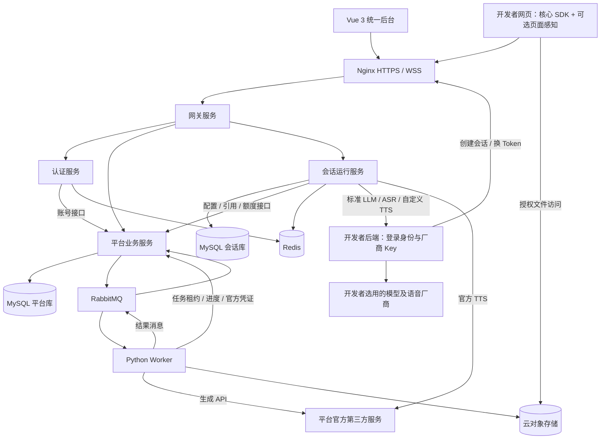

# LN 虚拟人开放平台项目架构说明书

**版本：V1.4（保留负责人调整后的一级目录）**  
**日期：2026-09-10**  
**需求依据：项目需求说明书 V1.3；架构 Q1～Q29、制作验证阶段修改及文档一致性修订。**

> 本文将已确认架构与架构 Q24 授权的实现选型合并整理。服务边界与已选协议作为实现基线；负责人已验收制作路线，上游构建、真实接入和兼容性仍待验证，不表示系统已经部署。本文不改变第一版功能范围。

2026-09-09 V1.2 修订：统一 JWT+JTI、B/S 权限、调试来源、会话 HTTP 幂等、WSS 首帧认证、Standard Webhooks 签名与留存规则。字段及默认参数由[接口设计说明书01 V0.2](接口设计说明书01.md)维护，数据库映射已同步 V0.2。

2026-09-09 V1.3 修订：负责人明确以若依原工程为主体，保留其模块组织，在 ruoyi-system 上扩展平台业务，融合适用开源能力后补充缺失模块；覆盖此前 apps/services/packages 的目录方案。第一阶段包含工程骨架、形象制作发布与音色配置试听，不做声音克隆。初始化与验收方案见[第一阶段工程方案确认稿](docs/superpowers/specs/2026-09-09-phase-one-design.md)，具体模块裁剪在正式编码前确认。

2026-09-10 V1.4 修订：以负责人手动调整后的实际一级目录为准；现有文件夹不得减少，允许新增。RuoYi-Cloud与RuoYi-Cloud-Vue3保留在根目录，后端模块不再铺到根目录，前端不改名为ruoyi-ui。二级及更深目录按职责规划，模块裁剪仍在正式编码前确认。

## 1. 架构结论

- 以根目录下的 RuoYi-Cloud 和 RuoYi-Cloud-Vue3 作为后端、后台主工程，保留现有一级目录；增加独立 TypeScript SDK 和 Python 素材项目。
- 基于官方 RuoYi-Cloud 的 Spring Boot 3 分支，JDK 17、Maven；保留独立认证服务。
- 五个逻辑服务：网关、认证、平台业务、会话运行、Python 素材处理。素材处理拆 HTTP 与 Worker 两个运行入口，因此进程/容器数不是固定五个。
- MySQL 单实例分服务逻辑库，Redis 管理短期状态，RabbitMQ 传递异步消息，Nacos 用于 Java 服务发现和普通配置。
- 开发、生产均用云对象存储，账号及费用由项目负责人安排；不默认自建 MinIO。
- 开发者厂商 Key 只在开发者后端，平台会话服务经标准转接协议调用。官方声音和生成仍使用平台自有凭证。
- 浏览器通过 HTTPS/WSS 接入，本地播放透明 2D 预生成素材；不部署任何模型，不引入实时视频流或 WebRTC。
- 第一版单机 Linux + Docker Compose，不引入 Kubernetes、跨服务分布式事务、MongoDB、向量数据库和额外 Agent 平台。

## 2. 总体结构



图中双向业务通过请求/响应或独立事件实现，不意味着数据库共享。Nacos 面向 Java 进程提供发现和配置；Python 用 Compose 内部地址和受保护接口，不引入 Nacos Python SDK。HTTP 健康接口与 Worker 属于同一素材项目，Worker 状态通过心跳与任务进度判断。

## 3. 服务职责与若依复用

下表 gateway/auth/platform/session/media 是逻辑职责名称。从项目根目录定位，实际模块依次为 RuoYi-Cloud/ruoyi-gateway、RuoYi-Cloud/ruoyi-auth、RuoYi-Cloud/ruoyi-modules/ruoyi-system、RuoYi-Cloud/ruoyi-modules/ruoyi-session、ruoyi-media；不另建一个 platform-service 与 ruoyi-system 并行运行。

| 服务 | 所有权 | 明确边界 |
|---|---|---|
| gateway | HTTP/WSS 路由、入口限流、初步访问校验 | 不保存业务数据，不编排模型，不替代下游归属校验 |
| auth-service | 若依后台登录/退出、认证状态；补齐邮箱相关流程 | 通过平台账号接口读取用户，不创建第二份账号库；后台 Token 不用于 SDK Session |
| platform-service | 账号、角色菜单、Avatar、Voice、Skills、转接服务、配置版本、官方秘密、任务、额度、Outbox、Webhook | 唯一拥有平台库写权限；直接在原 ruoyi-system 中扩展平台业务，沿用其系统能力 |
| session-service | Session、消息、Context、轮次、实时连接、调用转接/工具、分句 TTS、停止 | 唯一拥有会话库写权限；不直接调用开发者厂商地址，不存开发者厂商 Key |
| media-service | FastAPI 内部接口 + 独立 Worker；生成 API、提帧、裁切、透明处理、打包 | 不运行模型，不直接读写业务库，结果由平台校验后结算 |

官方若依提供认证、网关、系统等模块及 Vue 3 前端选择；后台账号、菜单、按钮权限、字典、日志与 CRUD 基础可复用。部门/岗位的数据范围不代替本平台按账号隔离。[若依官方说明](https://github.com/yangzongzhuan/RuoYi-Cloud)

既定边界：任务补偿在所属服务实现，首版不要求额外任务中心、Sentinel控制台或Seata；代码生成如使用，仅属于开发工具。**具体模块、依赖、菜单和兼容表如何保留/停用/删除，在正式编码前另行确认**，本次目录布局不构成裁剪清单。保留上游来源和许可，优先改造已有模块，检查可复用能力后再补写。

## 4. 技术组合与版本策略

### 4.1 已确认技术

| 层 | 技术 |
|---|---|
| 管理后台 | Vue 3、TypeScript、Vite、Element Plus、Pinia、Vue Router |
| Java | JDK 17、Spring Boot 3.5.x、Spring Cloud/Alibaba 配套版本、Maven |
| 数据与消息 | MySQL、Redis、RabbitMQ、Nacos |
| 对外通信 | REST/HTTPS、WebSocket/WSS；大文件走 HTTP/云存储 |
| 部署 | Linux、Docker Compose、Nginx；开发可由 IDE 启动应用 |

本次查询官方 springboot3 POM 显示 Boot 3.5.16、Cloud 2025.0.2、Alibaba 2025.0.0.0、Java 17。这是**所查询分支的声明值，不是已验证兼容的本项目锁定版本**。初始化时先验证制品可解析、基础服务启动和依赖兼容，再记录上游 SHA、镜像 digest 与锁文件，不使用浮动 latest。[官方分支 POM](https://raw.githubusercontent.com/yangzongzhuan/RuoYi-Cloud/springboot3/pom.xml)

### 4.2 架构 Q24 授权补选

| 项目 | 选择/推荐 | 理由与验证边界 |
|---|---|---|
| Java 数据访问 | 沿用若依 MyBatis + PageHelper，保留现有连接池 | 减少框架替换；归属条件必须在 Mapper/业务层落实 |
| Java 内部 HTTP | 普通服务接口沿用 OpenFeign；流式转接使用 Spring WebClient | 普通 CRUD 与流式取消分开，不自动重试非幂等付费请求 |
| Java 消息 | Spring AMQP | 统一 RabbitMQ 客户端，确认/重投/死信机制显式配置 |
| 迁移 | Flyway 的版本化 SQL | 两个业务库各自维护迁移；若依初始 SQL 整理为基线；仅选满足需求的开源部分 |
| Python | Python 3.12 作为初始验证目标、FastAPI + Uvicorn + Pydantic | HTTP 仅健康和必要内部接口；锁版本后验证二进制依赖 |
| Python Worker | asyncio + aio-pika；CPU 处理交给受限子进程 | 直接复用 AMQP 客户端；不同时引入 Celery、另一套任务状态库 |
| 图片/视频 | Pillow + FFmpeg 命令行 | 程序提帧/合成；不引入自动下载模型权重的抠图库 |
| 角色渲染 | 首先验证原生 Canvas 2D 图集播放 | 首版单角色单动作，不引入整个游戏引擎；性能不达标再评估 PixiJS，不视为已采用 |
| 页面采集 | html2canvas 作为验证候选，置于可替换适配层 | 尚未通过页面样本验证，不能视为最终精度承诺 |
| SDK 构建 | TypeScript 类型检查 + Vite library 构建，核心与 context 独立导出 | 不将 Vue/Element Plus 引入运行依赖，发布 npm 包 |
| 在线文档 | VitePress | 复用 Markdown，与后台统一链接，可独立静态发布 |
| 测试 | JUnit、pytest、Vitest；浏览器 E2E 使用 Playwright | 实现阶段锁兼容版本，重点验证协议、权限、失败恢复与播放 |
| 日志/健康 | 若依现有 SLF4J/Logback 与 Spring Actuator；Python 结构化日志 | 共用 requestId/taskId/turnId，不默认部署 ELK 全家桶 |

上述是架构选择，不宣称组件已集成。FastAPI 的进程部署与任务 Worker 是不同职责；不要用 HTTP 进程数量充当生成任务的可靠队列。[FastAPI 部署文档](https://fastapi.tiangolo.com/deployment/server-workers/)

## 5. 仓库布局

现有一级目录为 .codex、docs、examples、RuoYi-Cloud、RuoYi-Cloud-Vue3、upstream、validation，全部保留名称与位置。2026-09-10 已按本节增加 ruoyi-media 与 avatar-sdk，并创建所列二级目录骨架；业务代码、构建文件和模块注册仍待后续实施。原有其他文件未在树中逐一展开。

```text
项目根目录/
├── .codex/                          现有本机工具配置，保留
│   └── environments/
├── RuoYi-Cloud/                     现有Java主工程，名称与位置保留
│   ├── pom.xml                     若依父工程
│   ├── ruoyi-auth/
│   ├── ruoyi-gateway/
│   ├── ruoyi-api/
│   ├── ruoyi-common/
│   ├── ruoyi-modules/
│   │   ├── ruoyi-system/           在原模块上扩展平台业务
│   │   ├── ruoyi-session/          已建目录骨架，待实现会话与播报模块
│   │   └── （其他原有模块）          正式编码前确认裁剪
│   ├── ruoyi-visual/               原有目录，裁剪时再确认
│   ├── docker/                     基础设施与整个平台Compose/Nginx配置
│   ├── bin/                        Java及平台启动检查脚本
│   └── sql/                        来源SQL及建库准备说明
├── RuoYi-Cloud-Vue3/                现有后台主工程，名称与位置保留
│   ├── src/                        若依布局/权限与新增业务页面
│   ├── public/
│   ├── vite/
│   ├── bin/
│   └── html/                       现有内容保留，按需调整
├── ruoyi-media/                    已建目录骨架：独立Python素材项目
│   ├── src/ruoyi_media/            api、worker、providers、media各自分包
│   └── tests/
├── avatar-sdk/                     已建目录骨架：独立TypeScript能力包
│   ├── src/                        连接、图集、动作、音频等模块
│   └── tests/
├── examples/                       现有一级目录保留
│   └── integration-demo/          frontend与backend分开，演示接入/转接
├── docs/                           现有一级目录保留
│   ├── database/                   已有字段字典
│   ├── superpowers/               已有方案与计划
│   ├── api/                       已建目录，待放协议文件
│   └── site/                      已建目录，待建设在线文档
├── validation/                     现有手动验证工具保留
│   ├── avatar_lab/
│   ├── preview/
│   ├── tests/
│   └── workspace/                 本地输出，保持忽略
└── upstream/                       现有开源参考目录保留
    ├── LiveTalking/
    ├── MuseTalk/
    └── TalkingHead/
```

Java继续从RuoYi-Cloud/pom.xml构建，业务直接扩展到其中的ruoyi-system，不另建第二套平台服务。RuoYi-Cloud-Vue3/src沿用若依前端组织，在api/views等目录增加Avatar、任务、Voice和调试功能；不搬迁为ruoyi-ui。avatar-sdk独立构建并由后台引用，不依赖Vue/Element Plus；ruoyi-media独立Python环境，不参与Maven编译。

平台库迁移：RuoYi-Cloud/ruoyi-modules/ruoyi-system/src/main/resources/db/migration/；会话库迁移：RuoYi-Cloud/ruoyi-modules/ruoyi-session/src/main/resources/db/migration/。RuoYi-Cloud/sql只保留来源SQL和建库说明，不再维护另一套手工业务建表入口。RuoYi-Cloud/docker承载整个平台的部署编排，构建上下文显式指向各兄弟项目；RuoYi-Cloud/bin及前端已有bin目录各负其责，不需要为了部署再新增一级目录。

ruoyi-media内API/Worker分入口、共用受控适配与加工模块；examples/integration-demo内区分frontend/backend，开发者厂商Key仅进入示例后端本地配置。docs/database与docs/superpowers现有内容保留，协议和文档站分别放docs/api与docs/site。validation维持独立验证环境，upstream中的三个开源项目保留作来源对照。

2026-09-10 已初始化根 Git 仓库，初始分支为main，origin指向项目GitHub仓库。仓库现位于工作空间内的LN-virtual‑human‑platform子目录。若依前后端源码由根仓库直接跟踪；负责人确认后续直接在此基础上修改、不再同步若依上游，因此原有两个上游.git元数据及临时备份均已删除。一级目录保留约束不因后续模块裁剪而取消，模块构建文件与业务实现仍按后续计划落实。
 
## 6. 数据所有权与隔离

### 6.1 持久化

数据库细化设计见[数据库设计说明书 V0.2](数据库设计说明书.md)（2026-09-09）：包含若依表复用、48张新增表（平台35、会话13）、索引、版本引用与事务约束。调试签发来源、会话幂等及文字/合成/播放状态已同步；尚未执行DDL或数据库迁移。

| 数据归属 | 内容 |
|---|---|
| platform_db | 账号/角色菜单、资产/版本、转接服务/版本、Skills/版本、应用配置、平台自有秘密引用、任务步骤、额度账本、引用租约、Outbox、Webhook 投递 |
| session_db | Session 归属、双来源授权与配置版本引用、消息及三类轮次状态、Session Context、HTTP幂等、删除任务/通知 Outbox |
| Nacos 自有数据库（如选用） | 仅 Nacos 配置持久化，不与业务库混用 |

同一 MySQL 实例，独立逻辑库、账号和迁移；不跨库外键、不跨库写表。会话消息按条存储，索引至少围绕账号、应用、业务用户、Session、序号，唯一约束防止重复消息。不把整段历史塞入单个不断增长字段。

每项私有资源必须带 account_id，服务从已验证身份生成查询范围。官方资产使用明确官方所有权标志和发布状态，不通过缺少 account_id 暗示公开。内部任务同样校验账号与资源归属。

### 6.2 Redis

保存登录状态、Session 短期授权、撤销版本、限流计数、连接所有权/租约。MySQL 是任务、历史与额度的事实来源。不能因 Redis 重启丢失撤销记录而恢复已撤销 Token：撤销和账号状态需要持久依据；缓存缺失时回查，无法确认时拒绝，而不是默认授权。

### 6.3 云对象存储

开发和生产独立桶/凭证，长期资产与临时对象分路径及生命周期。业务库保存 object key 和元数据，不保存会过期的签名 URL 当永久地址。访问时验证归属再签发短期地址，支持浏览器所需 CORS。

优先选择所用云的官方 SDK；厂商未指定，不假定完整 S3 兼容。云账号、费用由负责人提供。临时中间文件可以在 Worker 工作目录短暂存在，但最终资产与需要跨请求读取的文件使用云存储。

## 7. 凭证与转接协议

### 7.1 四类凭证必须区分

1. **开发者厂商 Key**：只在开发者后端；平台 API 不接收此字段，错误/日志也不得包含。
2. **平台管理 Key、Application Secret、Session Token**：分别用于管理、后端接入和浏览器会话。
3. **转接接口访问凭证**：仅授权平台调用开发者转接服务，不等于模型厂商 Key。
4. **平台官方生成/TTS/云存储凭证**：由管理员或部署环境管理，Python 仅按任务获取必要官方能力。

### 7.2 通用鉴权选型

架构 Q22 的逐字段自定义签名方案未冻结；按用户指示采用成熟方式。第一版转接默认选择 **HTTPS + 独立、可撤销的 Bearer 接口访问 Token**。由开发者为该转接服务签发，平台仅安全保存这一接入凭证，使用 Authorization 头发送，浏览器不接触。按服务/Application 授权，支持轮换；不复用 Application Secret 双向调用，也不把 Token 当业务用户权限。

这是本项目技术选择，不是所有平台都采取相同方式的事实结论。Bearer 使用参考标准；成熟代理区分代理访问凭证与上游厂商凭证，可作为边界参考，不整体部署代理到平台。[RFC 6750](https://www.rfc-editor.org/rfc/rfc6750)、[LiteLLM 转接示例](https://docs.litellm.ai/docs/proxy/pass_through)

Bearer 本身不提供请求签名或防重放保证；业务幂等键用于避免重复执行。Webhook 已采用 **Standard Webhooks 的 HMAC-SHA256**，使用 webhook-id/timestamp/signature 和原始请求体验签、去重，格式及重试见接口01第13.2节；第一版无需额外 OAuth 授权中心。[Standard Webhooks 规范](https://github.com/standard-webhooks/standard-webhooks/blob/main/spec/standard-webhooks.md)

Session Token 采用 JWT+持久JTI。B 的 sessions:grant 是签发资格，S 的运行 Scope 由请求、Session固定配置与当前有效授权共同限制，不直接与 B 词表求交集。授权记录区分 BUSINESS_KEY 与 CONSOLE_DEBUG：前者检查签发 Key/epoch，后者绑定实际后台登录引用，退出该登录使其调试授权失效。撤销先持久化；每次实际处理检查当前来源，不能只等待消息通知。

平台自有及接入秘密通过经过审核的加密库保存，主密钥来自部署秘密文件、与数据库分离；不写 Nacos 普通配置、仓库或消息队列。具体密钥格式、轮换和备份在接口/部署契约中落实。

### 7.3 标准转接能力

| 能力 | 请求与响应方向 |
|---|---|
| LLM | 平台发送消息、图片引用/内容、工具定义、模型别名；转接返回文本增量、工具增量、结束原因、可获得用量 |
| ASR | LN_RELAY/1 通过 multipart 上传完整录音，返回文本及明确失败 |
| TTS | 文本、音色别名、请求 ID，返回逐句完整 WAV（PCM16、单声道、24kHz）；平台临时音频读取需 Session 鉴权 |
| 取消 | 请求 ID 定位，尽力中止；不能取消时停止转发且平台忽略迟到结果 |

LLM 优先以 OpenAI-compatible 消息和工具语义为基础，流式事件归一化；转接协议增加统一版本、错误、取消和能力声明。不假设任意厂商完全兼容，不自动更换模型或 Key。

用量来自转接端，缺失显示不可获取。开发者后端是数据处理链的一环：页面图片、对话、音频会经过它，必须在接入文档说明；“平台不存 Key”不意味着对话不经过平台。

## 8. 实时会话与浏览器通信

### 8.1 连接

管理和上传走 HTTPS，实时指令走 WSS。浏览器先通过已鉴权 HTTPS 换取一次性短期连接票据，使用子协议 ln-avatar.v1 建连，在握手成功后的首个 connection.auth 帧消费票据并绑定 Session。票据不放 URL 或子协议，不写日志；未鉴权连接不得执行业务，超时关闭。刷新使用独立 REAUTHORIZE 票据和 connection.reauthorize；字段与初始时限见接口01第9、16节。

为每次通过认证的新连接分配数据库持久递增 connection_epoch，Redis 原子更新且只接受更高代数的所有权；旧连接收到替换通知并关闭，旧 epoch 的消息全部拒绝。Redis 重启不能把代数重置为0。每轮建立 turn_id 和事件序号，SDK 忽略已停止轮次/旧连接事件。

### 8.2 运行路径

校验用户和应用 → 获取配置版本及实时有效权限 → 读取近期历史与 Context → 调用开发者 LLM 转接 → 校验工具/采集请求 → 继续模型输出 → 分句调用 TTS → 音频顺序播放。

HTTP 与流式客户端设置独立连接/读取/总时限；网关和 Nginx 不缓冲实时输出，WSS 心跳及超时与客户端协调。断线默认中止当前处理；恢复只恢复历史与状态，用户主动决定重发。

s_turn 分别持久记录文字生成、TTS合成和播放观测，s_operation 保存逐段状态。已完成的文字不会因随后停止音频而改为生成中断；仍在生成的文字才标记 INTERRUPTED。状态初值、终态和段级映射按接口01第9.4节实现。前台停止不取消实际已发生的计额事实，未知付费结果继续补偿核对。

会话HTTP授权/撤销使用本库 s_api_idempotency；签发与grant同事务，撤销与epoch及Outbox同事务。重试同一撤销只返回原结果，避免误撤销后续重新登录。平台管理接口使用 p_api_idempotency；两库均保留参数摘要而非秘密正文，至少24小时并覆盖执行/补偿期，已有业务唯一键继续防重。

### 8.3 官方 TTS 与额度

自定义 TTS 经开发者转接；官方 TTS 由会话服务调用平台官方服务。调用前向平台申请幂等额度预占（turn_id + segment_id），平台事务保存后才允许付费调用。生成完成通过可重试结果通知结算；超时不确定不直接再次合成或释放，先核对调用状态。此路径弥补会话服务与额度库分离后的可靠性要求。

### 8.4 停止

SDK 立即停止本地声音和动画并清空队列，同时发送停止事件；服务端原子终止轮次，取消 HTTP 读取、后续分段与待执行工具，转发尽力取消。无法确认上游取消时仍丢弃后续结果，费用按已成功合成计。重连不得触发旧音频重新播放。

## 9. 素材任务、RabbitMQ 与额度

### 9.1 本地事务加 Outbox

平台同一事务：检查额度、创建任务、预占、写 Outbox。定时发布 Outbox，使用 publisher confirms，发送不确定则重发。消费者采用手动确认，只有结果或下一阶段状态已可靠持久后才确认。

RabbitMQ 官方区分发布确认和消费者确认，两者不保证业务绝不重复；本项目按至少一次投递设计，用唯一业务标识去重。[RabbitMQ 确认机制](https://www.rabbitmq.com/docs/confirms)

消息包含 event_id、task_id、account_id、step、attempt、schema_version、trace_id，不带大文件、厂商秘密或永久公开 URL。

### 9.2 Worker 领取与恢复

1. Worker 消费步骤消息，向平台内部接口领取带过期时间的任务租约。
2. 平台检查归属、任务状态及版本，返回素材引用、生成参数及必要的官方调用凭证。
3. Worker 执行非模型加工/第三方 API；通过内部接口保存 provider_request_id、步骤进度和结果引用。
4. 长时间生成提交后保存上游任务 ID，释放当前步骤；由平台持久调度后续查询步骤，不无限占用一条 MQ 消息。
5. 输出上传后回传结果事件；平台检查租约/版本、重复 event_id、资产完整性，在本地事务中成功结算或失败释放，并写 Webhook Outbox。

上游请求已发出但响应丢失时，优先使用幂等请求键或查询接口。服务商两者均不支持时标记“结果待核对”，禁止自动重复付费生成；最终人工判定后再成功/失败结算。消息幂等不能消除上游接口不支持幂等造成的不确定窗口。

Worker 重启从平台步骤记录恢复，超时租约可重新领取；旧 Worker 结果凭租约版本不能覆盖新执行。待核对是内部状态，对外仍可显示处理中并给出明确说明。用户额度失败释放与上游真实成本分别记录。

### 9.3 Python 组件

FastAPI/Uvicorn 提供健康和必要内部接口；aio-pika 消费/确认消息。网络 I/O 异步处理，Pillow/FFmpeg CPU 工作放入有界子进程，超时回收进程和临时目录。禁止接收任意 shell 命令，参数以结构化白名单构造。HTTP API 在线不代表 Worker 已能处理任务，应分别报告 readiness。

aio-pika 提供 asyncio AMQP 客户端与发布确认能力，本项目仍自行实现任务租约和持久步骤，不把客户端重连当作业务恢复。[aio-pika 官方仓库](https://github.com/mosquito/aio-pika)

## 10. 资产版本、引用与清理一致性

### 10.1 防止“检查后删除”竞态

不能仅先问会话服务“有无引用”再直接删文件。技术设计采用平台管理的持久引用/预留：

- 创建 Session 前向平台为配置和 Avatar 版本预留引用，平台同一事务检查未进入删除状态。
- 会话服务落库成功后确认；中途失败按操作 ID 重试/补偿，不因网络超时盲目释放可能已生效的引用。
- 删除 Avatar 先在平台事务中标记删除中并阻止新引用，再确认无应用/会话引用，最后清理对象并更新状态。
- Session 删除先不可恢复，再发可靠释放事件；过期 Session 扫描同理。孤立预留定期向会话服务核对，不靠单纯 TTL 猜测释放。

这是一致性实现策略，不新增用户操作步骤。转接服务/Voice/Skill 的引用删除使用同类约束，已有会话固定版本但紧急停用即时优先。

### 10.2 数据留存

Session 最后有效活动后 30 天清理全部消息和 Context，按 Session 而非逐消息创建日期计算，心跳、刷新Token和查看历史不续期。调用/任务/Webhook记录从最终完成终态起保留30天；未完成、未知、未结算或待投递先核对/补偿，可超过30天。用量汇总12个月，额度余额、预占与结算流水作为事实依据持续保留，账号销毁前完成账务收尾。长期包元数据不随任务日志清理。

API去重与可靠消息按公开重试窗口、执行/补偿期及关联事实保留规则清理；撤销事件、grant或必要墓碑不能早于对应去重记录删除。这些技术例外不延长Session正文及临时图像/录音的保存，详见数据库第10节。

图片/DOM/本轮 Context/录音/工具原始结果不进入常规数据库及日志。临时对象请求完成后主动删除，定时扫描兜底；云生命周期作为防遗漏措施，不替代即时业务不可访问。备份按单独周期清理并验证恢复，不能声称业务删除等于所有物理副本立即消失。

## 11. SDK、动画与页面感知

### 11.1 SDK

core 提供连接、渲染、动作、录音、播报、对话、停止；context 模块动态加载截图依赖和元素引用逻辑。统一入口，核心不依赖 Vue，后台使用相同包。ESM 和类型声明先交付，兼容输出按实际接入验证确定。

角色采用头顶到鞋底完整全身站姿，由透明帧/图集和 manifest 表达；固定脚底锚点，保证头、手、脚均不裁切。按动作请求资源、限制缓存，视口尺寸变化等比例缩放。原生 Canvas 2D 先验证单角色播放，浏览器绘制基于单一时钟调度；audio 的真实播放/暂停/结束事件驱动 speaking，不把网络接收当作已经听到。全身脸部显示更小，嘴部动作可辨识度列为样品验收项。

录音用浏览器能力，处理麦克风拒绝、音频自动播放限制和浏览器格式差异，通过事件让开发者 UI 引导。CPU 解码/内存峰值必须实测；不承诺真人照片生成能达到实拍视频自然程度。

### 11.2 截图及 DOM 独立处理

默认视口，Element 按选定元素，全页需显式开启并限制尺寸/分片。DOM 副本过滤 allow/deny、默认排除密码输入框；截图使用选定范围的未敏感遮蔽画面，不从已脱敏 DOM 重绘后声称“图片直传”。不修改原页面布局。

html2canvas 是 DOM 重绘而非系统级截图，存在 CSS、跨域图像和污染 Canvas 限制。[官方原理说明](https://html2canvas.hertzen.com/documentation)、[支持特性](https://html2canvas.hertzen.com/features)

候选验证清单：普通表单、Vue 异步页面、Canvas 图表、SVG、复杂 CSS、跨域图、长页、iframe、字体加载、滚动定位、DOM 变化。逐项返回实际覆盖及失败状态，不能自动启用屏幕共享或服务器代理兜底。

dom_deny 只保护 DOM 文本，截图可能仍含相同内容，UI/文档必须明确。权限越界的采集范围仍拒绝；高亮依据本次允许的元素引用并再次校验，不能因截图看到内容就取得点击或 DOM 访问权限。

## 12. 部署、运维与测试

一台 Linux 主机运行 Nginx、四个 Java 服务、Python API/Worker、MySQL、Redis、RabbitMQ、Nacos。五个逻辑服务并不表示只有五个容器。限制 Worker 并发和 JVM 内存，先实测再购买/确定规格；无 GPU 要求。

- Nginx 提供 Vue 后台/文档及 HTTPS/WSS 入口；数据库、MQ、Nacos 控制台与内部接口不直接暴露公网。
- 开发环境可 IDE 启动应用，基础组件 Compose；云存储始终远端且环境隔离。开发者转接示例需与平台网络可达，默认不用另购穿透服务。
- 镜像/依赖锁定，环境模板无秘密；数据库和必要配置卷持久化，做异机备份与恢复演练。
- 健康检查区分进程存活、依赖就绪和任务处理能力。单机重启不会保留长连接，按 Session 恢复规则处理。
- 定时任务使用数据库租约避免未来多实例重复扫描。初版无需大型监控集群，基础指标包括首字/首音耗时、失败率、积压、预占年龄、清理滞后和 WebSocket 数。
- CI 顺序：静态/类型检查 → 单元测试 → 数据迁移与消息集成测试 → 浏览器 E2E → 构建。付费真实服务验证单独受预算控制，不在每次提交自动消费。

重点验收：重复消息只结算一次、崩溃后恢复、上游超时待核对、跨账号拒绝、转接停用生效、旧 Session 禁止引用已删资产、停止后无迟到播放、截图直传与 DOM 过滤差异、Session 30 天整段清理。

## 13. 开源复用与许可核对

本表为本次官方资料初查，具体引入版本、二进制构建参数和传递依赖仍须形成组件清单；不把一个主仓库许可证扩大为整个部署的统一许可。

| 组件 | 本次核对与采用边界 |
|---|---|
| RuoYi-Cloud | 官方仓库标记 MIT；基于其模块二次开发，保留来源和声明。[来源](https://github.com/yangzongzhuan/RuoYi-Cloud) |
| FastAPI | MIT，采用 API 层。[来源](https://github.com/fastapi/fastapi) |
| aio-pika | Apache-2.0，采用 AMQP 客户端。[来源](https://github.com/mosquito/aio-pika) |
| Pillow | MIT-CMU，采用图像处理。[来源](https://pillow.readthedocs.io/en/stable/about.html) |
| FFmpeg | 许可取决于编译选项，启用 GPL 组件会改变适用条件；检查实际构建和附带依赖，不笼统标为 MIT。[官方说明](https://ffmpeg.org/legal.html) |
| html2canvas | MIT，候选截图适配器，先验证再冻结。[来源](https://github.com/niklasvh/html2canvas) |
| Flyway | 仓库列 Apache-2.0，商业附加部分须另查；仅使用所需开源迁移能力。[来源](https://github.com/flyway/flyway) |
| VitePress | MIT，采用静态文档站。[来源](https://github.com/vuejs/vitepress) |
| MuseTalk / LiveTalking / TalkingHead | 已拉取源码并开展模块级复用分析；不部署模型不等于不借鉴项目。优先参考 LiveTalking 的云 TTS、分句和打断，以及 TalkingHead 的浏览器音频调度；MuseTalk 的视频处理与已有掩码合成可按需抽取。当前不整包引入推理运行时、不改变首版基础 speaking 及 Canvas 图集路线。具体文件、限制与提交见 docs/opensource-reuse.md。[MuseTalk 来源](https://github.com/TMElyralab/MuseTalk) |
| hatch-pet | 参考流程与算法组织；本地 Skill 可读取不等于其所有脚本可直接再分发，复制前核对来源许可 |

Redis/MySQL/RabbitMQ/Nacos、Java/Node 运行时、前端依赖、云 SDK 和测试工具在冻结具体版本时逐项补充 SPDX/NOTICE 与制品来源，尤其不能把历史 Redis 版本许可假定为所有新版本许可。本轮未下载完整依赖树，不宣称已完成全量供应链审计。

## 14. 决策追踪

| 架构问题 | 最终决定 |
|---|---|
| Q1 | 不自行部署模型，开源复用集中在非模型能力 |
| Q2/Q5 | 原四服务被五服务覆盖，保留若依认证服务 |
| Q3及2026-09-10目录修订 | 统一项目工作区、多应用各自构建；保留现有一级目录；根Git仓库已初始化；若依源码纳入根仓库，上游Git元数据按负责人决定删除 |
| Q4/Q5 | 若依官方 Cloud 基础，裁剪通用模块并扩展业务 |
| Q6 | JDK 17、Boot 3 分支、配套 Cloud/Alibaba、锁版本 |
| Q7 | Vue 3 + TS + Vite + Element Plus + Pinia + Router |
| Q8/Q15 | MySQL + Redis + 对象存储，不引入 MongoDB；按服务分库 |
| Q9/Q10 | 开发与生产都用云对象存储，负责人处理账号费用 |
| Q11 | Nacos；Python 不强制接入 |
| Q12/Q16 | RabbitMQ、本地事务、Outbox、幂等和补偿 |
| Q13 | HTTPS/WSS，大文件走 HTTP，无 WebRTC |
| Q14 | Java 实时调用与编排；Python 生成 API 与素材加工 |
| Q17 | Linux 单机 Compose，无 Kubernetes |
| Q18 | 共享表按账号隔离，后端执行 |
| Q19～Q21 | 开发者 Key 仅在其后端，账号级转接服务复用 |
| Q22 | 不冻结自定义签名方案，按成熟接入方式技术选型 |
| Q23 | Python HTTP 与 Worker 分开启动 |
| Q24 | 剩余底层组件授权技术选型，效果/费用/资源取舍仍需对齐 |
| Q25 | 浏览器预生成透明 2D 动画播放 |
| Q26 | 默认视口，全页显式开启 |
| Q27 | 截图无敏感遮蔽，DOM 保留 allow/deny 与密码排除 |
| Q28 | SDK 核心与可选页面感知模块 |
| Q29 | 一套管理后台，角色菜单与后端权限；文档可独立发布 |

## 15. 下一阶段输出与进入条件

制作路线已经负责人验收，上游源码和四份设计文档已准备。工程实施第一阶段目标为：**可重复启动、可登录、权限生效、迁移可复用的若依骨架；参考图上传到Avatar验收发布，以及独立Voice配置、真实试听与最小纯播报演示。声音克隆不在该阶段。**

[第一阶段工程布局、初始化与验收方案](docs/superpowers/specs/2026-09-09-phase-one-design.md)为本次审阅稿，规定建议顺序、M1/M2标准与证据。模块裁剪由负责人保留到正式编码前确认；未确认前不据目录方案删除原模块。

推进顺序为：确认方案及编码前裁剪 → 若依工程和依赖基线 → 基础设施、迁移、登录权限（M1）→ 云端生成和正式资产包 → 预览验收发布 → Voice与SPEAK_ONLY调试 → 真实链路及故障验收（M2）。后续继续LLM、ASR、Skills、页面感知、完整开发者接入和其余管理能力，完整第一版仍按需求V1.3验收。

协议及接口01第16节参数是初始实现基线，不等于已验证性能。后续落实实际供应方、构建版本与部署连接，记录调用费用、质量和恢复结果。当前已完成目录骨架和根仓库初始化，尚未执行模块裁剪、数据库迁移、正式业务编码或新的收费调用。
